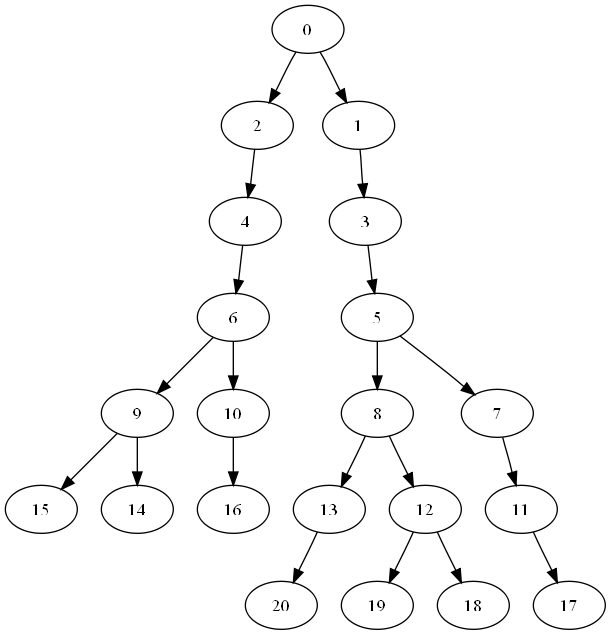
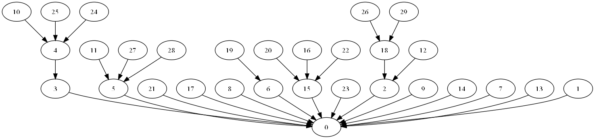
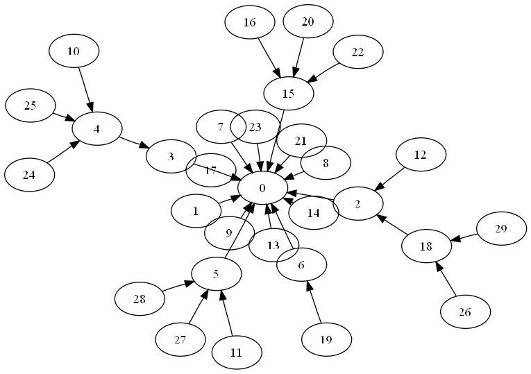
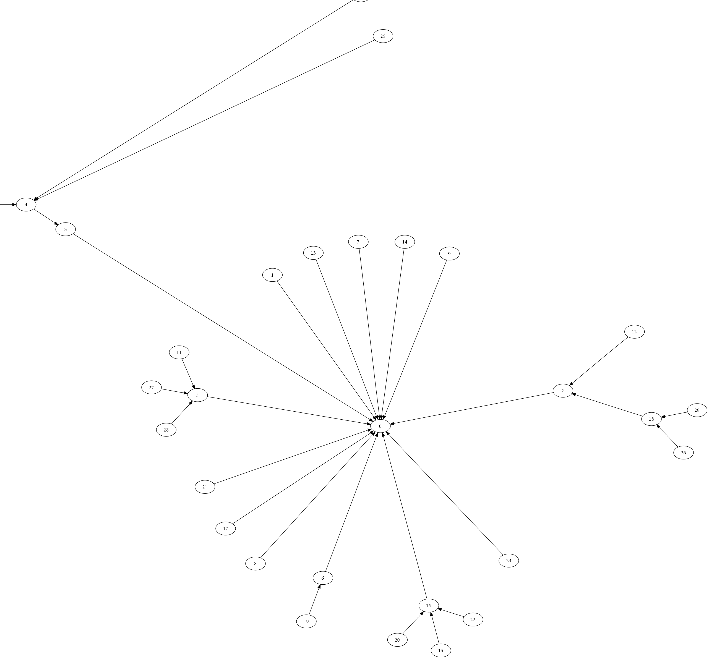

.. _container_tutorial:

#####################
Tutorial
#####################

This tutorial will not cover every features of the package.
Instead, it introduces the main common features of the package,
and will give you a good idea of the library.

.. toctree::
    
    graph_tutorial.rst
    tree_tutorial.rst

Display
#########################

To display a graph, you have to install graphviz and pydot.

Random Tree
---------------------

.. code-block:: python

    import openalea.container as cont
    from openalea.container.generator import random_tree
    from openalea.container.backend import graphviz

    tree = cont.Tree()
    vid = random_tree(tree, tree.root, nb_children=2, nb_vertices=20)

    # Convert the tree into a graphviz directed graph.
    g = graphviz.tree_to_pydot(tree)

    g.write_png('tree.png', prog='dot')

Random Graph
------------

.. code-block:: python

    import networkx as nx
    from openalea.container.backend import networkx, graphviz

    # Build a growing network directed graph
    nx_graph = nx.gn_graph(30)

    # Convert NetworkX graph into our graph
    graph = networkx.from_networkx(nx_graph)

    # Convert the tree into a graphviz directed graph.
    g = graphviz.graph_to_pydot(graph)

    g.write_png('graph_dot.png', prog='dot')
    g.write_png('graph_neato.png', prog='neato')
    g.write_png('graph_circo.png', prog='circo')

