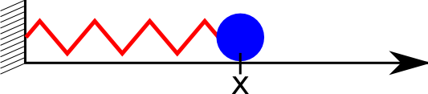
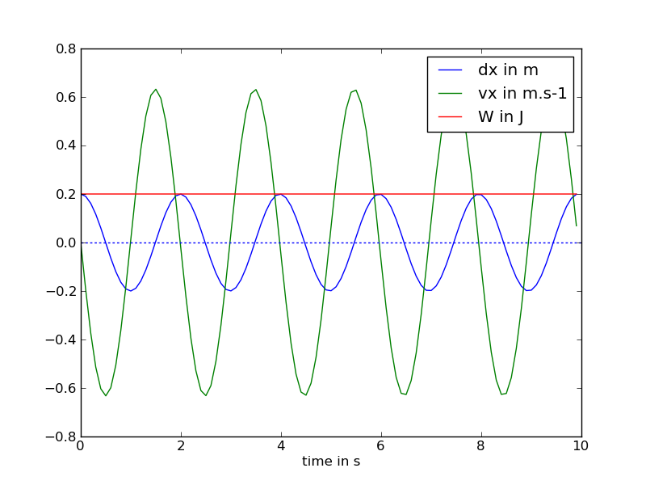

.. _meca_basics_linear1D:

#################################
Linear Spring in 1D
#################################

:Version: |version|
:Release: |release|
:Date: |today|

The goal of this document is to explain the basics of the behaviour of a simple linear elastic element and how to integrate it throughout time using scipy ode integrator. The python script for this example can be downloaded (download file: :download:`simu.py`) and run in a shell console using::

	user@computer:$ python simu.py

System description
##################

In this tutorial we will study a simple mass attached to a simple linear 1D elastic element. In the reference state, the geometry of this elements is characterized with:
 - a rest length :math:`$l^0$` expressed in :math:`$m$`.
 - a cross section :math:`$S$` expressed in :math:`$m^2$`.
 - the mass :math:`$m$` (in :math:`$kg$`)of the ball attached to the spring.

One of the extremity of the element is fixed and the other one, that bear the load, is free. Hence, the state of the system can be accurately described using only two parameters:
 - :math:`$x$`, the position of the free extremity expressed in :math:`$m$`. We put the origin of space on the attached extremity of our spring.
 - :math:`$v_x$`, the velocity of the same extremity expressed in :math:`$m.s^{-1}$`.

The material, the spring is made of, is isotropic and characterized by:
 - :math:`$E$`, a Young's modulus of 10 :math:`$GPa$` (wood for example)
 - a Poisson's ratio of 0 (none) since we are in 1D

The elastic property of the spring can be summarized in a stiffness constant :math:`$K$`:

.. math::
    K = \frac{S}{l^0} E

.. literalinclude:: simu.py
    :start-after: #begin parameters
    :end-before: #end parameters

Energy computation
#####################

The total energy stored in the system in the actual configuration is the sum of an elastic energy and a kinetic energy.

.. math::
    W = W_e + W_c = \frac{1}{2} K (x - l^0)^2 + \frac{1}{2} m v_x^2

.. literalinclude:: simu.py
    :start-after: #begin energy
    :end-before: #end energy

Gradient of the energy
#######################

To compute the evolution of this system throughout time we will assume that once released, the system will evolve towards a minimum of energy going down the gradient of energy. The derivative of the energy according to space corresponds to forces applied on the system:

 .. math::
    \frac{d W}{d x} = K (x - l^0)

.. literalinclude:: simu.py
    :start-after: #begin gradient of energy
    :end-before: #end gradient of energy

Evolution throughout time
##########################

Hence, for a given state, the evolution of the system is such that:
 - the rate of change of the position of a point correspond to its velocity
 - the rate of change of the velocity of a point is proportional to forces applied on this point

 .. math::
    \begin{pmatrix} \frac{d x}{d t} \\ \frac{d v_x}{d t} \end{pmatrix}
    =
    \begin{pmatrix} v_x \\ - \frac{1}{m} \frac{d W}{d x} \end{pmatrix}

.. literalinclude:: simu.py
    :start-after: #begin evolution
    :end-before: #end evolution

The integration will be done using the `ode` method in `scipy.integrate`.

.. literalinclude:: simu.py
    :start-after: #begin compute evolution
    :end-before: #end compute evolution

Plot results
############################

The evolution of the position of the mass, its speed and the total amount of energy in the system is plotted using the pylab library.

.. literalinclude:: simu.py
    :start-after: #begin plot
    :end-before: #end plot

.. warning:: On this figure we display :math:`$dx = x - l^0$` instead of :math:`$x$` to have a plot centered around zero.

The system is conservative. The total amount of energy is constant throughout time. Elastic energy is transformed into kinetic energy and vice versa. Hence, the system never reach an equilibrium state.

