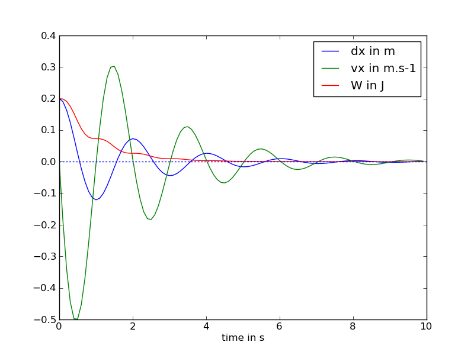

.. _meca_basics_linear1D_dissipative:

#################################
Linear Spring in 1D with Friction
#################################

:Version: |version|
:Release: |release|
:Date: |today|

The goal of this document is to add a dissipative term to the system described in :ref:`meca_basics_linear1D`. The python script for this example can be downloaded (download file: :download:`simu.py`) and run in a shell console using::

	user@computer:$ python simu.py

System description
##################

The system is exactly the same than the one described in :ref:`meca_basics_linear1D`. This time however, the sphere is not moving freely along the Ox axis. A solid friction is exerced on the sphere that depends linearly on the velocity of the sphere. This friction will be characterized by a coefficient :math:`$\lambda$` linking the friction force :math:`$F_s$` exerced on a point to its velocity.

 .. math::
    F_s = - \lambda v_x

.. literalinclude:: simu.py
    :start-after: #begin gradient of energy
    :end-before: #end gradient of energy

Energy computation
#####################

As for :ref:`meca_basics_linear1D`, the total energy stored in the system in the actual configuration is the sum of an elastic energy and a kinetic energy.

.. math::
    W = W_e + W_c = \frac{1}{2} K (x - l^0)^2 + \frac{1}{2} m v_x^2

.. literalinclude:: simu.py
    :start-after: #begin energy
    :end-before: #end energy

Plot results
############################

The evolution of the position of the mass, its speed and the total amount of energy in the system is plotted using the pylab library.

.. literalinclude:: simu.py
    :start-after: #begin plot
    :end-before: #end plot

.. warning:: On this figure we display :math:`$dx = x - l^0$` instead of :math:`$x$` to have a plot centered around zero.

The system is no longer conservative. The total amount of energy decrease with time. A part of kinetic and elastic energy is transformed into heat by friction, leading the system to an equilibrium state.

