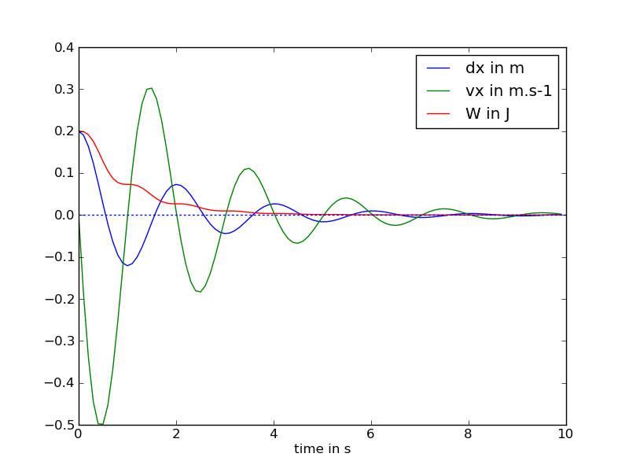

.. _meca_basics_linear1D_jacobian:

#################################
Linear Spring in 1D with Jacobian
#################################

:Version: |version|
:Release: |release|
:Date: |today|

The goal of this document is to add an explicit computation of the jacobian to the system described in :ref:`meca_basics_linear1D_dissipative`. The python script for this example can be downloaded (download file: :download:`simu.py`) and run in a shell console using::

	user@computer:$ python simu.py

System description
##################

The system is exactly the same than the one described in :ref:`meca_basics_linear1D_dissipative`. The evolution of the system is guided by:

 .. math::
    \begin{pmatrix} \frac{d x}{d t} \\ \frac{d v_x}{d t} \end{pmatrix}
    =
    \begin{pmatrix} v_x \\ - \frac{1}{m} K (x - l^0) - \frac{1}{m} \lambda v_x \end{pmatrix}

Jacobian computation
#####################

Previously, in :ref:`meca_basics_linear1D` and :ref:`meca_basics_linear1D_dissipative` only the derivative of the state of the system according to time was given. In this tutorial, we intend to explicitely compute the jacobian of this derivative in order to fasten the computation of the evolution of the system.

.. math::
    J = \begin{pmatrix} \frac{d}{d x} \frac{d x}{d t} &
                        \frac{d}{d vx} \frac{d x}{d t} \\
                        \frac{d}{d x} \frac{d vx}{d t} &
                        \frac{d}{d vx} \frac{d vx}{d t} \end{pmatrix}
      = \begin{pmatrix} 0 & 1 \\
                        - \frac{K}{m} &
                        - \frac{\lambda}{m} \end{pmatrix}

.. literalinclude:: simu.py
    :start-after: #begin jacobian
    :end-before: #end jacobian

Evolution throughout time
##########################

As for :ref:`meca_basics_linear1D` and :ref:`meca_basics_linear1D_dissipative`, 
the integration will be done using the `ode` method in `scipy.integrate`. This time we include the jacobian in the definition of the solver.

.. literalinclude:: simu.py
    :start-after: #begin compute evolution
    :end-before: #end compute evolution

Plot results
############################

The evolution of the position of the mass, its speed and the total amount of energy in the system is plotted using the pylab library.

.. warning:: On this figure we display :math:`$dx = x - l^0$` instead of :math:`$x$` to have a plot centered around zero.

This result is exactly the same than the one obtained without the jacobian. A small amount of time has been gained however in the computation of the evolution of the system.

