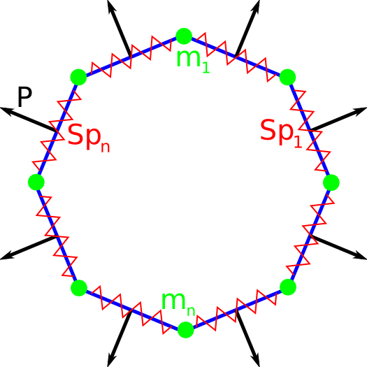
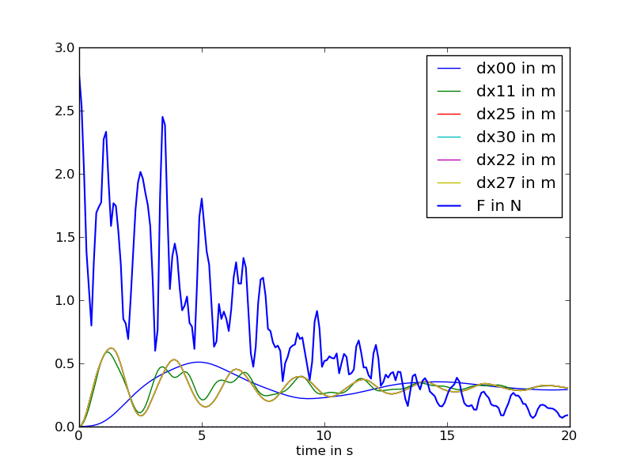
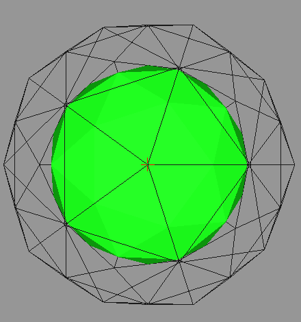

.. _meca_basics_mechanics_lib:

#########################################################
Linear Springs in 3D using the openalea.mechanics library
#########################################################

:Version: |version|
:Release: |release|
:Date: |today|

The goal of this document is to explain the basics of how to use both scipy.integrate.ode and the openalea.mechanics library to solve a simple mass-spring problem composed of linear springs in 3D space. The python script for this example can be downloaded (download file: :download:`simu.py`) and run in a shell console using::

	user@computer:$ python simu.py

System description
##################

In this tutorial we will study a simple icosphere composed of a set of :math:`M` linear elastic elements that link a set of :math:`$N$` ponctual masses. The mesh of this element is stored in a file (download file: :download:`sphere.msh`) and read using functions from `openalea.container`.

.. literalinclude:: simu.py
    :start-after: #begin read mesh
    :end-before: #end read mesh

In the reference state, the geometry of each elastic element is characterized with:
 - a rest length :math:`$l^0$` expressed in :math:`$m$`.
 - a cross section :math:`$S^0$` expressed in :math:`$m^2$`.
 - the mass :math:`$m$` (in :math:`$kg$`)of the ball attached to the spring.

All these parameters are identical for each spring.

The material, each spring is made of, is isotropic and characterized by:
 - :math:`$E$`, a Young's modulus of 10 :math:`$GPa$` (wood for example)
 - a Poisson's ratio of 0 (none) since we are in 1D

Each ponctual mass is free to move in a 3D space, hence we require 2xNx3 parameters to describe the state of the system at a given time:
 - :math:`$\underline{X}_i = (x_i,y_i,z_i)$`, the position of one particule expressed in :math:`$m$`.
 - :math:`$\underline{V}_i = (v_{i,x},v_{i,y},v_{i,z})$`, the velocity of the same particule expressed in :math:`$m.s^{-1}$`.

The state of the system will be stored in a numpy array with a shape of (2,N,3) such that:
 - state[0,i,:] will be the position of the ith particule
 - state[1,i,:] will be the velocity of the ith particule

.. literalinclude:: simu.py
    :start-after: #begin parameters
    :end-before: #end parameters

System implementation
######################

The system will be represented using LinearSpring3D elements from the openalea.mechanics python package. Each edge of the mesh is replaced by a linear spring.

.. literalinclude:: simu.py
    :start-after: #begin create springs
    :end-before: #end create springs

In order to reach an equilibrium state and do not oscillate indefinitely, we add a viscous friction to each mass.

.. literalinclude:: simu.py
    :start-after: #begin create damper
    :end-before: #end create damper

Last, the pressure that push the points of the sphere appart is modelised using `PressureActors`.

.. literalinclude:: simu.py
    :start-after: #begin create pressure
    :end-before: #end create pressure

Energy computation
#####################

The total energy stored in the system in the actual configuration is the sum of an elastic energy and a kinetic energy.

.. math::
    W = W_e + W_c = \sum_{j = 1}^{M} \frac{1}{2} K (\left\| \underline{X}_k - \underline{X}_l \right\| - l^0)^2
                  + \sum_{i = 1}^{N} \frac{1}{2} m \left\| \underline{V}_i \right\|^2

This can be efficiently done by summing the contribution of each spring obtained using the LinearSpring3D.energy method.

.. literalinclude:: simu.py
    :start-after: #begin energy
    :end-before: #end energy

.. warning:: Only the potential elastic energy is summed. All other forms of energy spend by actors depends on the transformation and not only on the current state of the system.

Gradient of the energy
#######################

The formulation of the gradient of the energy is an extension of the 2D case detailed in :ref:`meca_basics_linear2D`. It's exact mathematical formulation will not be given here. To compute it we just need to initialise a null gradient and call the LinearSpring3D.assign_forces method for each mechanical actor.

.. literalinclude:: simu.py
    :start-after: #begin gradient of energy
    :end-before: #end gradient of energy

Evolution throughout time
##########################

This part is unchanged from :ref:`meca_basics_linear1D`. In a first step we use the computed forces to format the time derivative of the evolution of the state:

 .. math::
    \begin{pmatrix} \frac{d x_i}{d t} \\
                    \vdots \\
                    \frac{d v_{i,x}}{d t} \end{pmatrix}
    =
    \begin{pmatrix} v_{i,x} \\
                    \vdots \\
                    - \frac{1}{m} \frac{d W}{d x_i} \end{pmatrix}

.. literalinclude:: simu.py
    :start-after: #begin evolution
    :end-before: #end evolution

In a second step we compute the jacobian of the system the same way we computed the forces in the system.

.. literalinclude:: simu.py
    :start-after: #begin jacobian
    :end-before: #end jacobian

In a third step, we integrate the time derivative using the `ode` method in `scipy.integrate`.

.. literalinclude:: simu.py
    :start-after: #begin compute evolution
    :end-before: #end compute evolution

Plot results
############################

For the 10 first points of the mesh we plot the distance of the point to the actual center of the sphere. The maximal residual force in the system is also plotted using the pylab library.

.. literalinclude:: simu.py
    :start-after: #begin plot
    :end-before: #end plot

.. warning:: On this figure we display :math:`$dx = \left\| x - C \right\| - R$` instead of :math:`$\left\| x - C \right\|$` to have a plot nearby zero.

Display final state
############################

The final state reached by the sphere is drawn in 3D to ensure visualy that the sphere remained a sphere.

.. literalinclude:: simu.py
    :start-after: #begin display final state
    :end-before: #end display final state

In green, the initial sphere and in black the final sphere with pressure applied.
