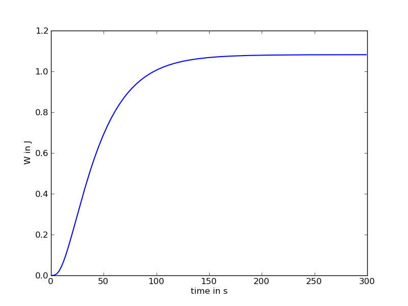

.. _meca_linear_halfcircle:

#################################
Half Circle using Linear Elements
#################################

:Version: |version|
:Release: |release|
:Date: |today|

The goal of this document is to study the behaviour of a dome composed of linear elements in 2D. The python script for this example can be downloaded (download file: :download:`simu.py`) and run in a shell console using::

	user@computer:$ python simu.py

System description
##################

The system is composed of NB linear elastic elements arranged in a half of a circle. Each side of the half-circle is fixed to the ground and can move only horizontaly. The top most point of the circle can only move verticaly. Hence the structure can deform freely but cannot move globally. A constant pressure is applied from bottom to top on these elements.

Each spring is made of the same material characterized by:
 - a Young's modulus of 1000 (Pa)
 - a Poisson's ratio of 0. (none) since 1D

Each ponctual mass is free to move in 2D, hence we require 2xNBx2 parameters to describe the state of the system at a given time:
 - :math:`$\underline{X} = (x_i,y_i)$`, the position of one particule expressed in :math:`$m$`.
 - :math:`$\underline{V} = (v_{x,i},v_{y,i})$`, the velocity of the same particule expressed in :math:`$m.s^{-1}$`.

The state of the system will be stored in a numpy array with a shape of (2,NB,2) such that:
 - state[0,i,:] will be the position of the ith particule
 - state[1,i,:] will be the velocity of the ith particule

.. literalinclude:: simu.py
    :start-after: #begin parameters
    :end-before: #end parameters

System implementation
######################

The system will be represented using LinearSpring2D elements from the `openalea.mechanics` python package.

.. literalinclude:: simu.py
    :start-after: #begin create springs
    :end-before: #end create springs

In order to reach an equilibrium state and do not oscillate indefinitely, we add a viscous friction to each mass.

.. literalinclude:: simu.py
    :start-after: #begin create damper
    :end-before: #end create damper

Last, the pressure that push the points of the circle appart is modelised using `PressureActors`.

.. literalinclude:: simu.py
    :start-after: #begin create pressure
    :end-before: #end create pressure

Energy computation
#####################

The total energy stored in the system in the actual configuration is computed by summing the contribution of each spring obtained using the LinearSpring2D.energy method.

.. literalinclude:: simu.py
    :start-after: #begin energy
    :end-before: #end energy

.. warning:: Only the potential elastic energy is summed. All other forms of energy spend by actors depends on the transformation and not only on the current state of the system.

Gradient of the energy
#######################

The formulation of the gradient of the energy is an extension of the 1D case detailed in :ref:`meca_basics_linear1D`. It's exact mathematical formulation will not be given here. To compute it we just need to initialise a null gradient and call the LinearSpring2D.assign_forces method for each mechanical actor.

.. literalinclude:: simu.py
    :start-after: #begin gradient of energy
    :end-before: #end gradient of energy

Evolution throughout time
##########################

This part is unchanged from :ref:`meca_basics_linear1D`. In a first step we use the computed forces to format the time derivative of the evolution of the state:

 .. math::
    \begin{pmatrix} \frac{d x_i}{d t} \\
                    \vdots \\
                    \frac{d v_{i,x}}{d t} \end{pmatrix}
    =
    \begin{pmatrix} v_{i,x} \\
                    \vdots \\
                    \frac{f_i}{m} \end{pmatrix}

.. literalinclude:: simu.py
    :start-after: #begin evolution
    :end-before: #end evolution

In a second step we compute the jacobian of the system the same way we computed the forces in the system.

.. literalinclude:: simu.py
    :start-after: #begin jacobian
    :end-before: #end jacobian

In a third step, we integrate the time derivative using the `ode` method in `scipy.integrate`.

.. literalinclude:: simu.py
    :start-after: #begin compute evolution
    :end-before: #end compute evolution

Analytical computation of final state
######################################

In this particular configuration, the link between the pressure inside the circle and the stress encountered by each element can be analytically computed.

.. math::
    \sigma_f = \frac{P R_f}{t_h}

where :math:`$R_f$` is the radius of the final circle configuration reached by the system. This relation allow us to compute the analytical strain encountered by each spring:

.. math::
    \varepsilon_f = \frac{\sigma_f}{E}

From the definition of the strain we can easily compute the final length reached by each spring and the final radius.

.. math::
    l_f = l^0 \exp \varepsilon_f

.. literalinclude:: simu.py
    :start-after: #begin analytical result
    :end-before: #end analytical result

Plot evolution
############################

The evolution of the position of the points and the maximal residual force in the system is plotted using `pylab`.

.. literalinclude:: simu.py
    :start-after: #begin plot evolution
    :end-before: #end plot evolution

.. warning::
    We do not plot directly the position of points but the relative difference between the distance of a point to the center and the analyticaly computed (see below) radius reached by the system in the final state.
    
    .. math::
        dr_i = \frac{\left\| \underline{X}_i \right\|- R_f}{R_f}

After 200 s the system reach an equilibrium state. since some external forces are applied on the system, this equilibrium is characterized by an elastic potential energy higher than 0.

.. literalinclude:: simu.py
    :start-after: #begin plot energy
    :end-before: #end plot energy

Display final Mechanical state
##############################

For the final equilibrium state reached by the system, we compute the strain encountered by each spring.

.. literalinclude:: simu.py
    :start-after: #begin plot strain
    :end-before: #end plot strain

.. warning::
    We plot the relative difference between the strain in a given state of the system and the analytically computed one.
    
    .. math::
        \Delta \varepsilon = \frac{\varepsilon - \varepsilon_f}{\varepsilon_f}

Since all springs are mechanically equivalent, the strain is uniform. We can do the same computation for the stress beared by each spring. Due to the linear relation between strain and stress in our formulation, these two plots are exactly the same.

