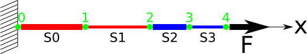
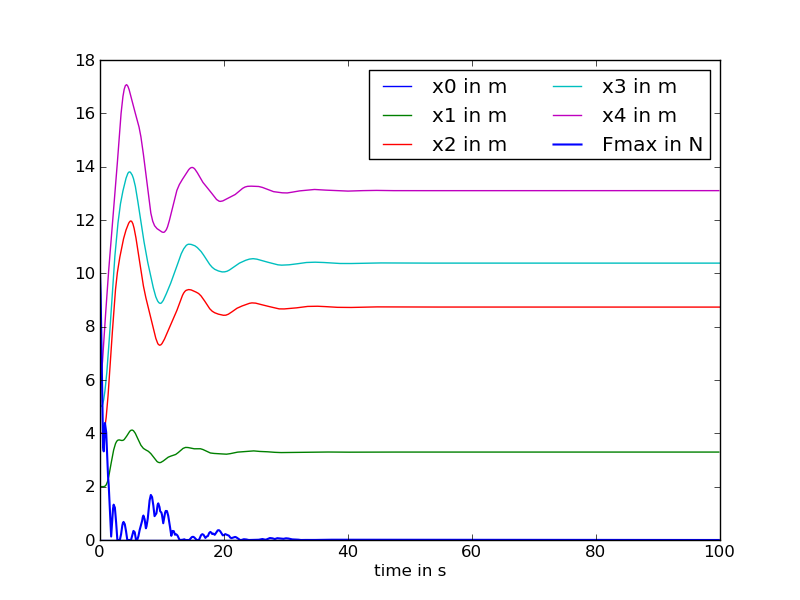
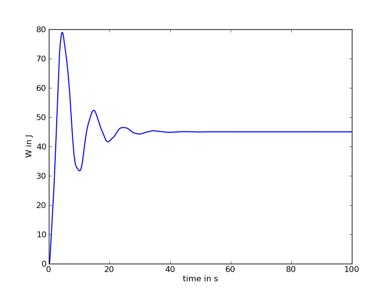
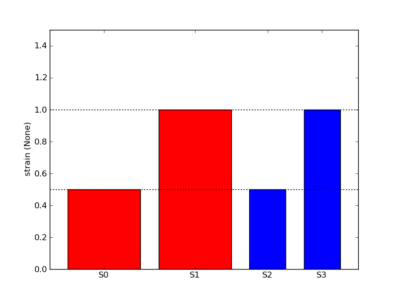

.. _meca_linear_linear1D:

#################################
Linear elements
#################################

:Version: |version|
:Release: |release|
:Date: |today|

The goal of this document is to explain the behaviour of elastic linear elements in the simple case of a 1D space. The python script for this example can be downloaded (download file: :download:`simu.py`) and run in a shell console using::

	user@computer:$ python simu.py

System description
##################

The system is composed of 4 different linear elastic elements:
 - 2 long one (red) and 2 short one (blue)
 - 2 thicker (wider line) and 2 thinner

These springs are attached one to another in a line. The left most one is fixed to the ground whereas the right most one is subjected to a constant load :math:`$F$`.

Each spring is made of the same material characterized by:
 - a Young's modulus of 1000 (Pa)
 - a Poisson's ratio of 0. (none) since 1D

Each ponctual mass is free to move along the Ox axis, hence we require 2x5x1 parameters to describe the state of the system at a given time:
 - :math:`$x_i$`, the position of one particule expressed in :math:`$m$`.
 - :math:`$v_i$`, the velocity of the same particule expressed in :math:`$m.s^{-1}$`.

The state of the system will be stored in a numpy array with a shape of (2,N,3) such that:
 - state[0,i,0] will be the position of the ith particule
 - state[1,i,0] will be the velocity of the ith particule

We will not use the other dimensions that will stay constant equal to 0 but are required in order to use the 3D elements implemented in the `openalea.mechanics` package.

.. literalinclude:: simu.py
    :start-after: #begin parameters
    :end-before: #end parameters

System implementation
######################

The system will be represented using LinearSpring3D elements from the `openalea.mechanics` python package.

.. literalinclude:: simu.py
    :start-after: #begin create springs
    :end-before: #end create springs

In order to reach an equilibrium state and do not oscillate indefinitely, we add a viscous friction to each mass.

.. literalinclude:: simu.py
    :start-after: #begin create damper
    :end-before: #end create damper

Energy computation
#####################

The total energy stored in the system in the actual configuration is computed by summing the contribution of each spring obtained using the LinearSpring3D.energy method.

.. literalinclude:: simu.py
    :start-after: #begin energy
    :end-before: #end energy

.. warning:: Only the potential elastic energy is summed. All other forms of energy spend by actors depends on the transformation and not only on the current state of the system.

Gradient of the energy
#######################

The formulation of the gradient of the energy is an extension of the 1D case detailed in :ref:`meca_basics_linear1D`. It's exact mathematical formulation will not be given here. To compute it we just need to initialise a null gradient and call the LinearSpring3D.assign_forces method for each mechanical actor.

.. literalinclude:: simu.py
    :start-after: #begin gradient of energy
    :end-before: #end gradient of energy

Evolution throughout time
##########################

This part is unchanged from :ref:`meca_basics_linear1D`. In a first step we use the computed forces to format the time derivative of the evolution of the state:

 .. math::
    \begin{pmatrix} \frac{d x_i}{d t} \\
                    \vdots \\
                    \frac{d v_{i,x}}{d t} \end{pmatrix}
    =
    \begin{pmatrix} v_{i,x} \\
                    \vdots \\
                    \frac{f_i}{m} \end{pmatrix}

.. literalinclude:: simu.py
    :start-after: #begin evolution
    :end-before: #end evolution

In a second step we compute the jacobian of the system the same way we computed the forces in the system.

.. literalinclude:: simu.py
    :start-after: #begin jacobian
    :end-before: #end jacobian

In a third step, we integrate the time derivative using the `ode` method in `scipy.integrate`.

.. literalinclude:: simu.py
    :start-after: #begin compute evolution
    :end-before: #end compute evolution

Plot evolution
############################

The evolution of the position of the points and the maximal residual force in the system is plotted using `pylab`.

.. literalinclude:: simu.py
    :start-after: #begin plot evolution
    :end-before: #end plot evolution

After 40 s the system reach an equilibrium state. since some external forces are applied on the system, this equilibrium is characterized by an elastic potential energy higher than 0.

.. literalinclude:: simu.py
    :start-after: #begin plot energy
    :end-before: #end plot energy

Display final Mechanical state
##############################

For the final equilibrium state reached by the system, we compute the strain encountered by each spring.

.. literalinclude:: simu.py
    :start-after: #begin plot strain
    :end-before: #end plot strain

Colors and width of the bars correspond to the one used in the system description. It can be noticed that, for springs made of the same material, their mechanical state do not depend on their length. Only the section of the spring is important: the thicker the spring, the smaller the deformation for a given load. This property is directly translated into stress differences.

.. image:: result_stress.png
    :width: 300pt
    :align: center

In this particular configuration, since the load is transmitted unchanged to each spring, the stress encountered by a spring is equal to the load divided by the cross section of the spring.

.. math::
    \sigma = \frac{F}{S}

