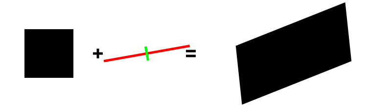

.. _meca_measure_strain:

##############################
Measure Strain
##############################

:Version: |version|
:Release: |release|
:Date: |today|

The goal of this document is to explain how to measure the strain of a system between a reference configuration and a current configuration.

.. seealso:: The method presented here requiers to know the appariement between points in the reference configuration and points in the actual configuration. For a method based on inertia that discard this limitation but is less simple to interpret physically see :ref:`meca_measure_strain_inertia`

System definition
#####################

The system considered will be a simple box in the reference state. In the actual configuration, the system have been deformed to assume an elongated box shape.

+---------------------------------+---------------------------------+
|.. image:: reference_shape.png   |.. image:: actual_shape.png      |
|    :width: 150pt                |    :width: 150pt                |
|    :align: center               |    :align: center               |
+---------------------------------+---------------------------------+
|.. centered:: Reference          |.. centered:: Actual             |
+---------------------------------+---------------------------------+

Each shape is represented by a set of points computed from the picture of the shape in both it's reference configuration and actual configuration. We assume that the lineage of each point in the reference configuration is known. Hence, there exist a deformation :math:`$\underline{\underline{F}}$` and a translation :math:`$\underline{T}$` such as:

.. math::
    \underline{X}_{act} = \underline{\underline{F}} . \underline{X}_{ref} + \underline{T}

Strain
#####################

The strain of a transformation is a measure of the intrinsic deformation of the shape when all solid transformations (translations and global rotations) have been removed.

The following code compute the strain between the reference configuration and the actual shape as:

.. math::
    \underline{\underline{\varepsilon}}
    = \frac{1}{2} \log \underline{\underline{S}}
    \quad \textrm{where} \quad
    \underline{\underline{F}} = \underline{\underline{R}} . \underline{\underline{S}}

.. literalinclude:: compute_strain.py

The strain is defined in each direction of space. It can be represented in 2D as a 2x2 matrix.

.. math::
    \underline{\underline{\varepsilon}}
    = \left( \begin{array}{cc}
              0.87 & -0.13 \\
              -0.13 & 0.17
      \end{array} \right)

The principal directions of this tensor provide informations on the main direction of the deformation once solid rotations have been removed:
 - :math:`\varepsilon_1 = 0.89` along :math:`(0.98,-0.18)`
 - :math:`\varepsilon_2 = 0.15` along :math:`(0.18,0.98)`

