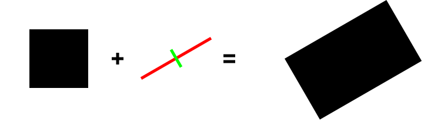

.. _meca_measure_strain_inertia:

##############################
Measure Strain using Inertia
##############################

:Version: |version|
:Release: |release|
:Date: |today|

The goal of this document is to explain how to measure the strain of a system between a reference configuration and a current configuration using a method based on the comparison of the inertia of the shape in the reference and actual configuration.

.. seealso:: Another method based on appariements is presented in :ref:`meca_measure_strain`

System definition
#####################

The system considered will be a simple sphere in the reference state. In the actual configuration, the system have been deformed to assume a elliptic shape.

+---------------------------------+---------------------------------+
|.. image:: reference_shape.png   |.. image:: actual_shape.png      |
|    :width: 150pt                |    :width: 150pt                |
|    :align: center               |    :align: center               |
+---------------------------------+---------------------------------+
|.. centered:: Reference          |.. centered:: Actual             |
+---------------------------------+---------------------------------+

Each shape is represented by a set of points computed from the picture of the shape in both it's reference configuration and actual configuration.

.. literalinclude:: find_shape.py

Inertia
#####################

The inertia of a shape represent roughly the elongation in each direction around it's barycenter.

+---------------------------------+---------------------------------+
|.. image:: reference_inertia.png |.. image:: actual_inertia.png    |
|    :width: 150pt                |    :width: 150pt                |
|    :align: center               |    :align: center               |
+---------------------------------+---------------------------------+
|.. centered:: Reference          |.. centered:: Actual             |
+---------------------------------+---------------------------------+

The following code compute the inertia for both the reference and the actual configuration.

.. literalinclude:: compute_inertia.py

From a math point of view, the inertia in 2D is a 2x2 matrix.

.. math::
    \underline{\underline{I}}_{ref}
    = \left( \begin{array}{cc}
              608 & 0 \\
              0 & 608
      \end{array} \right)
    \quad \quad
    \underline{\underline{I}}_{act}
    = \left( \begin{array}{cc}
              2069 & -689 \\
              -689 & 1279
      \end{array} \right)

In the picture above, each inertia matrix has been represented by it's principal directions.

Strain
#####################

The strain of a transformation is a measure of the intrinsic deformation of the shape when all solid transformations (translations and global rotations) have beeen removed.

The following code compute the strain between the reference configuration and the actual shape as:

.. math::
    \underline{\underline{\varepsilon}}
    = \frac{1}{2} \left( \log \underline{\underline{I}}_{act}
    - \log \underline{\underline{I}}_{ref} \right)

.. literalinclude:: compute_strain.py

The strain is defined in each direction of space. It can be represented in 2D as a 2x2 matrix.

.. math::
    \underline{\underline{\varepsilon}}
    = \left( \begin{array}{cc}
              0.57 & -0.22 \\
              -0.22 & 0.31
      \end{array} \right)

The principal directions of this tensor provide informations on the main direction of the deformation:
 - :math:`\varepsilon_1 = 0.70` along :math:`(0.87,-0.50)`.
 - :math:`\varepsilon_2 = 0.19` along :math:`(0.50,0.87)`.

