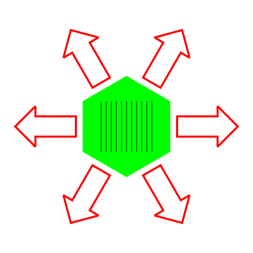
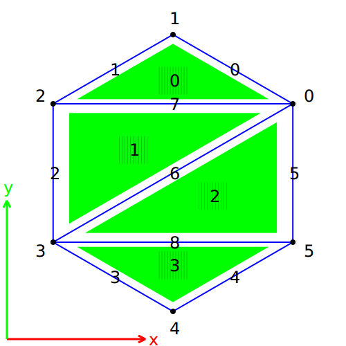
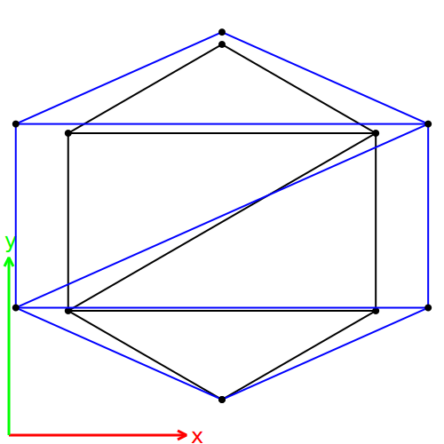
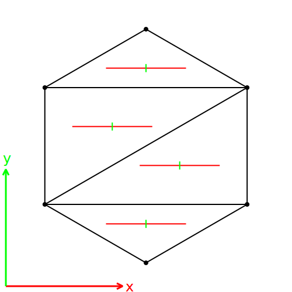

.. _meca_membrane_material_anisotropy:

################################
Material anisotropy on membranes
################################

:Version: |version|
:Release: |release|
:Date: |today|

The goal of this document is to explain the behaviour of elastic membranes when subjected to different forces. The python script for this example can be downloaded (download file: :download:`simu.py`) and run in a shell console using::

	user@computer:$ python simu.py

.. seealso:: The result shown here might be compared with the one obtained in :ref:`meca_membrane_force_anisotropy`

System description
##################

The system is a single membrane whose geometry, in it's reference state, is a flat hexagon with:
 - a radius of 1 (m)
 - a uniform thickness of 0.01 (m)

The material, the membrane is made of, is isotropic and characterized by:
 - a Young's modulus of 10 (GPa, wood for example)
 - a Poisson's ratio of 0.1 (none)

The material, the membrane is made of, is anisotropic (fiber reinforced for example) and characterized by:
 - a Young's modulus of 10 (GPa) along Ox
 - a Young's modulus of 100 (GPa) along Oy
 - a Poisson's ratio of 0 (none)
 - a shear modulus of 30 (GPa)

A force is applied on each vertex that pull apart every edges with an intensity of 1Oe6 (N). On the picture stripes represent the direction of fibers.

.. literalinclude:: simu.py
    :start-after: #begin parameters
    :end-before: #end parameters

System representation
#####################

-------------------------
Geometry
-------------------------

To represent the geometry of such a system, we use a triangle mesh composed of 4 triangles as despicted on the picture below:

The following code create the mesh.

.. literalinclude:: simu.py
    :start-after: #begin create mesh
    :end-before: #end create mesh

-------------------------
Mechanics
-------------------------

The mechanics of the system is simulated using one triangle membrane spring per face of the mesh.

.. literalinclude:: simu.py
    :start-after: #begin create mechanical representation
    :end-before: #end create mechanical representation

To ensure the convergence of the algorithm and reach an equilibrium state, we add a damping factor to all points.

.. literalinclude:: simu.py
    :start-after: #begin create damper
    :end-before: #end create damper

Applied forces are introduced as boundary conditions. Each point at the extremity of one edge receive half the force applied on this edge. To prevent any translation of the system the bottom point is fixed. Moreover, to prevent any rotation of the system the top point is constrained to move only according the Oy axis.

.. literalinclude:: simu.py
    :start-after: #begin gradient of energy
    :end-before: #end gradient of energy

Simulation
###############

To find a mechanical equilibrium, we let the system evolve up to a minimum of energy using an integration algorithm. The evolution function is similar to the one introduced in :ref:`meca_basics_mechanics_lib`.

.. literalinclude:: simu.py
    :start-after: #begin evolution
    :end-before: #end evolution

We will consider that an equilibrium is reached when the resulting force computed on each point is less than 1e-7 (N).

.. literalinclude:: simu.py
    :start-after: #begin find equilibrium
    :end-before: #end find equilibrium

The picture above display the final shape of the simulated system compared to the reference shape. To emphasize the deformation, all displacements have been scaled 30 times. The reference configuration of the membrane is black and the current configuration of the membrane is blue.

.. literalinclude:: simu.py
    :start-after: #begin draw equilibrium state
    :end-before: #end draw equilibrium state

Analysis
###############

The actual strain of each triangle is computed in the final configuration of the system. Since, each strain tensor is computed in the local reference frame of the elastic element considered, extra care must be taken to express it in the global reference frame before performing any computation.

.. literalinclude:: simu.py
    :start-after: #begin equilibrium state
    :end-before: #end equilibrium state

On the picture below, the strain of each triangle is represented through it's principal directions (once again, deformations have been scaled 30 times to be visible).

The mean strain encountered by the whole membrane is roughly:

.. math::
    \underline{\underline{\varepsilon}}
    = \left( \begin{array}{cc}
              10^{-2} & 0 \\
              0 & 10^{-3}
      \end{array} \right)

.. literalinclude:: simu.py
    :start-after: #begin draw equilibrium strain
    :end-before: #end draw equilibrium strain

