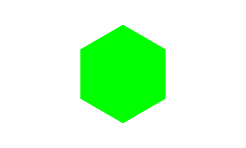
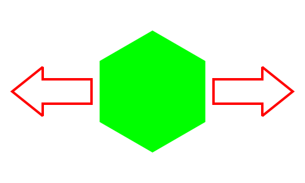
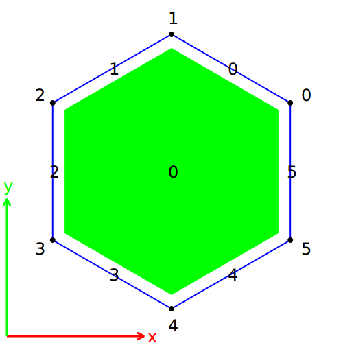
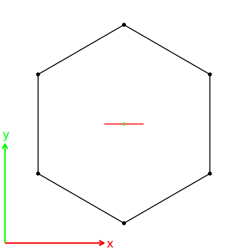

.. _meca_membrane_polygon:

############################################
Mechanics of membranes using polygon springs
############################################

:Version: |version|
:Release: |release|
:Date: |today|

The goal of this document is to explain the behaviour of elastic membranes when subjected to different forces.

.. seealso:: The result shown here might be compared with the one obtained in :ref:`meca_membrane_force_anisotropy`. In this document we will use a single polygonal spring instead of multiple triangles.

System description
##################

The system is a single membrane whose geometry, in it's reference state, is a flat hexagon with:
 - a radius of 1 (m)
 - a uniform thickness of 0.01 (m)

The material, the membrane is made of, is isotropic and characterized by:
 - a Young's modulus of 10 (GPa, wood for example)
 - a Poisson's ratio of 0.1 (none)

A force is applied horizontally that pull apart both vertical edges with an intensity of 1Oe6 (N).

System representation
#####################

-------------------------
Geometry
-------------------------

To represent the geometry of such a system, we use a polygonal mesh composed of a unique face bordered by 6 edges as despicted on the picture below:

The following code create the mesh.

.. literalinclude:: create_mesh.py

-------------------------
Mechanics
-------------------------

The mechanics of the system is simulated using a single polygonal spring for the unique face of the mesh.

.. literalinclude:: create_springs.py

Applied forces are introduced as boundary conditions. Each point at the extremity of one edge receive half the force applied on this edge. Since the overall system is symmetric and due to the resolution method used, there is no need for any boundary condition to fix the displacement of points.

.. literalinclude:: create_boundary.py

Simulation
###############

To find a mechanical equilibrium, we let the system evolve up to a minimum of energy using an integration algorithm. We will consider that this equilibrium is reached when the resulting force applied on each point is less than 1e-6 (N).

.. literalinclude:: find_equilibrium.py

The picture above display the final shape of the simulated system compared to the reference shape. To emphasize the deformation, all displacements have been scaled 30 times. The reference configuration of the membrane is black and the current configuration of the membrane is blue.

Analysis
###############

On the picture below, the strain of the face is represented through it's principal directions (once again, deformations have been scaled 30 times to be visible).

The mean strain encountered by the whole membrane is:

.. math::
    \underline{\underline{\varepsilon}}
    = \left( \begin{array}{cc}
              7.10^{-3} & 0 \\
              0 & -7.10^{-4}
      \end{array} \right)

