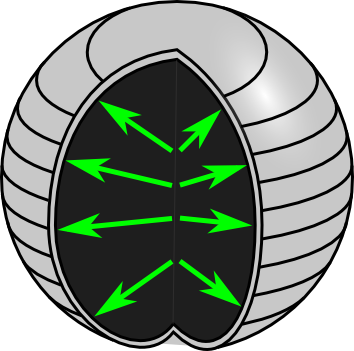
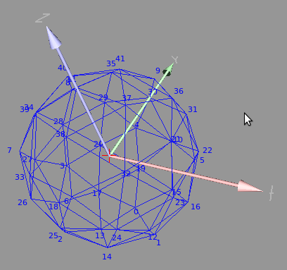
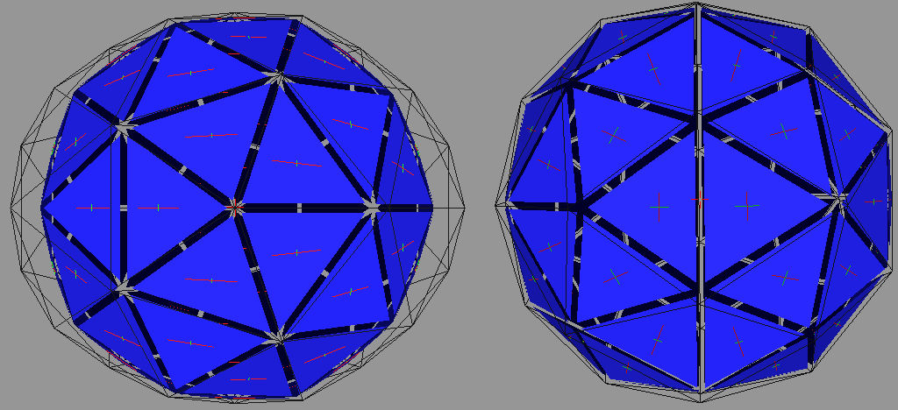
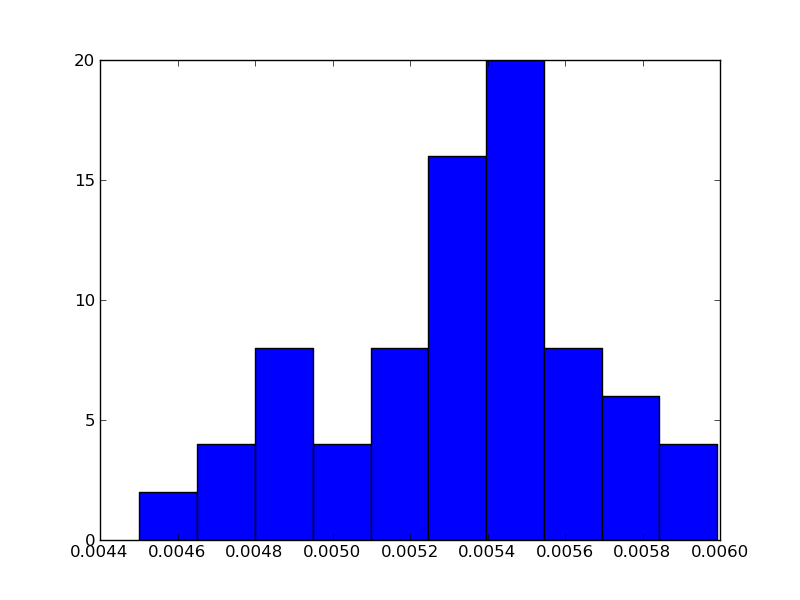
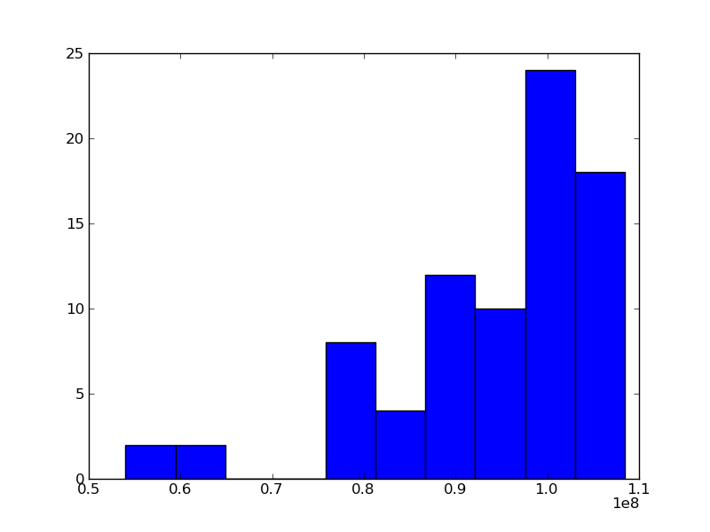

.. _meca_membrane_sphere_aniso:

#################################
Sphere with anisotropic material
#################################

:Version: |version|
:Release: |release|
:Date: |today|

The goal of this document is to reproduce the isotropic sphere (:ref:`meca_membrane_sphere_iso`) using an anisotropic material. The python script for this example can be downloaded (download file: :download:`simu.py`) and run in a shell console using::

	user@computer:$ python simu.py

System description
##################

The system is a sphere membrane characterized in its reference state by:
 - a radius of 1 (m)
 - a uniform thickness of 0.01 (m)

The material, the membrane is made of, is anisotropic and characterized by:
 - a Young's modulus of 10 (GPa, wood for example) in a direction perpendicular to fibers
 - a Young's modulus of 100 (GPa) in the fiber direction
 - a Poisson's ratio of 0. (none)

A pressure tends to inflate the sphere.

.. literalinclude:: simu.py
    :start-after: #begin parameters
    :end-before: #end parameters

System representation
#####################

-------------------------
Geometry
-------------------------

To represent the geometry of such a system, we use a triangle mesh read from a mesh file using `openalea.container` methods:

.. literalinclude:: simu.py
    :start-after: #begin read mesh
    :end-before: #end read mesh

-------------------------
Mechanics
-------------------------

The mechanics of the system is simulated using one triangle membrane spring per face of the mesh. Depending on the orientation of the face according, it's constituting material is more or less anisotropic.

.. literalinclude:: simu.py
    :start-after: #begin create springs
    :end-before: #end create springs

To ensure the convergence of the algorithm and reach an equilibrium state, we add a damping factor to all points.

.. literalinclude:: simu.py
    :start-after: #begin create damper
    :end-before: #end create damper

Applied forces are introduced as boundary conditions. Each point in the corner of a triangle is loaded with a third of the pressure force acting on this triangle. To prevent any translation of the system the bottom point is fixed. Moreover, to prevent any rotation of the system the top point is constrained to move only according the Oz axis.

.. literalinclude:: simu.py
    :start-after: #begin gradient of energy
    :end-before: #end gradient of energy

Simulation
###############

To find a mechanical equilibrium, we let the system evolve up to a minimum of energy using an integration algorithm. The evolution function is similar to the one introduced in :ref:`meca_basics_mechanics_lib`.

.. literalinclude:: simu.py
    :start-after: #begin evolution
    :end-before: #end evolution

We will consider that an equilibrium is reached when the resulting force computed on each point is less than 1e-3 (N).

.. literalinclude:: simu.py
    :start-after: #begin find equilibrium
    :end-before: #end find equilibrium

Analysis
###############

On the picture below, the strain of each triangle is represented through it's principal directions (deformations have been scaled 20 times to be visible).

.. literalinclude:: simu.py
    :start-after: #begin display final state
    :end-before: #end display final state

From an anlytical point of view, we expect the norm of the strain to be range from 0.005 to 0.01.

.. literalinclude:: simu.py
    :start-after: #begin strain distribution
    :end-before: #end strain distribution

The stress, however, is expected to still be uniform equal to 1e8 Pa.

.. literalinclude:: simu.py
    :start-after: #begin stress distribution
    :end-before: #end stress distribution

