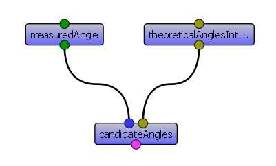

.. currentmodule:: vplants.phyllotaxis_analysis

User guide
##########

This is a tutorial for ``Phyllotaxis Analysis`` package, this package contains mainly the algorithms and the model previously published as 
`A Combinatorial Model of Phyllotaxis Perturbations in Arabidopsis thaliana <http://www.springerlink.com/content/f7024hu7q03m1221/>`_. 

``Phyllotaxis Analysis`` package provides tools to study phyllotaxis perturbations. More precisely, the tools allow you to see whether the 
perturbations are due to permutations of organs on the stem. 
Before doing this tutorial, you may read the paper, however during the tutorial we explain the main ideas and notions of the model and algorithms.

Installation
============

First you need to install the package::
    
    alea_install -U vplants.phyllotaxis_analysis

You can also use the OpenAlea installer.

After installation, to launch the graphical user interface:: 

    phyllotaxisAnalyzer

Analysis of sequences
=====================
Phyllotaxis is the organization of botanical elements e.g. leaves on the stem. It can be characterized by the angle between two successive leaves 
on the stem called divergence angle. 
The divergence angle is approximately constant e.g. close to 137.5 degrees, 99.5 degrees, etc which are referred to as canonical angles. 
The divergence angles can be measured along the stem generating a sequences of angles. 
Ideally a measured sequence would be composed of canonical angles. 
However some perturbations can be observed. 
The ``Phyllotaxis Analysis`` package provides tools to test whether the perturbations are due to permutations of leaves (or other botanical elements) 
on the stem.

Reading measured divergence angles from a file
************************************************
One can measure the sequences of divergence angles and then save them in a file. Then to analyse the measured sequences, we need to read them. 
The :ref:`read_file_mod` provides functions to read measured sequences saved in a file:

    >>> from vplants.phyllotaxis_analysis.read_file import * 

If the sequences of measured angles are saved in a csv file such that each column corresponds to measured divergence angles of a plant, 
to extract sequences you can use :func:`read_file.readCSVFile` function:

    >>> measuredSeqs = readCSVFile("./fileName.csv")

In VisuAlea, use  ``readCSVFile`` node in the phyllotaxis_analysis package.

	
Now measuredSeqs is a list of sequences of measured angles.
If you have just one sequence of measured angle to analyse you can simply use a Python list.

Example::

	measuredSeq = [120, 145, 280, 220, 270, 150, 145, 115, 135, 280, 225, 70, 240, 260, 145, 125, 285, 225, 260, 285, 235, 260, 145]

Here after we will suppose that the measured sequence is in the list ``measuredSeq``. 

To analyse your data, you need to import functions provided in :ref:`analysis_functions_mod` analysis_functions module::

	from vplants.phyllotaxis_analysis.analysis_functions import * 

If the measured sequence is in clockwise (or counterclockwise) orientation, to put it in counterclockwise orientation (or clockwise orientation) 
you can use   :func:`analysis_functions.counterClockwise` function::

	ccwSequence = counterClockwise(measuredSeq)
	
In VisuAlea, use ``counterClockwise`` node in the phyllotaxis_analysis package.	

Analysing sequences of theoretical angles
*******************************************
.. currentmodule:: vplants.phyllotaxis_analysis.analysis_functions  
In this section, we suppose that the sequences that we have are multiples of canonical divergence angle (e.g. 137.5, 99.5). Given the maximum number of organs involved in permutations and the canonical angle, we can calculate all possible theoretical angles both in degrees and integers representing coefficients of canonical angles.

In Python, use the function :func:`theoretical_divergence_angles` or 
in VisuAlea, use ``theoretical_divergence_angles`` node in the phyllotaxis_analysis package.	

For example::

    >>> permutationBlockMaxSize, canonicalAngle = 3, 137.5
    >>> print theoretical_divergence_angles(permutationBlockMaxSize, canonicalAngle)
    ([85.0, 222.5, 137.5, 275.0, 52.5, 190.0, 327.5], [-2, -1, 1, 2, 3, 4, 5])

We need to define intervals around theoretical angles, for example for ``permutationBlockMaxSize == 3``, we can define a dictionary in which for each theoretical angle an interval is associated::

    >>> theoreticalAnglesIntervals = {137.5: [104, 170], 
                                      222.5: [195, 255], 
                                      52.5: [5, 79], 
                                      275: [241, 308], 
                                      85: [57, 118], 
                                      190: [156, 217], 
                                      327.5: [294, 14]}

Given such a dictionary of intervals and a measured angle, we can find the theoretical angles that can correspond to a measured angle (:func:`candidateAngles`)::

    >>> measuredAngle=10
    >>> candidateAngles(measuredAngle, theoreticalAnglesIntervals)
    [52.5, 327.5]

In VisuAlea, use ``candidateAngles`` node in the phyllotaxis_analysis package.

	
A sequence of divergence angles is called *n*-admissible, if the non canonical angles can be explained by permutations involving at most *n* successive organs. 
Given a sequence of theoretical angles, you can use :func:`isNadmissible` in order to know whether the sequence is *n*-admissible. :func:`isNadmissible` gets the sequence and the canonical angle as its arguments and returns the maximum number of organs involved in a permutation, list of permuted organs, and order index series of the sequence, it returns 0 and two empty lists if the input is not an *n*-admissible sequence.  Order index series is the order of appearance of organs the first being 0::

    >>> # Sequence of theoretical angles
    >>> seqTA = [137.5, 137.5, 275, 222.5, 275, 137.5]
    >>> print isNadmissible(seqTA, 137.5)
    (2, ([[4, 3]], [0, 1, 2, 4, 3, 5, 6]))

In VisuAlea, use ``isNadmissible`` node in the package phyllotaxis_analysis.

You can also specify maximum number of organs involved in permutations, and then use :func:`isNadmissible` function to see whether for a given number of permutated organs the sequence is *n*-admissible::

    >>> print isNadmissible(seqTA, 137.5, 2)
    (2, ([[4, 3]], [0, 1, 2, 4, 3, 5, 6]))

If you have a list of intergers and you would like to see whether it is order index series of any *n*-admissible sequence, you can use :func:`isNAdmissibleIntegers`. It also returns list of permutated:: 

    >>> orderIndexSeries = [0, 1, 2, 4, 3, 5, 6]
    >>> print isNAdmissibleIntegers(orderIndexSeries, 2)
    (True, [[4, 3]])
	
Analysing sequences of measured angles
*****************************************
In this section, we are going to see how we can analyse a sequence of measured angles. To analyse a sequence of measured angles you should use  :func:`codeSequence`. 
It takes as input a sequence of measured angles, maximum number of organs involved in permutations, canonical angle, a dictionary of intervals, a concentration parameter, and a threshold value. 
The concentration parameter is used to calculate probability of assigning a theoretical angle to a measured angle. If this probability is below the threshold, the theoretical angle can not be assigned to the measured angle. It returns a list of *n*-admissible trees and depth of leaves. An *n*-admissible tree is a tree whose paths from root to its leaves are *n*-admissible::

	codeSequence(sequenceOfMeasuredAngles, permutationBlockMaxSize, canonicalAngle, theoreticalAnglesIntervals, kappa, threshold)

For example::

	>>> ListOfTreesIndex = codeSequence(measuredSeq, 3, 137.5, theoreticalAnglesIntervals, kappa = 10.4, threshold = 0.05 )

In VisuAlea, use ``codeSequence`` node in the phyllotaxis_analysis package.

	
To extract the prediction from the *n*-admissible tree, use :func:`extractSequences`. :func:`extractSequences` ` also returns the angles for which :func:`codeSequence` could not assign a theoretical angle which are called not explained angles. 
We consider all chained permutations preceding a not explained angle as invalid permutations. More precisely, if an angle is not explained, we should invalidate all preceding permutations down to the leftmost angle before the not explained angle not involved in a permutation. 
These chained permutations are marked by :func:`extractSequences` as invalidated angles::

	extractSequences(ListOfTreesIndex, sequenceOfMeasuredAngles, permutationBlockMaxSize, canonicalAngle)

More precisely, it returns the most probable prediction (sequence of theoretical angles), list of non-explained angles, permutations list, and invalidated organs indexes. 

For example::

	>>> bestSequence, notExpalinedAngles, validPermutations, invalids = extractSequences(ListOfTreesIndex, measuredSeq, 3, 137.5)
	
	>>> print bestSequence
	[137.5, 137.5, 275, 222.5, 275, 137.5, 137.5, 137.5, 137.5, 275, 222.5, 52.5, 222.5, 275, 137.5, 137.5, 275, 222.5, 275, 275, 222.5, 275, 137.5]

In VisuAlea, use ``extractSequences`` node in the phyllotaxis_analysis package.

	
You can use :func:`invalidateSeq` function that takes a sequence of theoretical angles, list of not explained angles, and maximum size of permutation blocks and returns list of invalidated angles::
	
	invalidateSeq(sequenceOfTheoreticalAngles, notExpalinedAngles, permutationBlockMaxSize)

In VisuAlea, use ``invalidateSeq`` node in the phyllotaxis_analysis package.

In the following, we provide you all of the code that we used in thsi tutorial.

.. literalinclude:: tutorial_code.py

Analysis of sequences using graphical user interface
=====================================================
A graphical user interface has been developed that has all the above mentioned functionalities. To use it, you need to launch ``phy``. You can open a csv file, or a text file that contains the measured angles. Then 
to analyze the sequence choose the plant number and set the parameters, then click the analyze button. To analyze the whole file, click on the Analyze the file. You can also enter a sequence manually.
A tool-tip is associated to each button that helps to know what each button does. Setting the canonical divergence allow you to test different phyllotactic modes. You can also change the orientation of a sequence and analyse the reversed sequence.
The default parameter values are saved in a python module ``parameters.py`` which also contains a dictionary of intervals, you can change it by replacing the intervals dictionary.

To see the prediction and plot the results click on the plot button.

Screen shots
===============

.. mod:: vplants.phyllotaxis_analysis.read_file
.. mod:: vplants.phyllotaxis_analysis.analysis_functions