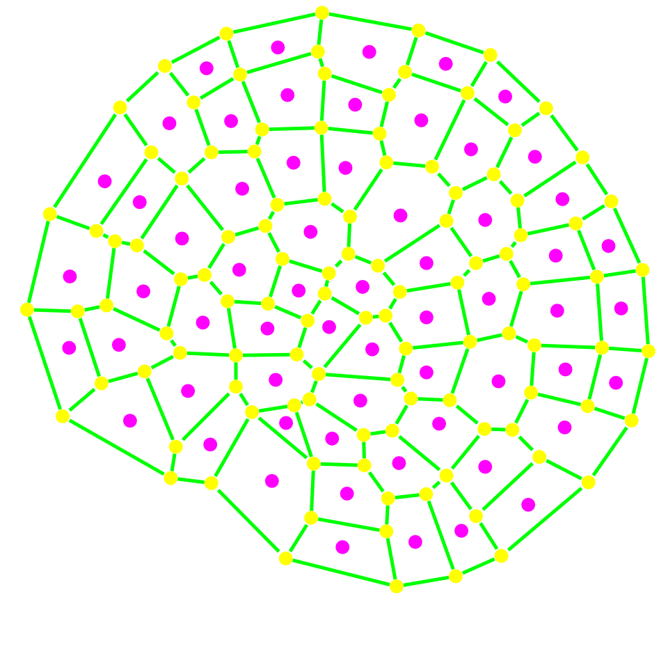

.. _tissue_planar2D:

#######################
 Divide Tissue 2D
#######################

:Version: |version|
:Release: |release|
:Date: |today|

The goal of this document is to describe a simple simulation that allow to divide cells according to a set of rules. The python script for this example can be downloaded (download file: :download:`simu.py`) and run in a shell console using::

	user@computer:$ python simu.py

-------------------------
Data acquisition
-------------------------

The tissue we will use in this simulation is the one that has been created in :ref:`tissue_draw2D` (:download:`coleochaete.zip`).

However, any 2D tissue that defines a single mesh relationship between it's elements can be used. This tutorial must be adapted for tissues with more properties and more topological relation between their elements. The following code will test that the tissue meets these requirements.

.. literalinclude:: simu.py
    :start-after: #begin open tissue
    :end-before: #end open tissue

As a simple example, we add a new random property attached to each cell that will track the division of cells throughout time.

.. literalinclude:: simu.py
    :start-after: #begin add properties
    :end-before: #end add properties

--------------------------
Division algorithm
--------------------------

The geometry of each cell is a polygone in 2D. To maintain this property throughout divisions, cell division must occur along a plane. The division algorithm will then take a cell id and a division plane and will perform all operations necessary to obtain two daughters cells with updated properties. The shrink factor correspond to a geometrical shrinking of the newly created separation wall both to be compliant with biological observations and to ensure that cells remains more or less convex.

.. literalinclude:: simu.py
    :start-after: #begin division algo
    :end-before: #end division algo

The choice of the division plane is a tradeoff among several rules that have been postulated through times. All of them postulate that the division plane pass through the barycenter of the cell but differs in the orientation of the division plane:
 - division occurs preferentially along the main geometrical axis of the cell.
 - division occurs along the smallest wall that pass through the center of the cell.
 - division occurs along the wall that pass through the center of the cell and is perpendicular to already exisiting cell walls.
 - division tends to create two daughter cells with the same volume.

The actual division plane used in this tutorial will be a linear combination of all these rules. The easiest way to find a wall that meet the requirement is to perform a fake cell division on a local clone of the mesh for a given direction and to measure wall length, wall perpendicularity and daughter cells sizes. If this operation is conducted for a set of predefined direction, one can obtain the best direction for each criteria. The chosen one will be a linear combination of the best direction for each rule.

.. literalinclude:: simu.py
    :start-after: #begin find division plane
    :end-before: #end find division plane

-----------------------------
GUI
-----------------------------

Display Tissue
###############

The tissue is displayed using:
 - a ScalarPropView to represent `prop` in each cell
 - a MeshView2D to display cell walls

.. literalinclude:: simu.py
    :start-after: #begin display tissue
    :end-before: #end display tissue

Defines Interaction Functions
#############################

To interact with this tissue, we need to define a GUI:
 - to set the value of weight and shrink parameters
 - defines which cell need to be divided

The gui to set parameters is drawn using Qt Designer (:download:`simu.ui`). We just define a function to retrieve the value of parameters.

.. literalinclude:: simu.py
    :start-after: #begin retrieve parameters
    :end-before: #end retrieve parameters

Then a single action is defined to divide all cells in the tissue according to the current parameters.

.. literalinclude:: simu.py
    :start-after: #begin define actions
    :end-before: #end define actions

The last interaction allow the user to select a single cell he wants to divide.

.. literalinclude:: simu.py
    :start-after: #begin define tools
    :end-before: #end define tools

Setup and start GUI
###################

Basically the only part left is to create a Viewer to display the tissue and a TemplateGUI to assemble the different parts of the gui together.

.. literalinclude:: simu.py
    :start-after: #begin launch GUI
    :end-before: #end launch GUI

-------------------------------
Results
-------------------------------

Shrink Factor
#############

+-----------------------------------+-----------------------------------+
|  .. image:: res_shrink_0.png      |.. image:: res_shrink_10.png       |
|      :width: 100%                 |    :width: 100%                   |
|      :align: center               |    :align: center                 |
+-----------------------------------+-----------------------------------+

