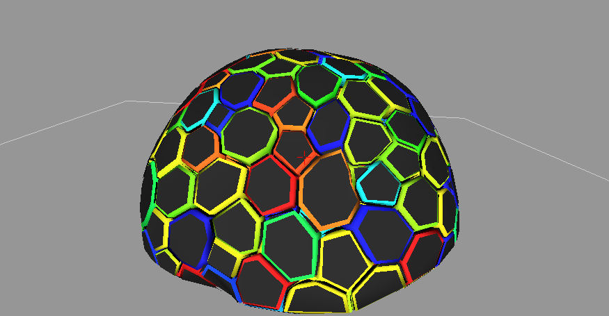

.. _tissue_simple3D:

#######################
 Divide Tissue 3D
#######################

:Version: |version|
:Release: |release|
:Date: |today|

The goal of this document is to describe a simple simulation that allow to divide cells interactivaly on a 3D tissue. This tutorial is similar to :ref:`tissue_planar2D` where we keep a single rule of division according to the main axis of the cell. The python script for this example can be downloaded (download file: :download:`simu.py`) and run in a shell console using::

	user@computer:$ python simu.py

-------------------------
Data acquisition
-------------------------

The tissue we will use in this simulation is the one that has been created in :ref:`tissue_delaunay3D` (:download:`tissue.zip`).

However, any 3D tissue that defines a single mesh relationship between it's elements can be used. This tutorial must be adapted for tissues with more properties and more topological relation between their elements. The following code will test that the tissue meets these requirements.

.. literalinclude:: simu.py
    :start-after: #begin read tissue
    :end-before: #end read tissue

As a simple example, we add a new random property attached to each cell that will track the division of cells throughout time.

.. literalinclude:: simu.py
    :start-after: #begin add property
    :end-before: #end add property

--------------------------
Division algorithm
--------------------------

The geometry of each cell is a polyedra in 3D. To maintain this property throughout divisions, cell division must occur along a plane. The division algorithm will then take a cell id and a division plane and will perform all operations necessary to obtain two daughters cells with updated properties. The shrink factor correspond to a geometrical shrinking of the newly created separation wall both to be compliant with biological observations and to ensure that cells remains more or less convex.

.. literalinclude:: simu.py
    :start-after: #begin division algo
    :end-before: #end division algo

The actual division plane used in this tutorial will be a perpendidular to the main axis of the cell and will pass through the center of the cell.

.. literalinclude:: simu.py
    :start-after: #begin division plane
    :end-before: #end division plane

-----------------------------
GUI
-----------------------------

Display Tissue
###############

The tissue is displayed using:
 - a ScalarPropView to represent `prop` in each cell
 - a MeshView to display cell walls

.. literalinclude:: simu.py
    :start-after: #begin display tissue
    :end-before: #end display tissue

Defines Interaction Functions
#############################

To interact with this tissue, we need to define a GUI:
 - to set the value of the shrink parameter
 - defines which cell need to be divided

The gui to set parameters is drawn using Qt Designer (:download:`simu.ui`). We just define a function to retrieve the value of parameters.

.. literalinclude:: simu.py
    :start-after: #begin retrieve parameters
    :end-before: #end retrieve parameters

Then a single action is defined to divide all cells in the tissue according to the current parameters.

.. literalinclude:: simu.py
    :start-after: #begin define action
    :end-before: #end define action

The last interaction allow the user to select a single cell he wants to divide.

.. literalinclude:: simu.py
    :start-after: #begin define tool
    :end-before: #end define tool

Setup and start GUI
###################

Basically the only part left is to create a Viewer to display the tissue and a TemplateGUI to assemble the different parts of the gui together.

.. literalinclude:: simu.py
    :start-after: #begin launch simu
    :end-before: #end launch simu

-------------------------------
Results
-------------------------------

Shrink Factor
#############

+-----------------------------------+-----------------------------------+
|  .. image:: res_shrink_0.png      |.. image:: res_shrink_10.png       |
|      :width: 100%                 |    :width: 100%                   |
|      :align: center               |    :align: center                 |
+-----------------------------------+-----------------------------------+

