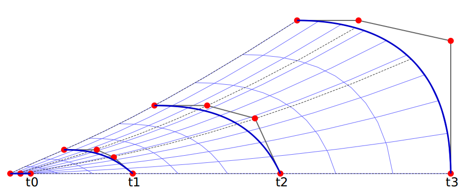
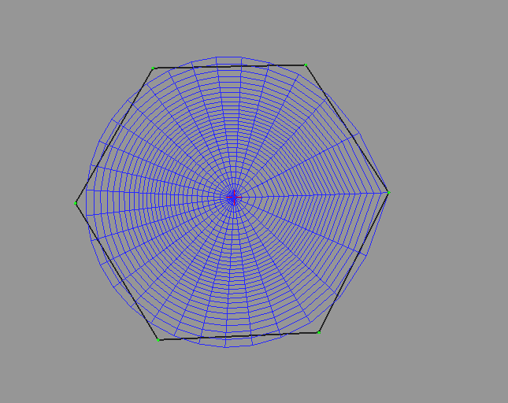

.. _tissue_growth_changing_field:

########################################
Positions fixed in a Growing Space
########################################

:Version: |version|
:Release: |release|
:Date: |today|

The goal of this document is to describe a simple simulation in which a surfacic tissue grow by staying fix in a global field that change in time and space. The python script for this example can be downloaded (download file: :download:`simu.py`) and run in a shell console using::

	user@computer:$ python simu.py

.. seealso:: This way of growing a tissue is a kind of dual view of the one described in :ref:`tissue_growth_fixed_field`

-------------------------
Data acquisition
-------------------------

Growth Field
############

In this simulation the growth field will be radial, Oz being the axis of symmetry. Hence, we just need to describe the field in a plane. Since the simulation is surfacic, space field will be described along a curve in a 2D space. Nurbs are particularly well adapted to describe this curve since they require only a small number of control point to obtain a smooth space curve. The following code create the Nurbs that will represent a radial frame of the space field for 4 different times.

.. literalinclude:: simu.py
    :start-after: #begin create steps
    :end-before: #end create steps

Since space evolve throughout time, for each time step such a curve must be provided. Here Nurbs can be used too to interpolate the position of control points throughout time. The evolution of a lineic slice of space throughout time is then described using a 2D Nurbs patch.

.. literalinclude:: simu.py
    :start-after: #begin create field
    :end-before: #end create field

Tissue
######

Since the tissue is destined to grow, there is no need to start with a complex tissue. A single hexagonal cell will do the trick.

.. literalinclude:: simu.py
    :start-after: #begin create tissue
    :end-before: #end create tissue

------------------------------
Growth
------------------------------

Each point of the tissue is characterized by a spatial 3D position.  This position correspond to a unique (u,v) coordinate in the provided growth field. For each point on the surface defined by the growth field a bijection can be defined between coordinates expresses in the cartesian frame and coordinates expressed in the patch uv coordinates.

.. literalinclude:: simu.py
    :start-after: #begin bijection
    :end-before: #end bijection

Throughout time, the (u,v) coordinates of a point stay fixed and this is the space that grow.

.. literalinclude:: simu.py
    :start-after: #begin growth func
    :end-before: #end growth func

The growth computation must just update the cartesian coordinates of the points in the new description of space.

.. literalinclude:: simu.py
    :start-after: #begin growth
    :end-before: #end growth

------------------------------
Cell Division
------------------------------

Since the tissue is growing, at some point, cells must be divided

The following code compute the main axis of a cell that will be used to choose the direction of division.

.. literalinclude:: simu.py
    :start-after: #begin find axis
    :end-before: #end find axis

The division computation must perform the actual division of the mesh that represent the geometry of the tissue and update properties attached to the cell.

.. literalinclude:: simu.py
    :start-after: #begin cell division
    :end-before: #end cell division

Cells are divided as soon as their surface reach a given threshold.

.. literalinclude:: simu.py
    :start-after: #begin division
    :end-before: #end division

--------------------------------
Display Tissue
--------------------------------

Each cell of the tissue is displayed as a polygon which color depends on the value of the property associated with the cell.

.. literalinclude:: simu.py
    :start-after: #begin display func
    :end-before: #end display func

--------------------------------
Scheduler
--------------------------------

In order to organize and iterate through the different tasks, a scheduler is defined.

.. literalinclude:: simu.py
    :start-after: #begin create scheduler
    :end-before: #end create scheduler

--------------------------------
Launch Simulation
--------------------------------

The only left is to define a GUI to interact with the scheduler and display the tissue. The only interaction left to the user consist in resetting the value of the property associated with each cell in order to follow cell lineage.

.. literalinclude:: simu.py
    :start-after: #begin launch simu
    :end-before: #end launch simu

.. table:: Simulation results

    +-----------------------------------+-----------------------------------+
    |  .. image:: res_step0.png         |.. image:: res_step1.png           |
    |      :width: 100%                 |    :width: 100%                   |
    |      :align: center               |    :align: center                 |
    +-----------------------------------+-----------------------------------+
    |  .. image:: res_step2.png         |.. image:: res_step3.png           |
    |      :width: 100%                 |    :width: 100%                   |
    |      :align: center               |    :align: center                 |
    +-----------------------------------+-----------------------------------+

