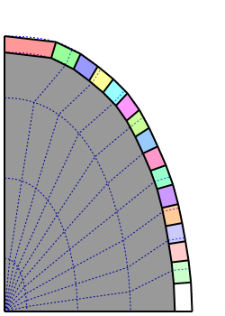

.. _tissue_growth_changing_field_2D:

###########################################
Positions fixed in a 2D Growing Space
###########################################

:Version: |version|
:Release: |release|
:Date: |today|

The goal of this document is to describe a simple simulation in which a 2D tissue grow by staying fix in a global field that change in time and space. The python script for this example can be downloaded (download file: :download:`simu.py`) and run in a shell console using::

	user@computer:$ python simu.py

.. seealso:: This way of growing a tissue is similar to the one described in :ref:`tissue_growth_changing_field`

-------------------------
Data acquisition
-------------------------

Growth Field
############

In this simulation, space will be described as a 2D nurbs patch with a local coordinate system (u,v). This space will evolve throughout time as a linear interpolation of a set of frames for given times. In fact, we will just describe space in the first frame (t = 0) and the last frame (t = 1) but other intermediate frames might be added.

For a given frame, space is defined by hand using an external editor (like `inkscape <http://www.inkscape.org/>`_ for example). The nurbs patch is described as a set of curves. Each curve describes the evolution of u coordinate for a fixed v. V coordinate is a linear interpolation between each curve. The following code read such a nurbs patch for each layer in the svg file (:download:`growth_field.svg`).

.. literalinclude:: simu.py
    :start-after: #begin space frames
    :end-before: #end space frames

.. warning:: Since space frames will be interpolated throughout time using a linear interpolation of the nurbs control points, a special attention must be taken to have the same number of control points for curves having the same v coordinate. For a given frame however, there is no such requirement.

.. literalinclude:: simu.py
    :start-after: #begin create space
    :end-before: #end create space

Tissue
######

The tissue is created proceduraly. The L1 layer is precisely defined but the internal part is first defined as a single big cell that will be divided later.

.. literalinclude:: simu.py
    :start-after: #begin create tissue
    :end-before: #end create tissue

The picture below show the created tissue on top of the initial space field (in blue dashed lines). Internal cells are summarized, for the moment, by only one big grey cell.

------------------------------
Growth
------------------------------

Each point of the tissue is characterized by a spatial 3D position.  This position correspond to a unique (u,v) coordinate in the provided space field. For each point a bijection can be defined between coordinates expresses in the cartesian frame and coordinates expressed in the patch uv coordinates.

.. literalinclude:: simu.py
    :start-after: #begin bijection
    :end-before: #end bijection

Throughout time, the (u,v) coordinates of a point stay fixed and this is the space that grow.

.. literalinclude:: simu.py
    :start-after: #begin Gfunc
    :end-before: #end Gfunc

The growth computation must just update the cartesian coordinates of the points in the new description of space.

.. literalinclude:: simu.py
    :start-after: #begin growth
    :end-before: #end growth

------------------------------
Cell Division
------------------------------

Since the tissue is growing, at some point, cells must be divided. 

The following code compute the axis of division of a cell. For an internal cell, the main axis is chosen whereas for a cell in L1, the axis of division is perpendicular to the surface.

.. literalinclude:: simu.py
    :start-after: #begin find axis
    :end-before: #end find axis

The division computation must perform the actual division of the mesh that represent the geometry of the tissue and update properties attached to the cell. To maintain the consistency of the L1 throughout time, a smaller shrink factor is used for vertices attached to cells in L1.

.. literalinclude:: simu.py
    :start-after: #begin cell division
    :end-before: #end cell division

Cells are divided as soon as their surface reach a given threshold.

.. literalinclude:: simu.py
    :start-after: #begin division
    :end-before: #end division

--------------------------------
Display Tissue
--------------------------------

Each cell of the tissue is displayed as a polygon which color depends on the value of the property associated with the cell. Cell walls are displayed in black on top of cells.

.. literalinclude:: simu.py
    :start-after: #begin display func
    :end-before: #end display func

--------------------------------
Scheduler
--------------------------------

In order to organize and iterate through the different tasks, a scheduler is defined.

.. literalinclude:: simu.py
    :start-after: #begin create scheduler
    :end-before: #end create scheduler

--------------------------------
Launch Simulation
--------------------------------

The only left is to define a GUI to interact with the scheduler and display the tissue. The only interaction left to the user consist in resetting the value of the property associated with each cell in order to follow cell lineage.

.. literalinclude:: simu.py
    :start-after: #begin launch simu
    :end-before: #end launch simu

.. table:: Simulation results

    +-----------------------------------+-----------------------------------+-----------------------------------+-----------------------------------+
    |  .. image:: res_step0.png         |.. image:: res_step1.png           |  .. image:: res_step2.png         |.. image:: res_step3.png           |
    |      :width: 100%                 |    :width: 100%                   |      :width: 100%                 |    :width: 100%                   |
    |      :align: center               |    :align: center                 |      :align: center               |    :align: center                 |
    +-----------------------------------+-----------------------------------+-----------------------------------+-----------------------------------+

