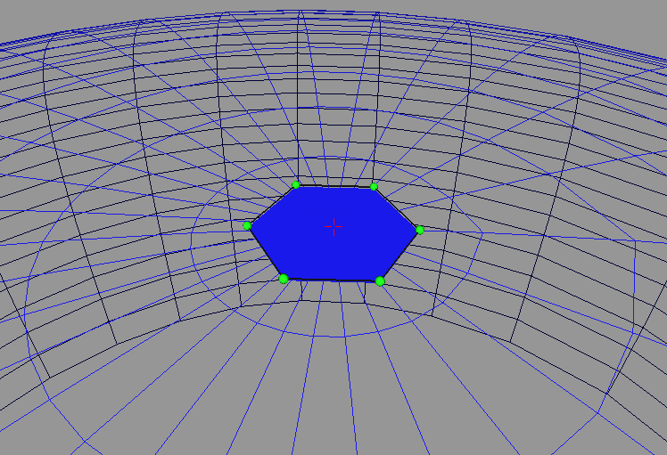

.. _tissue_growth_fixed_field:

######################################
Global Fixed Field
######################################

:Version: |version|
:Release: |release|
:Date: |today|

The goal of this document is to describe a simple simulation in which a surfacic tissue grow in a global field fixed in time and space. The python script for this example can be downloaded (download file: :download:`simu.py`) and run in a shell console using::

	user@computer:$ python simu.py

.. seealso:: This way of growing a tissue is a kind of dual view of the one described in :ref:`tissue_growth_changing_field` in the special case of a stationary field.

-------------------------
Data acquisition
-------------------------

Growth Field
############

In this simulation the growth field will be radial, Oz being the axis of symmetry. Hence, we just need to describe the velocity in a plane. Since the simulation is surfacic, growth will be described along a curve in a 2D space. Nurbs are particularly well adapted to describe this curve since they require only a small number of control point to obtain a smooth acceleration curve. A specific care must be taken to position these control points in order both:
 - to obtain a desired shape for the field
 - to ensure that the metric along the curve stay constant

+-----------------------------------+-----------------------------------+
|  .. image:: field_constant.png    |.. image:: field_acc.png           |
|      :width: 100%                 |    :width: 100%                   |
|      :align: center               |    :align: center                 |
+-----------------------------------+-----------------------------------+
|  .. centered:: constant           |   .. centered:: accelerating      |
+-----------------------------------+-----------------------------------+

.. warning:: If the metrics is not constant along the curve, the geometric growth that will be defined later may loose some meaning.

The following code create the Nurbs that will represent a radial frame of the growth field.

.. literalinclude:: simu.py
    :start-after: #begin create field
    :end-before: #end create field

The resulting growth field is displayed below. It corresponds to a stationary growth field around the origin.

Tissue
######

Since the tissue is destined to grow, there is no need to start with a complex tissue. A single hexagonal cell will do the trick.

.. literalinclude:: simu.py
    :start-after: #begin create tissue
    :end-before: #end create tissue

.. warning:: If the origin of space is not in the original tissue, the resulting simulation will not be stationary.

.. warning:: The origin is a singular point for the defined growth field. TODO

------------------------------
Growth
------------------------------

Each point of the tissue is characterized by a spatial 3D position.  This position correspond to a unique (u,v) coordinate in the provided growth field. For each point on the surface defined by the growth field a bijection can be defined between coordinates expresses in the cartesian frame and coordinates expressed in the patch uv coordinates.

.. literalinclude:: simu.py
    :start-after: #begin bijection
    :end-before: #end bijection

Growth will be defined as modification of the local (u,v) coordinates of points in the stationary growth field. For a radial growth, at each time step, only the u coordinate of a point must be changed.

.. literalinclude:: simu.py
    :start-after: #begin growth func
    :end-before: #end growth func

The growth computation must change the uv coordinates of each point and update the cartesian coordinates of the corresponding point.

.. literalinclude:: simu.py
    :start-after: #begin grow space
    :end-before: #end grow space

------------------------------
Cell Division
------------------------------

Since the tissue is growing, at some point, cells must be divided

.. warning:: the choice of the axis of division is crucial to allow a stationary growth. Division must occurs along or perpendicular to the local main direction of the field other way, at some point cell became non convex and superposed.

The following code compute the main axis of a cell and compare it to the local main directions V1 and V2 of the groth field. It returns the one the most aligned with the main direction of the cell.

.. literalinclude:: simu.py
    :start-after: #begin find axis
    :end-before: #end find axis

The division computation must perform the actual division of the mesh that represent the geometry of the tissue and update properties attached to the cell.

.. literalinclude:: simu.py
    :start-after: #begin cell division
    :end-before: #end cell division

Cells are divided as soon as their surface reach a given threshold.

.. literalinclude:: simu.py
    :start-after: #begin division
    :end-before: #end division

--------------------------------
Cell pruning
--------------------------------

At some point, the tissue will start to be too big. In order to limit the number of active cells in the simulation, cell that are too far away from the center are pruned.

.. literalinclude:: simu.py
    :start-after: #begin prunning
    :end-before: #end prunning

--------------------------------
Display Tissue
--------------------------------

Each cell of the tissue is displayed as a polygon which color depends on the value of the property associated with the cell.

.. literalinclude:: simu.py
    :start-after: #begin display func
    :end-before: #end display func

--------------------------------
Scheduler
--------------------------------

In order to organize and iterate through the different tasks, a scheduler is defined.

.. literalinclude:: simu.py
    :start-after: #begin create scheduler
    :end-before: #end create scheduler

--------------------------------
Launch Simulation
--------------------------------

The only left is to define a GUI to interact with the scheduler and display the tissue. The only interaction left to the user consist in resetting the value of the property associated with each cell in order to follow cell lineage.

.. literalinclude:: simu.py
    :start-after: #begin launch simu
    :end-before: #end maunch simu

.. table:: Simulation results

    +-----------------------------------+-----------------------------------+
    |  .. image:: res_step0.png         |.. image:: res_step1.png           |
    |      :width: 100%                 |    :width: 100%                   |
    |      :align: center               |    :align: center                 |
    +-----------------------------------+-----------------------------------+
    |  .. image:: res_step2.png         |.. image:: res_step3.png           |
    |      :width: 100%                 |    :width: 100%                   |
    |      :align: center               |    :align: center                 |
    +-----------------------------------+-----------------------------------+

