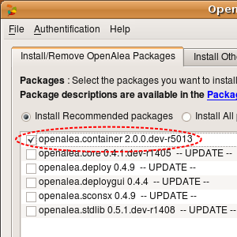
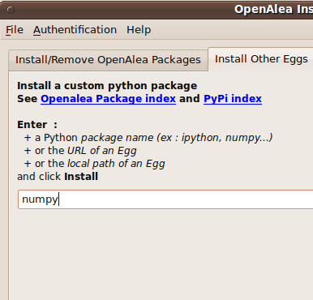
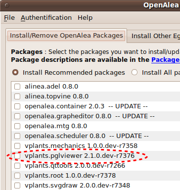
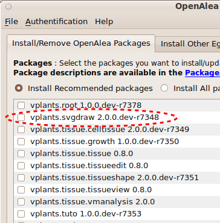
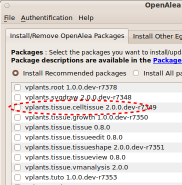
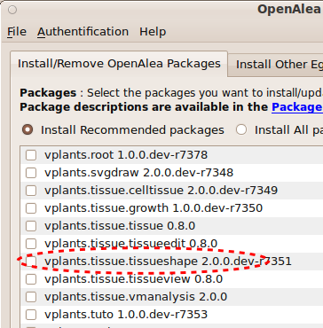
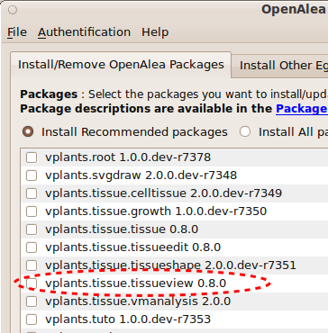
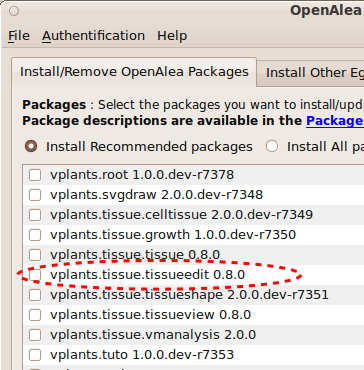

.. _tissue_installation:

############################
Tissue Packages Installation
############################

:Version: |version|
:Release: |release|
:Date: |today|

The goal of this document is to explain how to install and the role of the different packages used to perform simulations on tissue structures.

----------------------------
How to install
----------------------------
This tutorial helps you find your way in all the small packages you need to install before you can perform a tissue simulation. For each package two methods exist to install the package. The first one use `easy_install <http://pypi.python.org/pypi/setuptools>`_. ::

	user@computer:$ alea_install pkg_name

This method is equivalent to the use of `alea_install_gui` and is suitable for all users that do not want to use the latest developments and use the provided tools to perform some tissue simulation. Packages will be updated at each vplants release only. In the sequel, both methods will be described. Choose the one in adequation with your heart.

The other method is suitable for developpers. It consists in installing the different package from their sources (available on `gforge.vplants <http://gforge.inria.fr/scm/?group_id=43>`_). Once you have checked out the sources in a vplants/ directory for example, just go in the directory of the package and type ::

	user@computer:vplants/pgk_name/$ python setup.py install

----------------------------
How to run small examples
----------------------------
Along this tutorial, a set of small examples helps to test the installations steps. There is two methods to execute them. The first one consists in copy/paste the provided code in a python interpreter. The seconds requires to download the script locally, then invoke the python interpreter from the directory where the script lies ::

	user@computer:download/$ python test_toto.py

If you want the python interpreter to stay alive at the end of the script to explore the different objects for example, use the option `-i`. ::

	user@computer:download/$ python -i test_toto.py

.. seealso: Many other examples and tutorial are available from the `visualea` interface if you are not familiar with python script and prefer to use a visual method to create tissue models. However, the examples provided here are just meant to ensure that the installation process has been correctly fulfilled at each step.

----------------------------
Third party
----------------------------

openalea
########
All the packages developped for tissue simulations use extensively the openalea framework that you must first install. Follow this link to install <http://openalea.gforge.inria.fr/dokuwiki/doku.php?id=download>.

Among all `openalea` packages you must install at least `container` that extend python basic data structures with graphs, trees and meshes. ::

	user@computer:$ alea_install container

Numpy
########
The algorithms implemented to manage tissue geometry use arrays from numpy and related algorithms to deal with positions in space. Follow this link to install <http://openalea.gforge.inria.fr/dokuwiki/doku.php?id=download>. Alternatively you can use easy_install to download Scipy or Numpy ::

	user@computer:$ easy_install numpy

plantgl
#######
The simulations proposed hereafter make an extensive use of the `PlantGL <http://www-sop.inria.fr/virtualplants/wiki/doku.php?id=software:plantgl:plantgl>`_ library to represent the geometry of tissue elements. Hence, to display tissues you must install ::

	user@computer:$ alea_install plantgl

pglviewer
#########
This package provides a set of widgets and views to display 2D and 3D objects. It also provides some facilities to create GUI elements to interact with the user. This package is built around `PyQGLViewer <http://pyqglviewer.gforge.inria.fr/wiki/doku.php>`_, an extension of libQGLViewer from Qt. Qt has been installed in the very first step with openalea. You simply need to install `PyQGLViewer <http://pyqglviewer.gforge.inria.fr/wiki/doku.php>`_ (or compile it). ::

	user@computer:$ alea_install pyqglviewer

You can know install the `pglviewer <http://www-sop.inria.fr/virtualplants/wiki/doku.php?id=software:pglviewer>`_ package. Use the same method than for any openalea package. ::

	user@computer:$ alea_install pglviewer

To small script hereafter test the installation of `pglviewer` (:download:`test_pglviewer.py`).

.. literalinclude:: test_pglviewer.py

svgdraw
#######
This package provides a set of function to manipulate SVG images. It is used to extract informations from tissues that have been drawn or digitized. See tissue <tissue drawing simulation> for an example of use. ::

	user@computer:$ alea_install svgdraw

To install it from source ::

	user@computer:vplants/svgdraw/$ python setup.py install

To small script hereafter test the installation of `svgdraw` (:download:`test_svgdraw.py`). it will create a `toto.svg` file in the current directory. Use your favorite SVG viewer to open it (any web browser may work).

.. literalinclude:: test_svgdraw.py

----------------------------
Tissue packages
----------------------------

All tissue related packages can be installed from source easily since they are pure python packages. If you have access to the subversion of vplants you can try to run the multi setup that lies in the tissue directory and skip this part. ::

	user@computer:vplants/tissue/$ python setup.py install

If you do not have access to the subversion repository then you need to install everything from the egg files deposited on openalea and follow the procedure hereafter.

Celltissue
#############

This package contains the core data structure to play with tissues and some functions to serialize it. No algorithms are available from this package. It may be seen as an extension of `container` dedicated to plant tissues. ::

	user@computer:$ alea_install celltissue

To install it from source ::

	user@computer:vplants/tissue/celltissue/$ python setup.py install

Tissueshape
##############

This package provides a set of functions to manipulate tissue geometry and create tissues from scratch. ::

	user@computer:$ alea_install tissueshape

To install it from source ::

	user@computer:vplants/tissue/tissueshape/$ python setup.py install

To small script hereafter test the installation of `tissueshape` (:download:`test_tissueshape.py`). it will create a `tissue.zip` file in the current directory.

.. literalinclude:: test_tissueshape.py

Tissueview
#############

This package provides a set of views on tissues. Hence, the display of tissue structure and informations associated with tissue is facilitated ::

	user@computer:$ alea_install tissueview

To install it from source ::

	user@computer:vplants/tissue/tissueview/$ python setup.py install

To small script hereafter test the installation of `tissueview` (:download:`test_tissueview.py`). it will create an hexagonal grid, associate a random value with each cell and display both cells and walls.

.. literalinclude:: test_tissueview.py

Tissueedit
################

This package provides a set of GUIs to interact with properties defined on a tissue or directly with tissue structure ::

	user@computer:$ alea_install tissueedit

To install it from source ::

	user@computer:vplants/tissue/tissueedit/$ python setup.py install

To small script hereafter test the installation of `tissueedit` (:download:`test_tissueedit.py`). it will create an hexagonal grid, associate a random value with each cell and display both cells and walls. Using the GUI you can then modify the value of the property in each cell.

.. literalinclude:: test_tissueedit.py

Genepattern
###############

.. warning:: TODO

This package contains the formal definition of gene expression patterns and a set of function to manipulate them. Install this package only if you need to play with gene expression patterns.

Tissue meta
#############

This package is a meta package that install the user documentation and some tutorials. ::

	user@computer:$ alea_install tissue

.. image:: alea_install_tissue.png
    :width: 200pt
    :align: center

To install it from source ::

	user@computer:vplants/tissue/tissue_meta/$ python setup.py install

----------------------------
Bugs
----------------------------
If you experience bugs, feel free to report them on `gforge <http://gforge.inria.fr/tracker/?atid=2598&group_id=79&func=browse>`_ or send a mail to the author. Thanks

