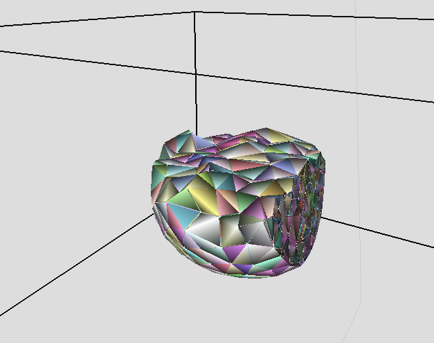
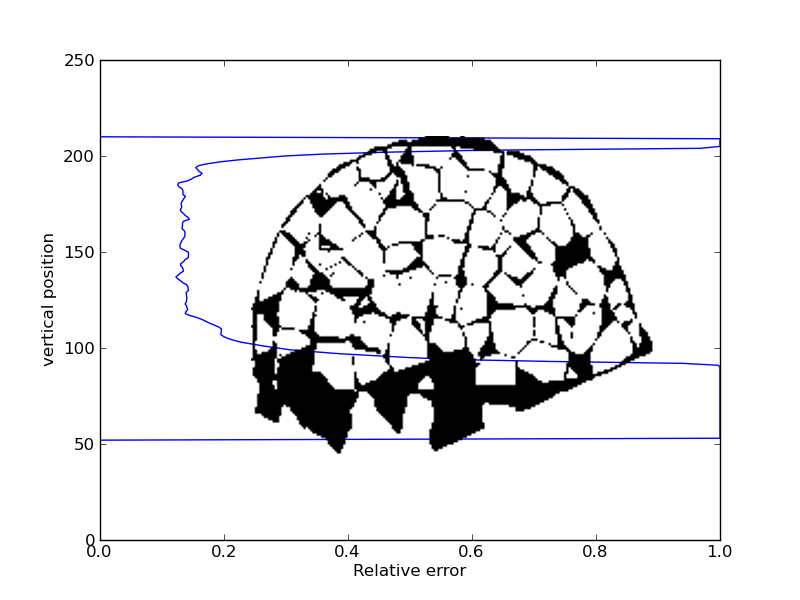

.. _tissue_delaunay3D:

#######################
 Delaunay 3D
#######################

:Version: |version|
:Release: |release|
:Date: |today|

The goal of this document is to explain one method to reconstruct a 3D tissue that use:
 - a Delaunay algorithm to find cell neighborhood
 - a Voronoi's tesselation to compute cell geometry

.. seealso:: Most of this method is a 3D extension of :ref:`tissue_delaunay2D`

-------------------------
Data acquisition
-------------------------

To allow the reconstruction of a tissue with this method we must measure:
 - the position of cell centers
 - the exact geometry of the outer boundary of the tissue
 - an approximation of the outer limit of cell centers

Usually, data used correspond to a 3D stack of microscopic images of a tissue.

In the 2D case (:ref:`tissue_delaunay2D`) it was still possible to mark `by hand` each cell center individually. In the 3D case, there is more than a thousand cells represented and it is very difficult to find a 3D position directly in the stack. Therefore we must resort to computer algorithms to automatically segment the images (`Romain Fernandez (2010) <http://naturemethods.org/paper/tofind>`_). We end up with a 3D image where each voxel contains the label of the cell it belongs to.

From there, it is quite simple to compute de center of each cells as the barycenter of all voxels marked with the id of the cell.

The outer boundary that correspond to the surface of the tissue plus a bottom line is edited by hand using a nurbs patch.

This acquisition provides the global shape of the tissue with cells marked by their center inside this curve.

-------------------------
Cell Neighborhood
-------------------------

Simple Delaunay
###############

The second step of the reconstruction consist in reading the informations acquired in the previous section and construct the Delaunay structure based on cell centers only.

.. literalinclude:: delaunay_simple.py

The result of this algorithm is a mesh where:
 - points correspond to cell centers
 - edges connect two neighbor cells
 - faces are triangles
 - Delaunay cells are tetraedrons
 - the overall shape is convex

Constrained Delaunay
####################

.. warning:: The example used do not require this step

..	The previous algorithm creates links between neighbor cells but do not take into account the outer boundary of the tissue. The resulting global shape is convex. Hence, some created triangles lies outside of the tissue.

.. image:: delaunay_simple_boundary.png
    :width: 40%
    :align: center

However, these triangles are easily detected since at least one of their edges intersects the outer limit curve. Once detected, these triangles are removed from the Delaunay triangulation.

.. literalinclude:: delaunay_constrained.py

.. image:: delaunay_constrained.png
    :width: 40%
    :align: center

Remove flat triangles
#####################

All the tetraedrons left in the Delaunay triangulation are located inside the provided boundary. However, locally, the shape is not exactly convex and the curve drawn by hand left some tertaedrons on the boundary that are flat and unwanted. These triangles must be filtered too.

These triangles are filtered according to the position of their circum center. The circum center of a Delaunay triangle correspond to a vertex of the Voronoi tesselation (see below). Since no vertices of the reconstructed tissue are outside of the provided boundary, every triangle with a circum center outside of the outer boundary curve is removed.

.. literalinclude:: delaunay_filtered.py

-------------------------
Cell geometry
-------------------------

So far the Delaunay meshing of the given set of cell center enable to know the direct neighborhood of each cell. However, we still need to compute an approximation of the geometry of each cell.

Voronoi
########

to compute the geometry of each cell, we choose to put a wall between two neighbor cells exactly in the mean distance between them. Hence, the obtained geometry correspond to a Voronoi tesselation of space (dual mesh of Delaunay mesh).

.. literalinclude:: voronoi_simple.py

Handling of infinite points
###########################

By definition, a wall that correspond to a Delaunay edge on the boundary intersect another wall only on the side of the internal tissue. The other extremity of the wall lies in infinity. To avoid this and still have a good shape for cells on the border, we use the user defined outer boundary to compute the exacte position of the dangling points.

For an infinite wall, the position of the point is set by the voronoi algorithm to the middle of the corresponding delaunay face. Hence, the exact position of dangling points is not so far away from the one returned by the voronoi algorithm (in the picture above, this information has been discarded to emphasize the problem). To compute the exact position of dangling point, we choose the most proximal point on the outer boundary curve.

.. literalinclude:: voronoi_projected.py

-------------------------
Data comparison
-------------------------

The set of operation described above produce a realistic tissue. Realistic means that each cell is polygonal. However, we still need to test to know if the reconstructed tissue is far away from the initial data or not. To perform this test, we need to compare the reconstructed tissue with the initial data provided.

Cell center position
####################

The first test consist to display the cell centers on the reconstructed tissue to verify that the points are still in the centroid of the reconstructed cell.

+-----------------------------------+-----------------------------------+
|  .. image:: test_cell_center.png  |.. image:: test_cell_center_err.png|
|      :width: 100%                 |    :width: 100%                   |
|      :align: center               |    :align: center                 |
+-----------------------------------+-----------------------------------+

The position of the wanted cell centers in red match the position of the reconstructed cell centers in black with a good approximation. However, on the boundary, in regions where the shape of the tissue change rapidly compared to the size of cells, the discretization induced by cells is too big and the geometry of cells in the corner is not correctly respected.

Geometry of cells
####################

Since the initial confocal image has been segmented, we can use this information to compare the geometry of the reconstructed cells with the geometry of segmented cells.

+-----------------------------------+-----------------------------------+-----------------------------------+
|  .. image:: tgs_reference.png     |.. image:: tgs_reconstruct.png     |.. image:: tgs_err.png             |
|      :width: 100%                 |    :width: 100%                   |    :width: 100%                   |
|      :align: center               |    :align: center                 |    :align: center                 |
+-----------------------------------+-----------------------------------+-----------------------------------+
|.. centered:: Reference            |.. centered:: Reconstructed        |.. centered:: Error                |
+-----------------------------------+-----------------------------------+-----------------------------------+

In this case, the approximation of cell geometry using a Voronoi tesselation create a bias specificaly on the border of the meristem. On a vertical cut of the meristem, the same conclusions arise. However, we must account too, with the fact that some cells at the bottom of the meristem have been removed due to the user defined overall shape of the meristem. Hence, the error is maximal at the bottom of the meristem and on the surface. A voronoi tesselation fail to capture the bumpy shape of cells in the L1 for example.

+-----------------------------------+-----------------------------------+-----------------------------------+
|  .. image:: tgs_vert_ref.png      |.. image:: tgs_vert_rec.png        |.. image:: tgs_vert_err.png        |
|      :width: 100%                 |    :width: 100%                   |    :width: 100%                   |
|      :align: center               |    :align: center                 |    :align: center                 |
+-----------------------------------+-----------------------------------+-----------------------------------+
|.. centered:: Reference            |.. centered:: Reconstructed        |.. centered:: Error                |
+-----------------------------------+-----------------------------------+-----------------------------------+

Globally, this method create a bias of around 14% of voxels that are not correctly labeled for cells inside the meristem. Near the surface and at the bottom of the meristem, this error is around 100%. It means that for these regions, there is as many voxels that are not correctly marked that there is that are correct.

Another way to estimate the validity of the reconstructed tissue consist in drawing the reconstructed walls on the initial image obtain by microscopy. Since no more informations are available, in this case, the validation will be expert, made by the user.

