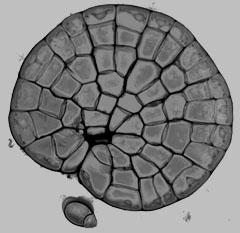
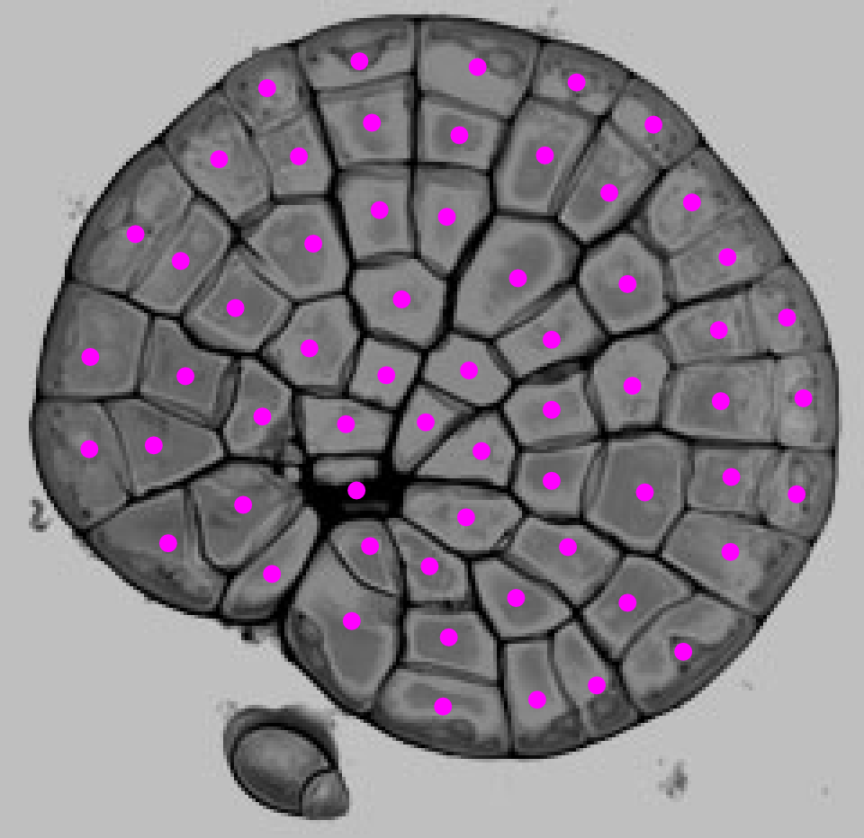
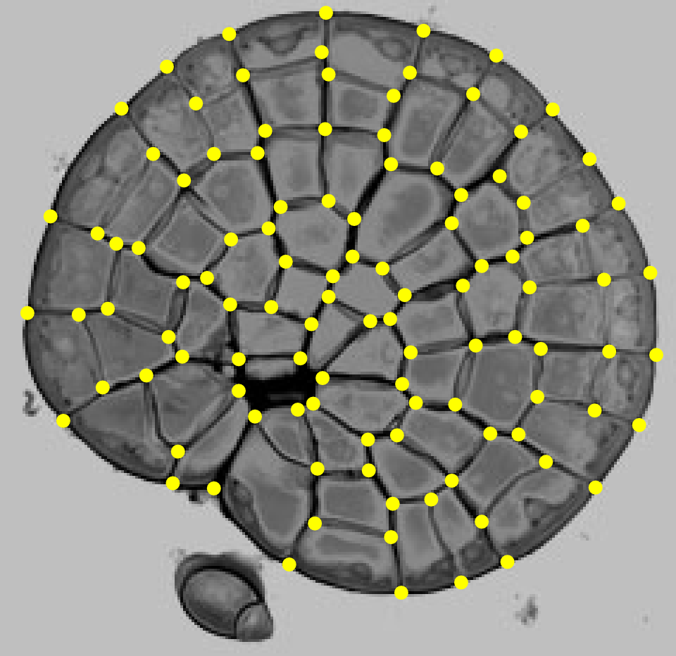
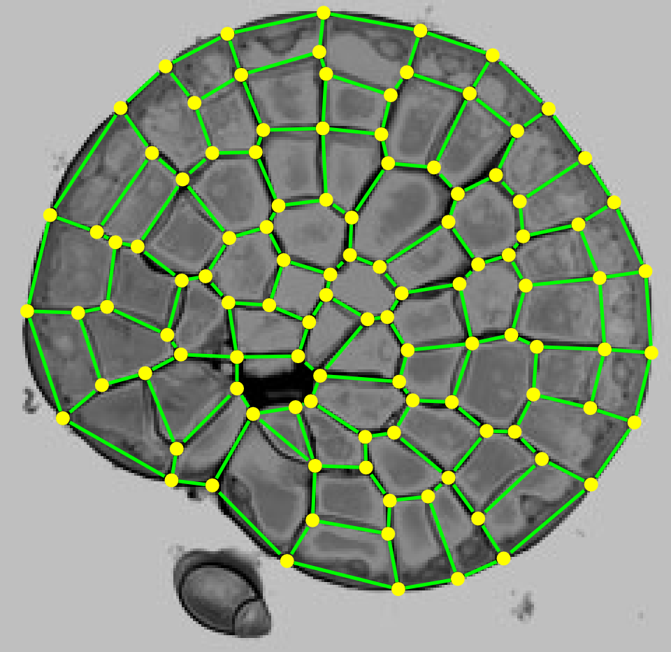
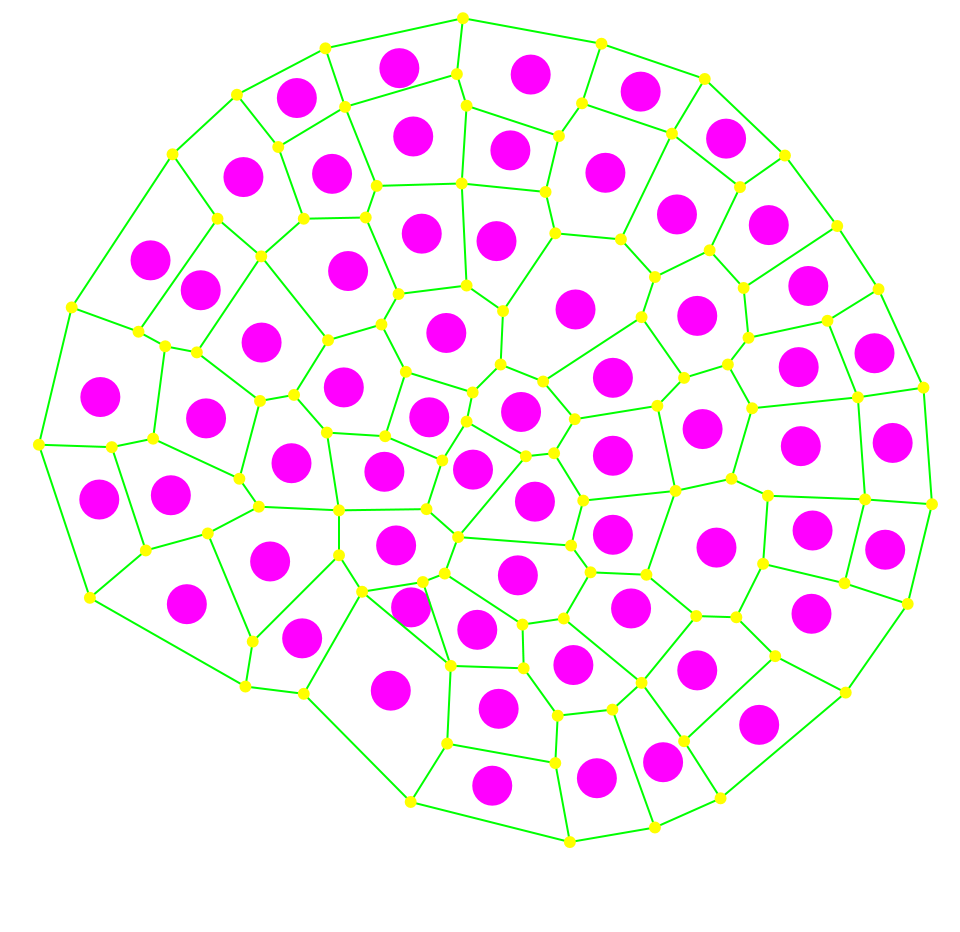
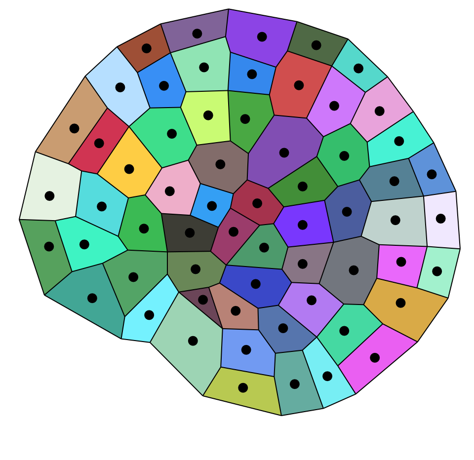

.. _tissue-draw2D:

 Draw Tissue 2D
################

:Version: |version|
:Release: |release|
:Date: |today|

The goal of this document is to explain one method to reconstruct a 2D tissue that use:
 - a vectorial description of tissue geometry
 - a cycle detection to link cells with their geometry

-------------------------
Data acquisition
-------------------------

To allow the reconstruction of a tissue with this method we must measure:
 - the position of cell centers
 - the exact geometry of cell walls

Usually, data used correspond to a microscopic image of a slice of a tissue. In this example, a picture of `coleochaete` will be used.

Cell center are marked using a vectorial drawing editor like `inkscape <http://www.inkscape.org/>`_ for example.

Then intersection of cell walls (vertices) are marked with the same method.

Cell walls are represented by a connection between two vertices.

This acquisition provides a vectorial drawing of cell centers surrounded by cell walls (:download:`coleochaete.svg`).

.. image:: data_acquired.png
    :width: 200pt
    :align: center

In the near future, automatic segmentation of images will directly take the microscopic image, segment it and return the informations needed.

-------------------------
Cell Geometry
-------------------------

Initialisation
###############

The first step consist in opening the data file and creating an empty mesh structure.

.. literalinclude:: initialise.py

Cell centers
###############

The second step of the reconstruction consist in reading the cell layer to extract the position of cell centers.

.. literalinclude:: read_cell_centers.py

Vertices position
#################

Then the position of vertices is read.

.. literalinclude:: read_vertex_positions.py

Wall geometry
################

Walls are created as edges of the mesh and connected to vertices.

.. literalinclude:: read_walls.py

-------------------------
Cell topology
-------------------------

So far we have reconstructed the shape of each cell but there is no topological connection between a cell center and the surrounding walls. To create such a connection, cycles in walls must be detected and connected to the corresponding cell center.

.. literalinclude:: detect_wall_cycles.py

--------------------------
Tissue Creation
--------------------------

The last step of the reconstruction consist in expressing the reconstructed mesh as a valid tissue structure.

.. literalinclude:: create_tissue.py

This structure is stored in a tissue file in order to use it later in tissue simulations (:download:`tissue.zip`).

.. literalinclude:: write_tissue.py

