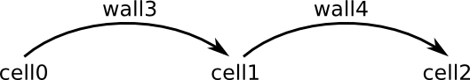
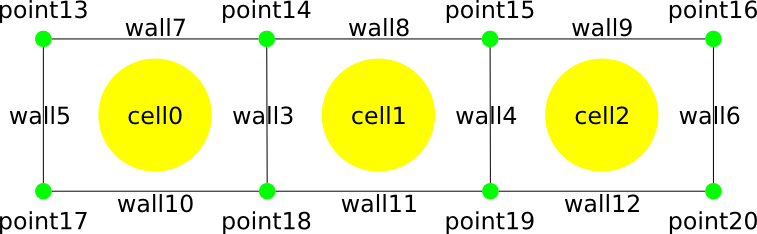

.. _tissue_walkthrough:

######################################
Tissue exploration and manipulation
######################################

:Version: |version|
:Release: |release|
:Date: |today|

The goal of this document is to describe the core methods used to explore and edit a tissue and its properties.

-------------------------
Tissue creation
-------------------------

A tissue is composed of a set of various elements (e.g. cells, walls, ...) and topological relations between them. Properties are handled outside the tissue structure and will be discussed in the next section.

(download file: :download:`creation.py`)

Tissue elements
###############

A tissue is composed of a set of elements. Each element can be assigned a biological type like cell or wall for example. To start using a tissue we must first import and create the `Tissue` object.

.. literalinclude:: creation.py
    :start-after: #import
    :end-before: #creation

Then we must declare a new type of element like cells for example, the method will return an id associated with this type of element.

.. literalinclude:: creation.py
    :start-after: #creation
    :end-before: #add

We can now add a certain number of elements (3 in the example below) of this given type. Since the method generate automatically a unique id for each new element, we store the cell id in a list to further access them.

.. literalinclude:: creation.py
    :start-after: #add
    :end-before: #test

The tissue structure allow to access the type of given element. In this case we verify that one of the created element is of type cell.

.. literalinclude:: creation.py
    :start-after: #test
    :end-before: #create

Of course we can add another biological type of elements (like walls for example) and populate it with elements.

.. literalinclude:: creation.py
    :start-after: #create
    :end-before: #remove

Elements that have been added can be removed too, simply by calling the `remove_element` with the id of the element to remove.

.. literalinclude:: creation.py
    :start-after: #remove
    :end-before: #types

Now the tissue structure is composed of two sets of elements, a first set of ten elements of type `ctyp` and a second set of elements of type `wtyp`. We can access the differents types of elements in the tissue and print the name associated with this type.

.. literalinclude:: creation.py
    :start-after: #types
    :end-before: #elements walk

We can also iterate on all elements stored in the tissue and access their type.

.. literalinclude:: creation.py
    :start-after: #elements walk
    :end-before: #elements types walk

If a type id (e.g. `ctyp` or `wtyp` in our example) is given to the method `elements`, the iteration occurs only on elements of the given type.

.. literalinclude:: creation.py
    :start-after: #elements types walk
    :end-before: #graph: create the topological

Now, the tissue is populated with elements, we need to sort these elements and defines some kind of links between them. This will be done by adding topological structures in the tissue.

Topological relations between elements
######################################

The tissue structure manage separately a set of elements and the topological relations between them. We have seen above how to populate the tissue with elements. Now to add links between these elements we must add some topological structures (e.g. `Graph`, `Topomesh`, ...) in the tissue structure. The choice of the topological object depends on the type of links one want to establish between tissue elements:
 - a `Graph` will establish a link between elements of the same type using elements a second type (e.g. two cells are linked together (are neighbors) through a wall)
 - a `Relation` will establish a link between an elements of type 1 and an element of type 2 using an element of type 3 (e.g. a cytoplasm is linked to a piece of wall through a piece of membrane)
 - a `Topomesh` will establish relations between elements of different degrees (e.g. an edge connect two points, a face is bordered by a set of edges, a cell is bordered by a set of faces, (point,edge,face,cell) are linked by a topomesh kind of relation)

More informations can be found about the type of links a topological object express between elements in the documentation of `openalea.container <http://openalea.gforge.inria.fr/doc/vplants/container/doc/_build/html/contents.html>`_

Graph relation
--------------

The picture below describe a tissue stucture composed of cells and walls where walls are used as links between two cells.

To obtain this structure we must first add a graph relation in the tissue structure. The `add_relation` method requiers a keyword to describe the type of topological relation to create (here "graph") and the list of types of elements involved in the relation (here `(ctyp,wtyp)` means that the graph that will be created will use `ctyp` as vertices and `wtyp` as edges). This method returns the id that will be used later to access the relation structure.

.. literalinclude:: creation.py
    :start-after: #graph: create the topological
    :end-before: #graph: create edges

Now we need to define explicitely the links between the elements. This will be done using the methods defines in the `Graph` object. The `Graph` object is retrieved from the tissue structure with the method `relation` taking as argument the id of the relation (here `graph_id`).

.. literalinclude:: creation.py
    :start-after: #graph: create edges
    :end-before: #graph: walkthrough

This same object `graph` is used to explore the relations between cells (for more information about `Graph` read the documentation of `openalea.container <http://openalea.gforge.inria.fr/doc/vplants/container/doc/_build/html/contents.html>`_)

.. literalinclude:: creation.py
    :start-after: #graph: walkthrough
    :end-before: #point type creation

Topomesh relation
-----------------

The graph described hereabove propose a first type of topological relation between elements of the tissue. We can superimpose in parallel with this relation another of type of relation between elements. In this tutorial we will add a topological mesh relation between elements in order to represent the geometry of the tissue. The picture below is a graphical representation of such a mesh.

To defines the structure described above we must first define a new type of elements, points.

.. literalinclude:: creation.py
    :start-after: #point type creation
    :end-before: #mesh: create the topological

Now we can define the topomesh relation between all the elements of the tissue using the keyword `mesh` in the `add_relation` method. For more informations about `Topomesh` please read the documentation of `openalea.container <http://openalea.gforge.inria.fr/doc/vplants/container/doc/_build/html/contents.html>`_:
 - points (`ptyp`) will stand for wisps of degree 0
 - walls (`wtyp`) will stand for wisps of degree 1
 - cells (`ctyp`) will stand for wisps of degree 2 (the tissue is planar so cells are not volumes but faces)

.. literalinclude:: creation.py
    :start-after: #mesh: create the topological
    :end-before: #mesh: add points

Now we need to add some new elements in the tissue to match the description on the picture above (8 elements of type `ptyp` and 8 elements of type `wtyp`). To perform this task we can use the same method described above using the `add_element` method of the tissue object. However, in this part we will use another method. The tissue structure is constructed internally such as each modification done to any of the topological structure is reflected in the tissue. Hence, instead of using `t.add_element(ptyp)` to add a new point, we could use the method `add_wisp` of the mesh object. In the code below we start by retrieving the `Topomesh` object previously created and use it to populate both the mesh and the tissue with new elements.

.. literalinclude:: creation.py
    :start-after: #mesh: add points
    :end-before: #mesh: link elements

The last step to fully defines the mesh is (like for the graph above) to explicitely declare the links between the elements. In the particular case of our tissue an extra care must be taken to ensure consistency between the graph description defined above and the mesh relation we are trying to build. Mainly, we must ensure that the wall that act as an edge between two cells in the graph, is the wall that will border both cells in the mesh.

.. literalinclude:: creation.py
    :start-after: #mesh: link elements
    :end-before: #mesh: exploration

As for the graph above, we can use the mesh to explore some links between elements.

.. literalinclude:: creation.py
    :start-after: #mesh: exploration
    :end-before: #property: compound

As such, we now have a tissue structure populated with elements of different types linked together by a set of topological relations. The next section will explain briefly how we can attach properties to these elements.

-------------------------
Property handling
-------------------------

In the tissue packages a special care has been taken to separate the data structure that represent the topology of the tissue and the properties attached to this structure. This method ensure an easy combination of multiple different algorithms on the same structure. This separation is obtained using ids to name the different elements of a tissue. Hence a property is simply a map that take ids as keys. The example below provides an example on how to define a compound concentration in each cell of a tissue (the concentration is initialized to 0).

.. literalinclude:: creation.py
    :start-after: #property: compound
    :end-before: #property: pos

Independently, we can assign a 2D position to each point of the tissue to define a geometrical mapping for the tissue.

.. literalinclude:: creation.py
    :start-after: #property: pos
    :end-before: #property: water

The tissue structure garanty that each element has a unique id independently of his type. Hence, a property can be defined both for cells and walls. In the example below a water quantity is defined both in the walls and in the cells.

.. literalinclude:: creation.py
    :start-after: #property: water
    :end-before: #end

-------------------------
Tissue persistence
-------------------------

This section will explore the different possibilities offered to the user to store a tissue structure and to retrieve it afterward. Of course one can always use the pickling module of python to store anything but functions have been written that both facilitate and accelerate the process of reading and writing tissues.

(download file: :download:`persistence.py`)

Raw management
################

Writing
--------

To serialize a tissue object and its properties, the module `openalea.celltissue` provide the `topen` function that open a file like structure. As fro the classical `open` function, this function requires a filename and an opening mode (`r` for reading, `w` for writing and `a` for appending). The appending mode is usefull to add a new property in an already created tissue.

.. literalinclude:: persistence.py
    :start-after: #topen write
    :end-before: #write tissue

Once, a tissue file is open, we can write informations inside, starting with the tissue structure defined above.

.. literalinclude:: persistence.py
    :start-after: #write tissue
    :end-before: #write properties

Only one tissue can be stored in a given tissue file. For properties however, many properties can be stored. Hence, each of them must be given a unique id (name).

.. literalinclude:: persistence.py
    :start-after: #write properties
    :end-before: #write config

It is not mandatory but, to enhance the comprehension of what's inside the stored tissue, a good policy would be to write a configuration file in which a name is assigned to the different ids that have been defined. Hence, when reopening the tissue later, we would remember that for example, the type of the elements that represent the cells in the tissue is 0.

.. literalinclude:: persistence.py
    :start-after: #write config
    :end-before: #close tissue write

Once everything is written we must close the tissue to have the informations written on the disk.

.. literalinclude:: persistence.py
    :start-after: #close tissue write
    :end-before: #topen append

Appending
----------

If instead of creating a new tissue file, we just want to append something in an already existing tissue file, we must use the append mode. The code below add a new property in the file

.. literalinclude:: persistence.py
    :start-after: #topen append
    :end-before: #topen read

Reading
--------

To read a bit of informations stored in a tissue file, the process is the exact opposite. We must start by opening a tissue in reading mode (`r`)

.. literalinclude:: persistence.py
    :start-after: #topen read
    :end-before: #read tissue

Then we can read the tissue stored in the file

.. literalinclude:: persistence.py
    :start-after: #read tissue
    :end-before: #read properties

And the properties. We choose which properties to read.

.. literalinclude:: persistence.py
    :start-after: #read properties
    :end-before: #read config

If available a configuration file will help to explore the tissue

.. literalinclude:: persistence.py
    :start-after: #read config
    :end-before: #close tissue read

Then, when everything has been read, we can close the tissue file

.. literalinclude:: persistence.py
    :start-after: #close tissue read
    :end-before: #explore

The configuration file will prove to be relevant when we'll want to explore the tissue. For example, if we want to access all elements of a given type we can do either :

.. literalinclude:: persistence.py
    :start-after: #explore
    :end-before: #use cfg

or

.. literalinclude:: persistence.py
    :start-after: #use cfg
    :end-before: #tissuedb read

However, the first version requires that the cell elements have been defined first. If some want to add this cell type on top of an already existing tissue for example, this is no longer possible. The second version garanty that you'll iterate on elements that are cells from the point of view of the creator of the tissue.

TissueDB object
################

The method described above allow a fine control over what will be stored in the tissue file and what will be read after that. However, it requires multiple lines of code to store informations that are usually linked (tissue and its properties). To simplify the process of read and write, a `TissueDB` structure has been created that maintain both the tissue, its properties and the defined configuration files. The following code create such an object and fill it with informations stored in "tissue.zip".

.. literalinclude:: persistence.py
    :start-after: #tissuedb read
    :end-before: #tissuedb explore

Then, we can use the different methods defines in `TissueDB` to access all the elements stored in the tissue file.

.. literalinclude:: persistence.py
    :start-after: #tissuedb explore
    :end-before: #tissuedb modify

A property stored in the tissuedb can be changed. The modifications will be reflected in the tissuedb as long as the reference on the property is not modified, meaning we can change values in the properties but cannot change it for an entirely new map.

.. literalinclude:: persistence.py
    :start-after: #tissuedb modify
    :end-before: #tissuedb write

Saving a `TissueDB` is as simple as reading it. We just call the `write` method on the object. If special care has been taken not to change references as explained above, the stored tissue will reflect all changes made to the structure.

.. literalinclude:: persistence.py
    :start-after: #tissuedb write
    :end-before: #end

-------------------------
Tissue exploration
-------------------------

We will now use the tissue created above to explain how we can explore it. First we need to open it using one of the method described above.

(download file: :download:`exploration.py`)

.. literalinclude:: exploration.py
    :start-after: #open
    :end-before: #tissue walk

Walking through a set of elements of a given type
##################################################

There is multiples ways to iterate through a set of elements that verify a given property. The first way will iterate through all elements of a given type using the `elements` method of the tissue object. This method requires the id of the type to iterate through. It is usually a good practice, instead of putting directly the value of the id, to use the one stored in the configuration file that must be present with any tissue. That way we are sure we iterate on cells for example.

.. literalinclude:: exploration.py
    :start-after: #tissue walk
    :end-before: #graph walk

Another way to iterate on all cells in the tissue will be to use the graph relation that exists between cells. In this relation, cells act as the vertices of the graph.

.. literalinclude:: exploration.py
    :start-after: #graph walk
    :end-before: #mesh walk

In the tissue above, cells are also defined as wisps of degree 2 in the mesh. Hence, we can use this topological structure too to iterate over cells.

.. literalinclude:: exploration.py
    :start-after: #mesh walk
    :end-before: #property walk

The last way to iterate over cells is to iterate over a property defined for cells. A special care must be taken with this method since nothing in the definition of the tissue exists that ensure the property is defined for each cell. In the example below we iterate through all elements that define a water content (might be cells or walls) above a certain threshold.

.. literalinclude:: exploration.py
    :start-after: #property walk
    :end-before: #water wall content

Combining topological relation with property
##################################################

As long as we know what we do, we can combine the different way of walking through elements of a tissue to gather information. In the example below, we know:
 - that water quantity is defined for each wall of the tissue
 - that wall and cells are topologicaly linked together in the mesh

.. literalinclude:: exploration.py
    :start-after: #water wall content
    :end-before: #end

