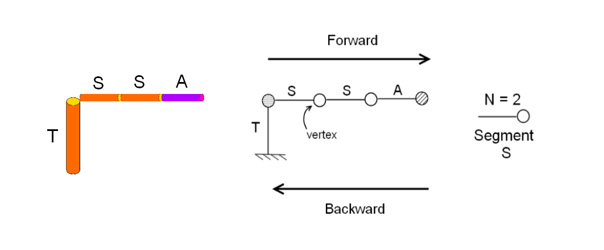
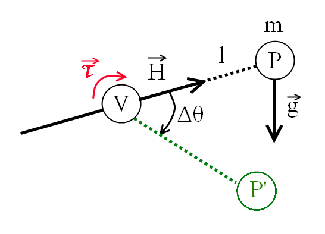
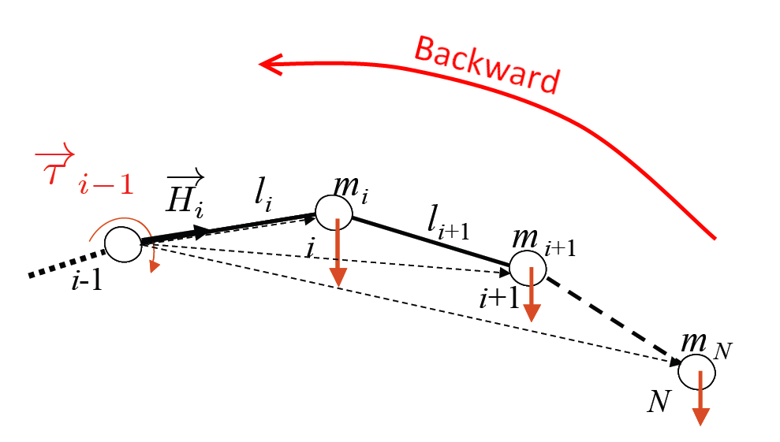
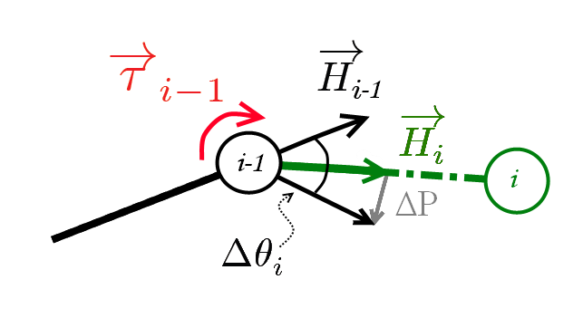

Simulation of gravity effect on a tree branch with L-Py
#######################################################

.. topic:: Section contents

	In this section, we explain how to simulate with L-Py the effect of gravity on a simple branch. This tutorial illustrate the notion of **Rapid Information Transfert**. 

Prerequisite
------------

- L-system with LPy
- Rapid Information Transfert symbol (<<)
- StartEach(), EndEach(), etc. function
 
Introduction
------------

The problem setting
===================

We want to calculate the effect of gravity applied to a horizontal branch with its biophysical property (wood density, elasticity). To do so, we will consider the branch as a set of springs and calculate the flexion on each spring due to the mass of the branch.

In addition to the simulation for a simple branch, we will also investigate the case of a more complex branch and when a fruit is present. 

Model of gravity force applied on a single branch
=================================================

To simulate the branch flexion, we consider the following:
	- The branch is modelled as a set of N cylinder called segment (S) attached to a vertical trunk (T); 	
	- Each segment is rigid and they are connected at their vertices (V). We consider that the mass of the segment is located on the vertex at the end of this segment. 
	- The branch is ended by an apex (A) that does not grow. It is used to indicate the last vertex;	
	- To simulate the flexion, we are going to consider a spring on each of the vertices. Thus, the flexion is modeled as a torque (tendency to rotate) applied on each of those springs. 

Gravity force is applied on each segment. It creates branch torsion and flexion. In our case, we consider that the branch is included in a vertical plane: we consider only the flexion. We are going to spread gravity effect in two steps and along the two directions of the branch(backward/forward):
	- Backward direction (:math:`A\rightarrow T`)
		At each vertex, the torque is computed thanks to the gravity force. The torque is going to define the rotation which will be applied on the branch segment.
	- Forward direction (:math:`T\rightarrow A`)
		The rotation is applied on each of the branch segment.

Mechanical modeling of gravity effect on a branch
=================================================

We are going to bend slowly the branch until it reaches its equilibrium relativelly to gravity. 

The torque :math:`\vec{\tau}` at a vertex :math:`V` is defined as the tendency of a system to rotate around this vertex in the torque direction when a force :math:`\vec{F}` is applied at a point :math:`P` which is at a distance of :math:`l` in the direction :math:`\vec{H}` (reference direction). 

	
In our case, the force is the mass of :math:`P` times the gravity, i.e. :math:`m\vec{g}`:. The torque is the vectorial product of the vector :math:`l\vec{H}` with the force :math:`m\vec{g}`:
	
.. math:: 
	\vec{\tau} =  l\vec{H}\times m	\vec{g}

Wood material has stiffness. We are going to take it into account thanks to the spring elasticity (Young Elasticity Modulus).
 
Finally, the angle between the initial state (i.e. the segment :math:`[V,P]`) and the final state (i.e. :math:`[V,P']`) is defined as: 

.. math::
	\Delta\theta = \frac{|\vec{\tau}|}{E.I}.l
	
with :math:`E` the Young Elasticity Modulus and :math:`I` the momentum of inertia of the segment :math:`[V,P]` which is:

.. math::
	I = \pi.\frac{D^4}{64}
	
in the case of circular section of diameter :math:`D`.
	
.. note::
	If we apply the flexion on the branch gradually, the torque changes. Indeed the branch get closer to the gravity direction. It is the reason we cannot compute the final state of the branch directly from an initial state. We need to apply gradually the flexion. To do so, a relaxation factor (:math:`r<1`) is added to the rotation :math:`\Delta\theta`.

**Backward direction** 

If we apply a torque on a vertex, it will induce a torque on each previous vertex. That is why, for each vertex :math:`V_{i-1}`, the torque :math:`\vec{\tau}_{i-1}` is the sum of the forwarding vertex :math:`k\in\{i,...,N\}` along the branch:

.. math::
	\vec{\tau}_{i-1} = 	\sum_{k=i}^N l_k.\vec{H}_k\times m_k.\vec{g}

which can be factorized as:
 
.. math::
	\vec{\tau}_{i-1} = 	l_i\vec{H}_i.\times m_i .\vec{g} + \vec{\tau}_{i}

In other words: for each vertex, the torque is computed in function of the forwarding vertex torque. This is propagated from the apex :math:`A` to the vertex :math:`V_0` attached to the trunk. 

**Forward direction**
	
Once torques are computed for each vertex, we apply the rotation :math:`\Delta\theta_i` on each segment :math:`S_i`: 

.. math::
	\Delta\theta_i = \frac{\vec{\tau}_{i-1}}{E.I_i}.l_i

with :math:`I_i` the branch momentum of inertia (introduced above). This rotation has the same axis than the flexion.

Now, we compute the vector between :math:`\vec{H}_i` at current state and the new :math:`\vec{H'}_i` which is:

.. math::
	\Delta P = \vec{H}_i-M_{\Delta \theta_i}^{\tau_{i-1}}.\vec{H}_{i-1}

with :math:`M_{\Delta \theta_i}^{\tau_{i-1}}` the matrix of rotation of angle :math:`\Delta \theta_i` and rotation axe :math:`\tau_{i-1}`. Finally:

.. math::
	\vec{H'}_i = \frac{\vec{H}_i + r . \Delta P}{|\vec{H}_i + r . \Delta P|}

with :math:`r` a relaxation factor (:math:`<1`).

.. note::	
	 The "backward" and "forward" computation are applied until the equilibrium is reached, i.e. until :math:`\epsilon` is getting close to 0 with:
	 
	 .. math::
		\epsilon = |\Delta P|

Rapid Information Transfer
---------------------------

To gain computation time, we use the rapid information tranfer.

Script description
------------------	

Loading an example dataset
==========================

.. todo::
	The `tutorial` package comes with a few datasets. The data are in
	`share` directory. See the `data howto <>` 
	for more details.::

		>>> import vplants.tutorial
		>>> from openalea.deploy.shared_data import get_shared_data_path
		>>> print get_shared_data_path(vplants.tutorial, 'empty.txt')
	
	
Branch and gravity definition
=============================	

Each segment has physical attributes as its length (S_LEN), its diameter (S_DIAM), its volumic mass of wood (WoodDensity) and its elasticity factor (YoungModElasticity).
	
.. code-block:: python
    :linenos:		
	
	# Branches attributes
	# ===================	
	
	N = 100          # initial number of segments in the stem
	S_LEN   = 0.5        # in m
	T_LEN = 1.2        # in m
	S_DIAM  = 0.01       # in m
	WoodDensity = 1000   # volumic mass of wood = 0.8 kg/L
	YoungModElasticity = 10*10.**8    # Ex: Mapple = 10000 MPa; Oak = 11000 MPa; Pine =  9000 MPa
	
	[...]
	
	# Branch segments method
	# ######################

	class SegmentData:
	  "data associated with a segment"

	  def __init__(self):
		self.len = S_LEN
		self.diam = S_DIAM
		self.H = Vector3(0,1,0) # Head direction of the segment
		self.cummass = 0 # cumulated mass borne by the distal part of the segment
		self.cumtorque=Vector3() # cumulated torque due to the segments borne by the distal part of the segment

	  def getMass(self):
		return self.len*pi*(self.diam**2)/4*WoodDensity
	  mass = property(getMass)

	  def getMomentOfInertia(self):
		return pi * self.diam**4 / 64 # for a disc  
	  momentOfInertia = property(getMomentOfInertia)

	  def getRigidity(self):
		return YoungModElasticity * self.momentOfInertia
	  rigidity = property(getRigidity)

	  def __repr__(self):
		return ''

And the gravity strength is defined:

.. code-block:: python
    :linenos:		
	
	# Gravity model parameters
	# ========================
	
	Gravity = Vector3(0,0,-10.0)  # in N/Kg

Simulation parameters
=====================

We define the simulation parameter: 
	- derivlen: the number of step forward/backward
	- RELAX: the relaxing factor
	- error: initialized to 0
	- eps: the algorithm stops when error < eps
	- Forward, Backward: the direction
	- mode: initialization to Forward
		
.. code-block:: python
    :linenos:		
	
	# Simulation parameters
	# =====================

	derivlen = 300
	RELAX = 0.5        
	error = 0
	eps = 0.05
	Forward,Backward,Growth=range(3)
	mode = Forward 

Initial state
=============

The tree presented in this tutorial is a trunk with a single branch that is initially horizontal. 

.. code-block:: python
    :linenos:	
	
	Axiom: T(SegmentData())B(N)
	
	[...]
	
	# L-system: production
	# ====================
	
	decomposition:
	maximum depth: 100

	B(n) :
	  if n>0:
		produce S(SegmentData())B(n-1)
	  else: produce A
	
	[...]	
	
	T(c):
	  produce _(S_DIAM*1.4)F(S_TRUNC)

Simulation
==========

**Backward direction**

When we travel along the branch in the backward direction (:math:`A\rightarrow T`), the torque is updated: 

.. code-block:: python
    :linenos:		
	
	S(a) >> S(b):
	  if isBACKWARD():
		update_torque(a,b)
		produce S(a)
	
	T(a) >> S(b):
	  if isBACKWARD():
		update_torque(a,b)
		produce T(a)

with:

.. code-block:: python
    :linenos:	
	
	def update_torque(segment, segment_next): 
	  segment.cummass = segment.mass + segment_next.cummass # cummass update (case segment mass growing)
	  segvec =  segment_next.H * segment_next.len
	  weightvec =  Gravity * segment_next.cummass
	  segment.cumtorque = segment_next.cumtorque + (segvec ^ weightvec)

.. note::
	The cumulated mass is also updated in the case we want to simulate the growth of the branch.

For the first segment (adjacent to the apex) we just initiate the torque to 0. 

.. code-block:: python
    :linenos:
	
	S(a) >> A:
	  if isBACKWARD():
		a.cummass = a.mass 
		a.cumtorque = Vector3(0,0,0)#re-initiate cumtorque
		produce S(a)

**Forward direction**

Reverselly, once the torques are updated for each vertex, the flexion is applied to each vertex in the forward direction (:math:`T\rightarrow A`).

.. code-block:: python
    :linenos:	
	
	S(c) << S(a):
	  if isFORWARD():
		global error 
		apply_torque(a, c, error)
		produce S(a)
	
	T(c) << S(a):
	  if isFORWARD():
		global error 
		apply_torque(a, c, error)
		produce S(a)

with

.. code-block:: python
    :linenos:	
	
	def apply_torque(segment, segment_previous, error):
	  curvature = segment_previous.cumtorque * (1/segment.rigidity) * segment.len
	  rot = Matrix3.axisRotation((1,0,0),curvature[0]) 
	  newH = rot * segment_previous.H
	  diff = newH - segment.H
	  error += norm(diff)
	  v = segment.H + diff * RELAX
	  segment.H = v / norm(v)

.. warning::
	In our case, the branch is within the vertical plane. The "curvature" norm (i.e. :math:`|\Delta\theta_i|`) is the first component of the torque vector.
	
Break condition 
===============

Finally, the equilibrium is reached when the error between the displacement of the entire branch and the equilibrium for the theoretical configuration is reached.

.. code-block:: python
    :linenos:	
	
	def EndEach ():
	  global error, mode, eps
	  if mode == Backward : 
		setMode(Forward)
	  elif mode == Forward and error >= eps : 
		print ">>> mean error = ", error
		setMode(Backward)
	  elif mode == Forward: 
		print "EQUILIBRIUM REACHED: mean error = ", error, " < ", eps
		setMode(Backward)
    