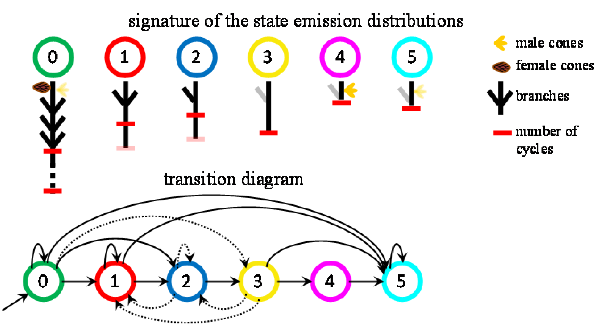
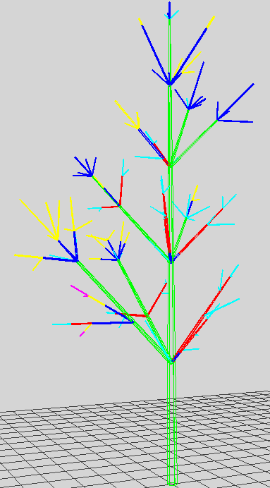
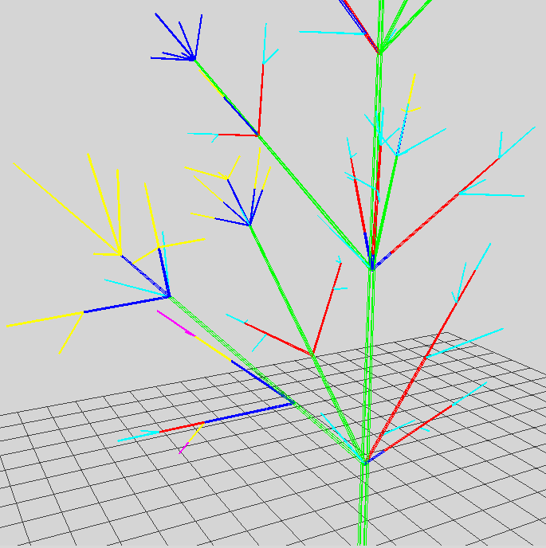
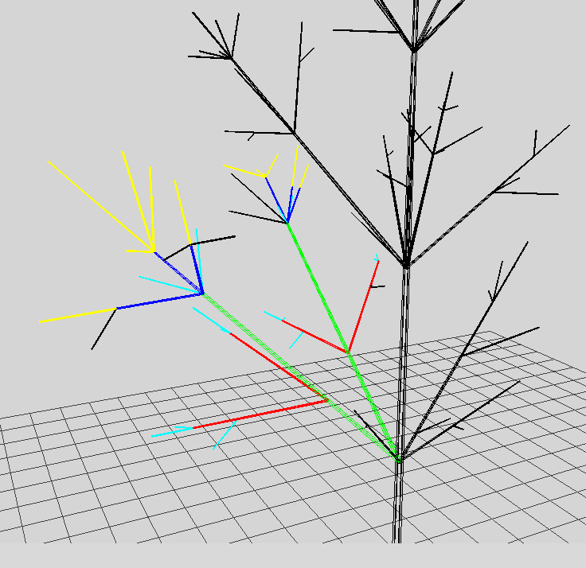

.. _tuto_treeanalysis:

Tree Analysis (data analysis of tree-structured data for plant architecture)
############################################################################

.. topic:: Section contents

    In this section, we elaborate on an example of analysis of tree growth synchronism.
    The shoots of sibling branches are mapped mutually using tree alignment algorithms.
    To reduce the noise related to the variability in shoot properties, the shoots are labeled
    using a statistical model for clustering tree-stuctured data: the hidden Markov tree (HMT) model.

The problem setting
===================

We consider seven branches of different Aleppo Pines individuals. These pines are described at the annual
shoot (AS) and growth unit (GU) scales. Several growth cycles may occur during a given year. The lateral branches borne
by a same annual shoot on the main stem tend to have similar structures and properties, which may be interpreted
as synchronism of growth (annual shoots on the lateral branches can be mapped into each other). The aim of this study
is to quantify the rate of synchronism of pairs of lateral branches.

To do so, an HMT model is estimated on the trees. The HMT model associates states with the tree vertices, using a Markovian
assumption on the state distribution within the tree. Each state determines a particular distribution of the vertex properties.
Then the shoots are labeled using the states of the estimated HMT model. The states represent clusters of vertices with 
similar properties; thus labelling appears as a denoising procedure where the shoot properties are summed up. The labeled
branches are compared using a tree matching procedure. 

The stages of the analysis are:
    #. Extract an MTG at AS scale
    #. Build a `Trees <http://openalea.gforge.inria.fr/doc/vplants/tree_statistic/doc/_build/html/user/tree.html#trees>`_ object from the MTG.
    #. Estimate an HMT model on the Trees (transition probability matrix and distributions of the shoot properties in each state).
    #. Estimate the states at each vertex (i.e. perform tree labelling).
    #. Match the labelled branches using an edit distance on trees.

Where are the data?
==========================

 The `tutorial` package comes with a few datasets. The data are in
 `share/data/` directory from the root. ::

    >>> import vplants.tutorial
    >>> from openalea.deploy.shared_data import shared_data
    >>> data = shared_data(vplants.tutorial)/'TreeAnalysis'
    >>> print data.glob('*aleppo*')

Loading the MTG and defining attributes functions
=================================================

First,  we load the MTG :download:`aleppo_pines.mtg <../../share/data/TreeAnalysis/aleppo_pines.mtg>`

.. literalinclude:: ../../share/data/TreeAnalysis/aleppo_pines.mtg
    :lines: 1-50
    
::

    >>> from openalea.mtg import * 
    >>> g = MTG(data/'aleppo_pines.mtg')

The mtg `aleppo_pines.mtg` is loaded. To draw it, just run::

    >>> plantframe.Plot(g)

The shoot properties are essentially defined at GU scale. 
To define length, number of branches, number of cycles, presence of male or female cones,
those quantities have to be extracted at GU scale and integrated out at AS scale.

The mtg is converted into a Trees object, using the command::

    >>> TAS2 = treestats.extract_trees(g, 3, filter, variable_funcs, variable_names)

where

    >>> variable_funcs = [MTGLength, MTGBrIntensity, MTGFCones,
                          MTGMCones, MTGPolycyclism, MTGDiameter, MTGStApex]

represents a list of functions to computed the vertex properties at AS scale, and 

    >>> variable_names = ["Length", "Branches", "Female", "Male",
                          "Polycyclism", "Diameter", "StApex"]

represents the list of property names.

The HMT model is estimated using::

    >>> EH = TAS2.Estimate("HIDDEN_MARKOV_TREE", HI, 200) 

where HI is an initial dummy HMT model used as starting point for the iterative estimation procedure of an HMT (based on the EM algorithm), and 200 represents the maximal number of iterations.

The state properties of the estimated HMT can be summed up on the following diagram.

Using the `PlantFrame <plantframe.html>`_ module, the estimated states can be viewed on the trees.

Within a given branch (branch number 3 in the following example), two lateral branching systems can be compared using::

    >>> r = ComputeBrMatching(3)
    
A distance is computed between these lateral branching systems. The principle is to use a sequence of editing operations on trees (vertex insertion, deletion or state substitution), associated with costs. The cost of the sequence of operations with minimal cost defines the distance between subtrees. The cost of state substitutions is defined by the following matrix

.. literalinclude:: ../../share/data/TreeAnalysis/aleppo_pines_distance.a

Then the vertices that have not been either inserted or deleted can be represented using, e.g.,

    >>> l = DisplayMatching(r, 4, 5)
    
if one wants to compare subtrees number 4 and 5. Here, `l` represents the vertices of each branching systems that have not been either inserted or deleted. These vertices can be mapped 
onto a vertex in the other branching system.

.. _Figure3.a:

    
    **Figure 3.a** State restoration.

.. _Figure3.b:

    
    **Figure 3.b** Mapping between two branches. The black vertices outside the branches are ignored. The black vertices inside the branches are those that could not be matched (insertion or deletion). The coloured vertices are those that could be matched (potentially up to a substitution).

Using the mapping, we can defined to notions of synchronism:
    #. The proportion of vertices that can be mapped onto a vertex in the other branching system (weak synchronism).
    #. The proportion of vertices that can be mapped onto a vertex with the same state in the other branching system (strong synchronism).

Hence, the rate of weak synchronism can be computed as::

    >>> float(len(l[0]) + len(l[1])) / (len(amlPy.Descendants(l[0][0])) + len(amlPy.Descendants(l[1][0])))
    >>> 0.81967213114754101

The rate of strong synchronism can be computed as::

    >>> 2.*len([i for i in range(len(l[0])) if OptimalState(l[0][i]) ==  OptimalState(l[1][i])]) / (len(amlPy.Descendants(l[0][0])) + len(amlPy.Descendants(l[1][0])))
    >>> 0.5901639344262295

.. todo:: Use TreeMatching on openalea.mtg.MTG instead of openalea.aml.MTG

.. sectionauthor:: Jean-Baptiste Durand, Farah Ben-Naoum

