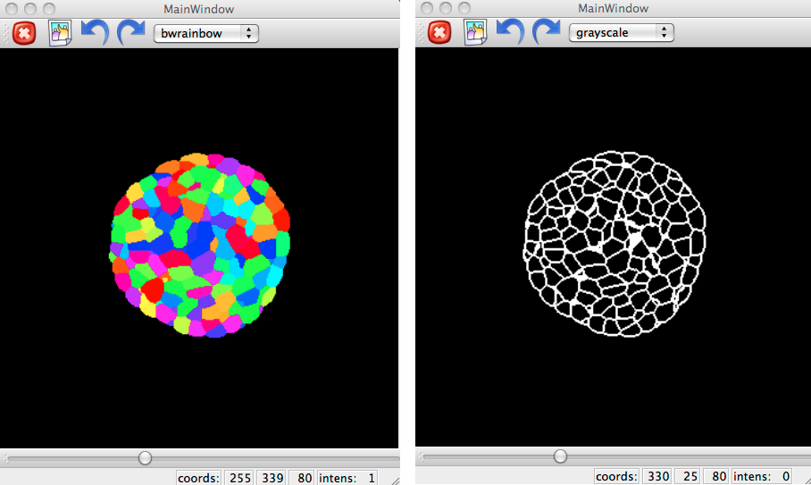
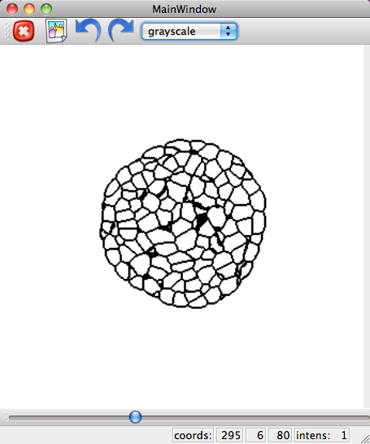
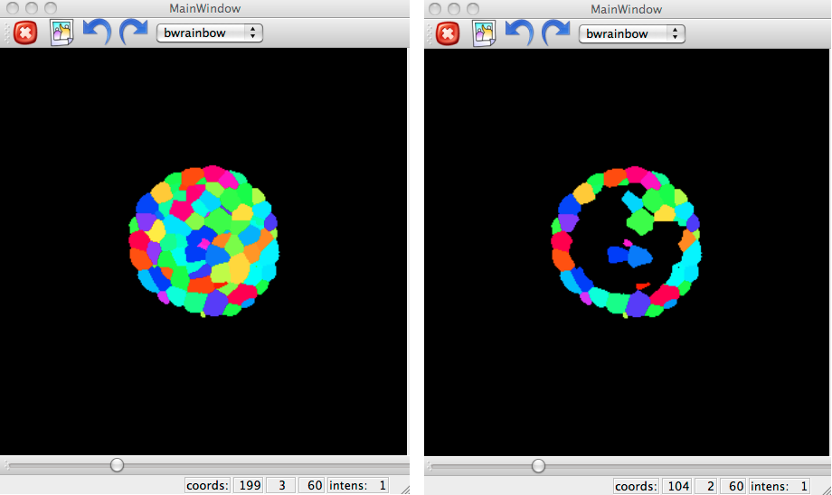

.. _mars_alt_analysis:

Modeling and Structural Analysis
################################

Analysis of tissue properties
+++++++++++++++++++++++++++++

The goal of this document is to describe how to extract a modeling template
for the tissue, ie get some information about the number of cells, each
cells volume, neighborhood structure and the shared surface area of two
neighboring cells.

The python script for this example can be
:download:`dowloaded <example_analysis.py>` along with the
:ref:`images <install_vtissuedata>`. Run the script like this::

	user@computer:$ python example_analysis.py

Reading and display a segmented image
=====================================

Segmented images can be loaded as any other image. In a |QtEnSh|:

.. literalinclude:: example_analysis.py
    :lines: 8-12

Dealing with cells
==================

First, let us read the properties of tissue with the function
:class:`~vplants.mars_alt.analysis.analysis.VTissueAnalysis`.

.. literalinclude:: example_analysis.py
    :lines: 16-17

Properties
==========

Number of cells
---------------

:meth:`~vplants.mars_alt.analysis.analysis.VTissueAnalysis.nlabels` returns
the number of cells in the tissue

.. literalinclude:: example_analysis.py
    :lines: 21

Center of mass
--------------

:meth:`~vplants.mars_alt.analysis.analysis.VTissueAnalysis.center_of_mass`
retreives the center of mass of cells in the tissue.

For a single cell :

.. literalinclude:: example_analysis.py
    :lines: 25

.. note::

    By default, the center of mass is determined in the in real-world units.
    To compute the center of mass in voxels :

    .. literalinclude:: example_analysis.py
	:lines: 29

For a sequence of cells :

.. literalinclude:: example_analysis.py
    :lines: 33

For all cells :

.. literalinclude:: example_analysis.py
    :lines: 37

Volume
------

:meth:`~vplants.mars_alt.analysis.analysis.VTissueAnalysis.volume` returns
the volume of cells in the tissue.

For a single cell :

.. literalinclude:: example_analysis.py
    :lines: 41

.. note::

    By default, the volume is determined in the in real-world units.
    To compute the volume in voxels :

    .. literalinclude:: example_analysis.py
	:lines: 45

For a sequence of cells :

.. literalinclude:: example_analysis.py
    :lines: 49

For all cells :

.. literalinclude:: example_analysis.py
    :lines: 53

Neighbors
---------

:meth:`~vplants.mars_alt.analysis.analysis.VTissueAnalysis.neighbors` returns
the neighborhood cells eg. which cells have contact with a given cell.

For a single cell :

.. literalinclude:: example_analysis.py
    :lines: 57

.. note:: Values different than 1 are used as labels of cells and
          1 is considered the background.

For a sequence of cells :

.. literalinclude:: example_analysis.py
    :lines: 61

For all cells :

.. literalinclude:: example_analysis.py
    :lines: 65

.. note:: The computation time can be quite long depending on the number of cells.

Shared surface area of two neighboring cells
--------------------------------------------

:meth:`~vplants.mars_alt.analysis.analysis.VTissueAnalysis.surface_area` returns
the surface area between two neighborhood cells.

.. literalinclude:: example_analysis.py
    :lines: 69

.. note::

    The following functions are implemented as nodes within VisuAlea.

    .. dataflow:: vplants.mars_alt.demo.analysis analysis

Extract cells in the layer 1
----------------------------

:meth:`~vplants.mars_alt.analysis.analysis.extract_L1` returns
the list of all the cells in the layer 1.

.. literalinclude:: example_analysis.py
    :lines: 73-74

.. figure:: ./images/placeholder.png

    extract_L1 function in VisuAlea

    .. dataflow:: vplants.mars_alt.demo.analysis extract_L1

Structural Analysis
+++++++++++++++++++

The goal of this document is to describe how extract structures for the tissue, ie get walls for example.

The python script for this example can be :download:`downloaded <example_structural_analysis.py>`
along with the :ref:`images <install_vtissuedata>`.
Run the script like this;

	user@computer:$ python example_structural_analysis.py

Draw walls
==========

First, start a |QtEnSh| and read the data:

.. literalinclude:: example_structural_analysis.py
    :lines: 10-14

:func:`~vplants.mars_alt.analysis.structural_analysis.draw_walls` can be used
for creating a wall image from a segmented image.

.. literalinclude:: example_structural_analysis.py
    :lines: 17-19

    Display walls from a segmented image.

It is possible to inverse the walls with the :func:`~openalea.image.algo.basic.reverse_image` function.

.. literalinclude:: example_structural_analysis.py
    :lines: 22-24

    Display walls from a segmented image.

    .. dataflow:: vplants.mars_alt.demo.structural_analysis draw_walls

Draw L1
=======

:func:`~vplants.mars_alt.analysis.structural_analysis.draw_L1` can be used for
drawing the cells in the layer1 from a segmented image.

.. literalinclude:: example_structural_analysis.py
    :lines: 27-29

    Display the cells in the layer 1 from a segmented image.
    In Visualea the following dataflow does the same:

    .. dataflow:: vplants.mars_alt.demo.structural_analysis draw_L1

