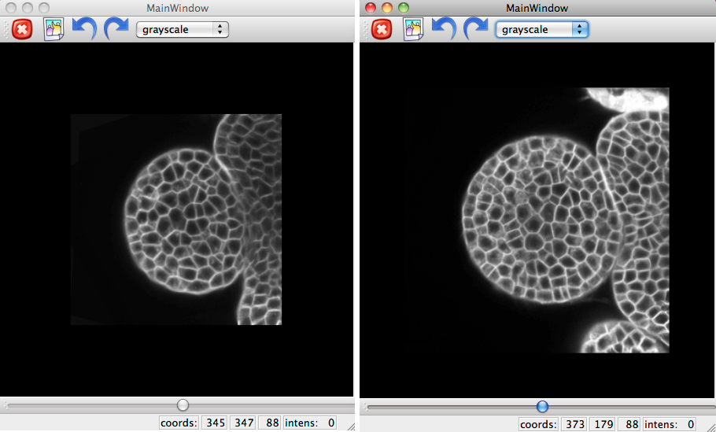
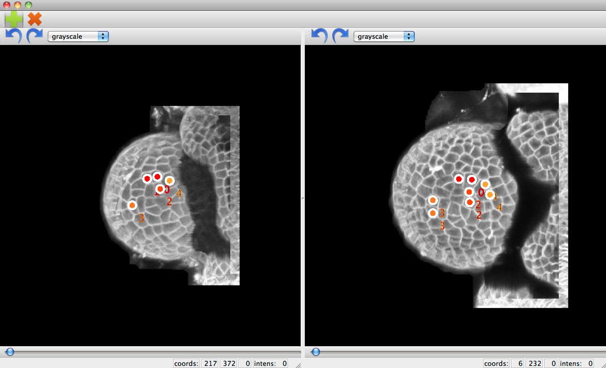
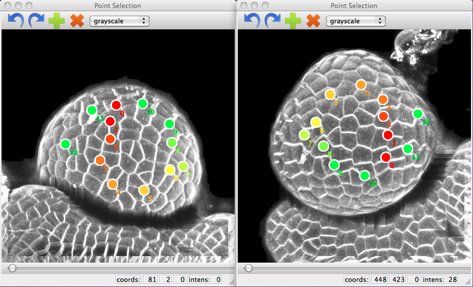

.. _mars_alt_automatic_lineage_tracking:

Automatic Lineage Tracking
##########################

This document explains how to identify cell lineages during floral growth.

The python script for this example can be downloaded (download file : :download:`mars_alt_automatic_lineage_tracking.py` along with the images
(download images: :download:`plantB-data.tar.gz`).
To run the script, it must be in the same directory than the images and run in a shell console using::

	user@computer:$ python mars_alt_automatic_lineage_tracking.py

The computation of cell lineage from the target image I and the source image J consists of the following steps:

    1.Initialization of the algorithm (initialization of the set of high confidence lineages)

    2.Computation of a deformation field based on a set of high confidence lineages, L.

    3.Refining of the deformation field with an automated non-linear registration algorithm.

    4.Building of lineage hypotheses and solving the lineage problem.

    5.Update of the set of high confidence lineages, L

Initialization of the algorithm
===============================

.. code-block:: python
    :linenos:

    from openalea.image import imread, display
    im0 = imread("imgFus_0.inr.gz")
    im1 = imread("imgFus_1.inr.gz")
    seg0 = imread("imgSeg_0.inr.gz")
    seg1 = imread("imgSeg_1.inr.gz")

    from PyQt4 import QtGui
    app = QtGui.QApplication([])

    w0 = display(im0)
    w1 = display(im1)
    w2 = display(seg0)
    w3 = display(seg1)

The algorithm requires defining an initial set of cell lineages to guide the computation of the deformation.
For that, we select manually with :class:`vplant.mars_alt.initialization_alt` a number of lineages between each time frame.

To ease this operation, you can reconstruct the surface of the meristem from each time frame.

.. code-block:: python
    :linenos:

    w2 = initialization_alt(im0,im1,seg0,seg1)

.. note:: The required number of initial cell lineages ultimately depends on the amount of deformation between two consecutive time frames and on the desired cell lineage detection accuracy.

It is possible to load a previous mapping from a pickle file and use it.

.. code-block:: python
    :linenos:

    import pickle
    f = open("mapping-01","r")
    mapping = pickle.load(f)
    f.close()

    w2.set_mapping(mapping)

This mapping can be saved to a pickle file.

.. code-block:: python
    :linenos:

    import pickle
    f = open("mapping-01","w")
    pickle.dump(mapping,f)
    f.close()

Since this is a projected view of this surface, the mapping can be got with the :class:`vplant.mars_alt.initialization_alt.get_points()` function.

.. code-block:: python
    :linenos:

    mapping = w4.get_mapping_from_surface(im0_segmented,alt0,im1_segmented,alt1)
    f = open("mapping-01","w")
    pickle.dump(mapping,f)
    f.close()

.. warning:: Due to the images size, the :class:`vplants.mars_alt.surface2im` function can be very slow. So it is possible to subsample the images before this step.

.. code-block:: python
    :linenos:

    import numpy as np
    mat = np.array([[ 2.0, 0.0, 0.0, 0.5],
                    [ 0.0, 2.0, 0.0, 0.5],
                    [ 0.0, 0.0, 2.0, 0.5],
                    [ 0.0, 0.0, 0.0, 1.0]])

    xdim,ydim,zdim = im0.shape

    from openalea.asclepios import reech3d
    im0s = reech3d(im0,mat=mat,vout=(xdim/2,ydim/2,zdim/2))

Then we can reuse the previous mapping :

.. code-block:: python
    :linenos:

    f = open("mapping-01","r")
    mapping-01 = pickle.load(f)
    f.close()

**Figure 6: User-assisted registration with the surface of the meristem.**

