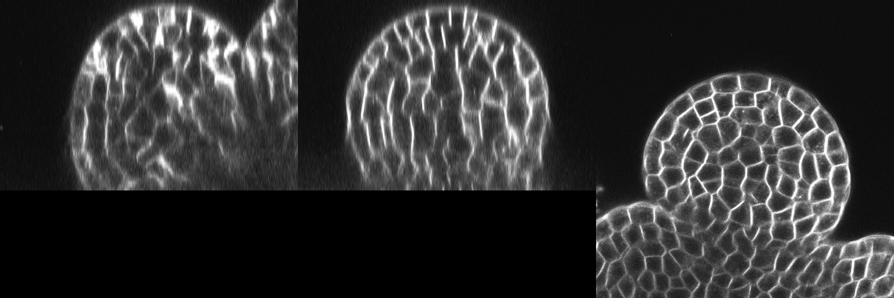
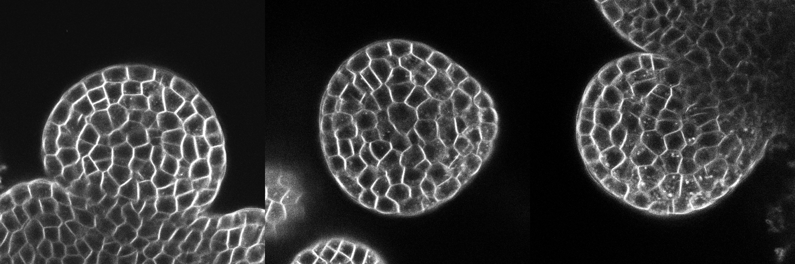
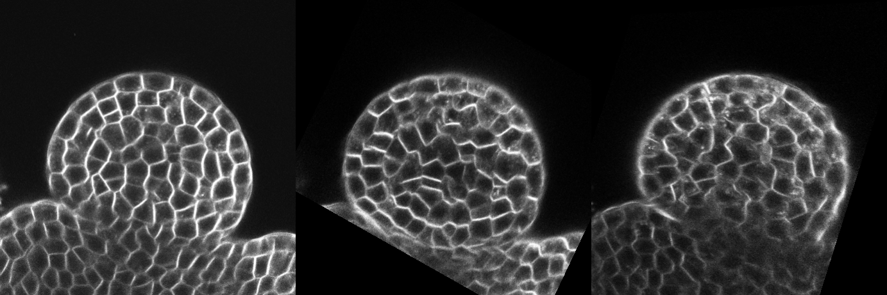
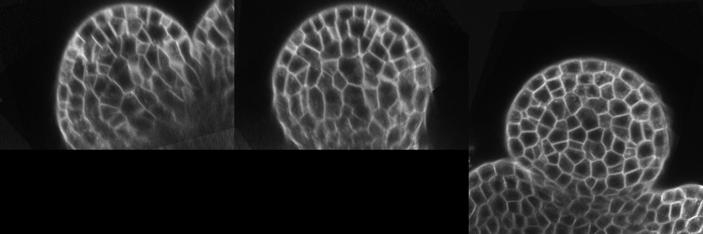

.. Figures for this file can be generated by installing openalea, vplants,
.. VPlants.VTissueData (1.0.3) and then, in this directory:

.. user@computer$ ipython --gui=qt
.. >>> %run example_fusion.py
.. >>> do_doc_images()

.. _multi_angle_reconstruction:

Multi-Angle-Reconstruction
##########################

In this section we will see how to register and fuse several (potentially anisotropic,  *ie* having
different voxel sizes) images - acquired from different angles but at the same time step - into one
high resolution isotropic image. First we will see how to register images by pairs, and then how to
combine them into a higher-resolution (super-resolution) image.

.. contents::

Fusing three images
===================

In this example we want to fuse together three acquisitions (0, 1 and 2) of a living meristem at different angle
and very close time steps (close enough to consider they are simultaneous).

Each acquisition has a good signal in the focus plane but bad signal in planes parallel the the view axis.

.. _original_cross_sections:

   Mid-depth YZ, XZ and XY cross sections of the original angle 0 acquisition. Bad quality
   in YZ and XZ.

By summing the acquisitions together we can obtain a higher resolution image, in all directions.
However, we must first correct the orientation:

   XY Mid-depth section of the three images to fuse : they are not registered.

Procedure
*********

To fuse the images we first need to register them two by two, image "0" being our reference.
We would like to automate the process, however the angle between images is too big for automated registration
so we first need to do a manual landmark registration.

Manual landmark registration tries to minimize square distance between pairs of points
from two point clouds.

.. tip::

    Have a look at :ref:`tips_reg_mips` to see how to acquire the point clouds (and
    to discover other ways of initialising the process).

We will assume you have saved them to files:

* image 1 on image 0 : "p12-1.txt" contains landmarks for image 0 in **3D real** coordinates and
  "p12-2.txt" contains landmarks for image 1 in **3D real** coordinates.
* image 2 on image 0 : "p13-1.txt" contains landmarks for image 0 in **3D real** coordinates and
  "p13-3.txt" contains landmarks for image 2 in **3D real** coordinates.

.. note::

    The point set for the reference image (0) is different for each task. This is simply
    because we might not find the same correspondences when looking at image 0 and image 1 or looking at image 0
    and image 2.

Once we have enough point correspondences we will use them to initialize the automated reconstruction.
First we will try to find the best rigid transform and then, since it's a living organism that can
have slightly changed between each angle, we will try to find a non-linear (vector-field) deformation.

The scripted version
====================

.. note::

    The full example can be downloaded :download:`here <./example_fusion.py>`.

Step 1/|N| : Getting the data
*****************************

Make sure you have :ref:`installed the data <install_vtissuedata>`

In a |QtEnSh|  import everything:

.. literalinclude:: example_fusion.py
    :lines: 13-19

Get the data paths:

.. literalinclude:: example_fusion.py
    :lines: 23-31

Read the data:

.. literalinclude:: example_fusion.py
    :lines: 34-41

* *pts01_0_3D* : list of coordinates for points on the reference image for the registration of image 1 on image 0.
* *pts01_1_3D* : list of coordinates for points on the floating image for the registration of image 1 on image 0.
* *pts02_0_3D* : list of coordinates for points on the reference image for the registration of image 2 on image 0.
* *pts02_2_3D* : list of coordinates for points on the floating image for the registration of image 2 on image 0.

Step 2/|N| : Preparing image 1 on image 0 registration
******************************************************

Parametrise the landmark registration:

.. literalinclude:: example_fusion.py
    :lines: 48

Parametrise the auto-linear registration:

.. literalinclude:: example_fusion.py
    :lines: 52-54

Parametrise the auto-non-linear registration:

.. literalinclude:: example_fusion.py
    :lines: 57

Create the reconstruction task that registers image 1 on image 0:

.. literalinclude:: example_fusion.py
    :lines: 61-64

This simply creates an association so that later on we know how to register image 1 on image 0.

Step 3/|N| : Preparing image 2 on image 0 registration
******************************************************

Parametrise the landmark registration:

.. literalinclude:: example_fusion.py
    :lines: 71

Create the reconstruction task that registers image 2 on image 0:

.. literalinclude:: example_fusion.py
    :lines: 75-78

.. note:: We reuse auto parameters from the "image 1 on image 0" registration step.

Step 4/|N| : Reconstructing
***************************

We have described what operations should be done to
register the images so we can now ask to compute the registrations:

.. literalinclude:: example_fusion.py
    :lines: 83-85

:func:`~vplants.mars_alt.mars.reconstruction.reconsctruct` will compute the registrations
(correctly initialising them) and will return two list :

* *recons_task* contains the list of tasks used for the registration
* *recons_results* contains the result of the registration (matrices, deformation fields...).

Both lists have same lengths and *recon_results[i]* = `reconstruct(*recons_task[i]*)`.

   XY cross-sections at mid-depth of the intermediate resampled images.

Step 5/|N| : Fusing
*******************

Instead of transforming those lists by hand to fead them to
:func:`~vplants.mars_alt.mars.fusion.fusion`,
simple use :func:`~vplants.mars_alt.mars.reconstruction.fuse_reconstruction`:

.. literalinclude:: example_fusion.py
    :lines: 90-93, 100-101

The :func:`~vplants.mars_alt.mars.reconstruction.fuse_reconstruction` function
uses the images from `recons_tasks` and the transformations from `recons_results`
to resample the images and fuse them together. It return two objects:

- ``fused_im_0_1_2`` (a |SpatialImage|) is the fused, super-resolution image.
- ``interm`` (a list of |SpatialImage| or **None**). If requested it is the list
    of intermediate resampled images.

   Mid-depth YZ, XZ and XY cross sections of the final fused image. The quality
   is better in all planes compared to :ref:`the original reference image <original_cross_sections>`.

.. |N| replace:: 5

The Dataflow version
====================

The above script can be resumed by the following dataflow (available as
an example in Visualea under the **vplants.mars_alt.demo.reconstruction tasks:reconstruction**
package:

.. dataflow:: vplants.mars_alt.demo.reconstruction tasks:reconstruction
