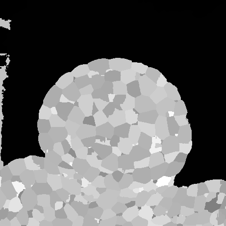

Segmentation
############

In this section we will try to automatically segment an image using watershed algorithm.

This sections starts off where the :ref:`multi_angle_reconstruction` ended. We had a
variable called **fused_im_0_1_2** corresponding to the super-resolution fusion of
three images taken at different angles at the same time step. This is the image we will
segment, so let's go:

.. literalinclude:: example_segmentation.py
    :lines: 14-17

The :func:`~vplants.mars_alt.mars.segmentation.cell_segmentation` function operates a
seed extraction, a watershed, and a cell-volume filter to remove small cells.

* *h_minima* parameter defines the *height* of the frontier between two bassins below
   which the two bassins will be merged.
* *volume* parameter is the volume of a cell below which it will be removed.
* *real* parameter tells the algorithm to consider *volume* is given in number of voxels
    (*real* is **False**) or in real units, *i.e* it takes the voxel
    sizes into account (*real* is True).

   XY cross-sections at mid-depth of the segmented image.

The updated Visualea dataflow with the cell_segmentation node:

.. dataflow:: vplants.mars_alt.demo.reconstruction mars
