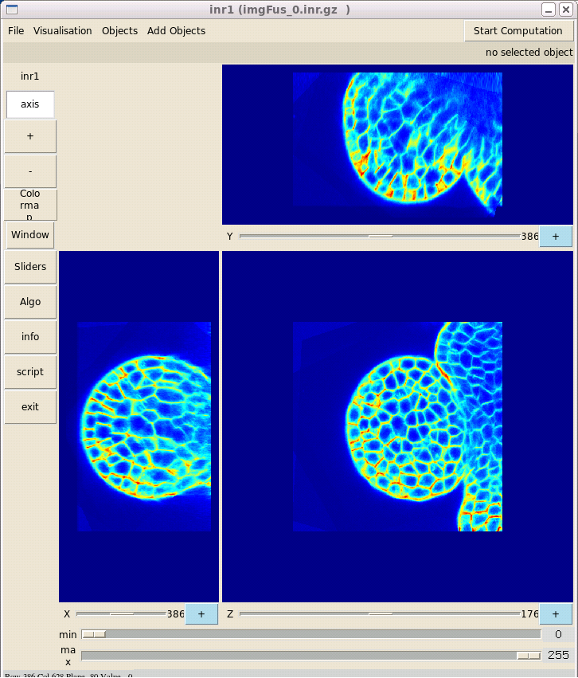

======
Fusion  
======

The fusion of all images is done by averaging the voxel intensities after resampling in a common geometry. ::

    cd ../3_Fusion
    ./Script_10_Reech_Et_Fusion
    zviewer imgFus.inr.gz

