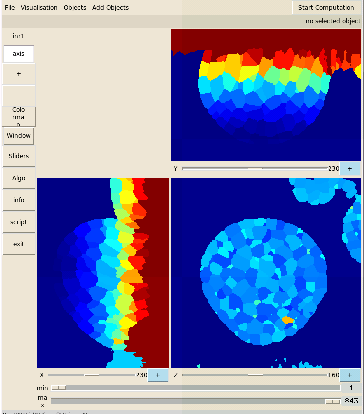
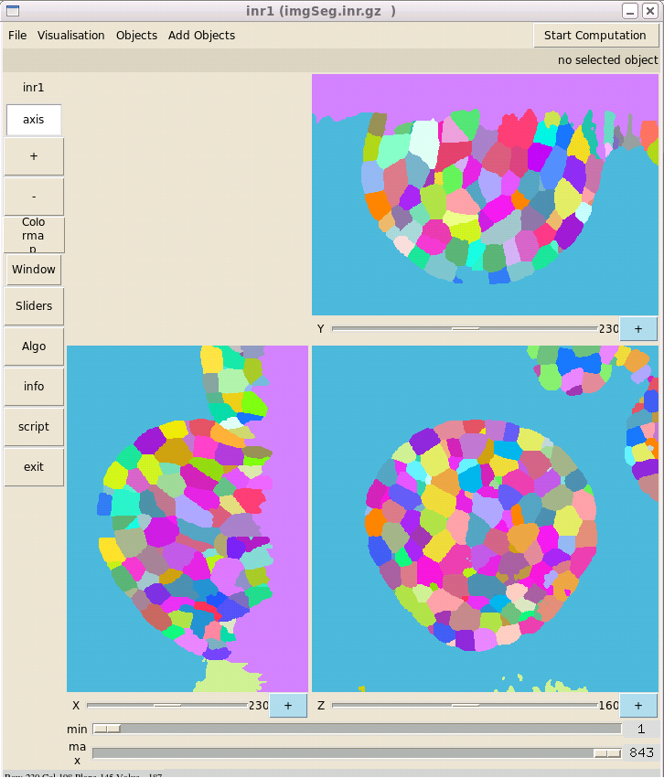
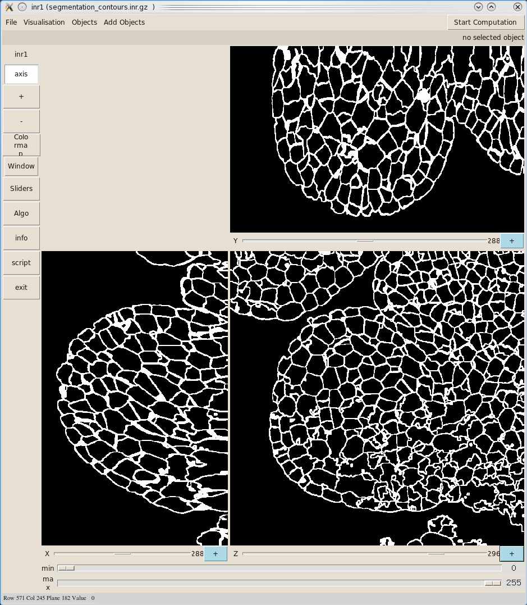

=================
Cell Segmentation
=================

We use a watershed algorithm for the cell segmentation, which is well adapted to our images in which the objects to segment are dark areas (cell interors) surrounded by bright and thin boundaries (cell walls). ::
    
    cd ../4_Segmentation
    CONVERTIR ../3_Fusion/imgFus.inr.gz ./imgFus.inr.gz 1
    SEGMENTATION imgFus.inr.gz imgSeg.inr.gz 1 1000 3 3 0
    zviewer imgSeg.inr.gz

The parameters used by SEGMENTATION are : :: 
    
    SEGMENTATION " input " " output " "minimal volume of cells" "h-minima" "filtering" "variance"

* **minimal volume of cells** allows to remove all cells which are smaller than volume
* **h-minima** allows controlling the pertinence of extracted minima ( generally between 3 and 5 (in intensity units) for the floral buds, and between 4 and 6 for the roots)
* **filtering** processes to a Alternate Sequential Filter or a Gaussian filter. 
    * filtering > 0 : Alternate Sequential filter 
    * filtering = 0 : Filtering with a gaussian kernel of variance **variance**

To display the image with any random colors : ::

    LUT_ALEATOIRE 1
    zviewer imgSeg.inr.gz
    Colormap - User Defined - randomLutBright.cmap   
 

To enhance the visualization of contours, we can run "DESSINERSEPARATIONS" script: ::

    DESSINERSEPARATIONS imgSeg.inr.gz imgSegCC.inr.gz 2
    zviewer imgSegCC.inr.gz

===================================
User-guided segmentation correction
===================================

You can fuse, remove or relabel cells with a user-guided segmentation correction tool. ::

    cd ../5_Segmentation_Expert
    yav++ segmentationExpert.tcl

=====================
Segmentation analysis
=====================

You can get any global information about cells (number of cells, cell volumes, barycenters). ::

    

