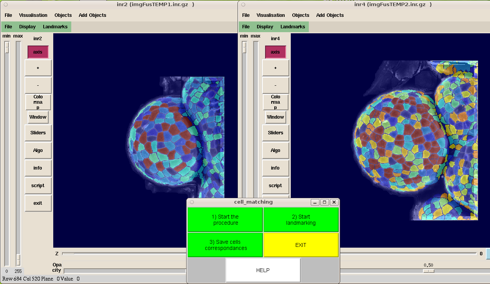

ALT : Automated Lineage Tracking 
++++++++++++++++++++++++++++++++

This step extends the 3-D analyses to include the automatic tracking of cell lineages during floral growth. To be able to study changes in floral shape, we follow the growth of individual flowers over a period of time.

The computation of cell lineage consists in iterating the following steps until stability:

1. Computation of a deformation field based on a set of known lineages
2. Refining of the deformation field with an automated non-linear registration algorithm
3. Building of lineage hypotheses and solving the lineage problem
4. Update of the set of known lineages

Before starting the process, MARS have to be applied to each flower or at least the segmentation step.

Initialization
""""""""""""""

For this tutorial, we will compute the lineage tracking of floral bud meristem between a time course 0 - 26 h : 

.. topic:: Datas 

    PlantB : Floral bud ( acquisition confocal microscope, datas acquiered at ENS-Lyon)

    time course : 0 - 26 h 
    
    stack resolution : 772 772 352 0.200320 0.200320 0.200320  

Copy from vtissue/alt, the plantB directory : ::

    mkdir alt
    cd alt
    cp -r $VTISSUEPATH/alt/plantB/* .
 
Edit the MetaInfo file to specify where the images are on your system. 

And run : ::

    CONSTRUIRE_ARBORESCENCE_POUR_SUIVI 1

The ALT work environment is build as follow ::

   ./
       MetaInfo    
           1_Recalage/
               	./Script_1_Preparation_Recalage
                ./Script_2_Appariements_Manuels
                ./Script_3_Recalage_Rigide_Manuel		
                  
           2_ALT
                ./Script_4_preparation_ALT
                ./marchingLineageClusterManager
                ./marchingLineageCluster
                ./marchingLineageCluster.pbs
                

Registration and User-guided identification 
"""""""""""""""""""""""""""""""""""""""""""

The first step is to prepare the ALT procedure.
For that we have to register the images between them in order to address the correspondances between cells with a user-guided identification. ::

    cd 1_Recalage
    cp ../*.inr.gz . 
    ./Script_1_Preparation_Recalage

To process to the identification of correspondances by pairing a few cells.

Run : ::

    ./Script_2_Appariements_Manuels 1

Press on "Start the procedure" and identify the correspondances.
To save, press "Save cell correspondances". Save the mapping as **mapping_01.txt**::

    ./Script_3_Recalage_Rigide_Manuel
    cd ../2_ALT
    ./Script_4_preparation_ALT

Computation of cell lineage
"""""""""""""""""""""""""""

To begin ALT, run : :: 

    ./marchingLineageClusterManager

At the end, we can see the % of correct ALT identification with: ::
    
    COMPARER_MAPPINGS_PARTIELS data/logSuivisAuto/logSuivi_01_iter_1_FLO-3_01.suivi logSuiviExpert_01.suivi out 1

    Lecture d'un mapping total (un logSuivi)
    Lecture du suivi expert
    Lecture du suivi auto et comparaison
    Fichier de suivi entre
    imgT0=data/Images_calculees/imgSegDefStep2_0_01_iter_1_FLO-3_01.inr.gz et
    imgT1=data/Images_calculees/imgSeg_1_01.inr.gz
    Dynamique lue = 1 vers 1041
    Dynamique lue = 1 vers 1745
    Mesure 1 : nb de lignages contenant une erreur
    Nombre de lignees fausses = 2 / 63 soit 3.1746 %
    Taux de reussite = 96.8254 %
    Mesure 2 : nb de meres erronees
    Nombre de filles dont la mere est fausse = 1 / 131 soit 0.763359 %
    Taux de reussite = 99.2366 %
