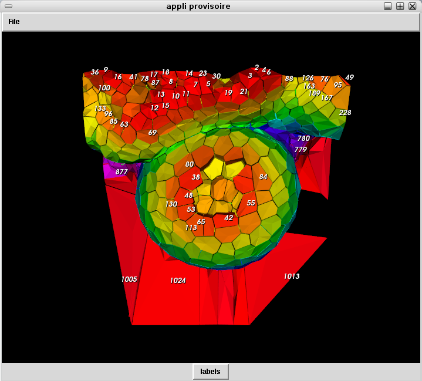

======================
Displaying Cell labels
======================

To activate the cell labels, you have to select the radio button next to the file name, at the top of the layer window. 
It tells the software that you want this label list to be on the display list.

At the bottom of the main window is a « labels » button. Click on it and click then on the image to activate the display. If you have selected the radio button, the labels should appear.

Clicking again on the button suppress the display

