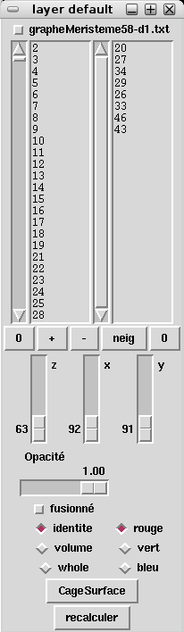
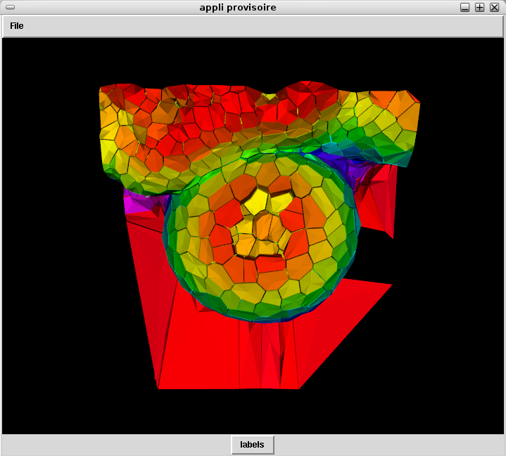

==========================
Cell selection and removal
==========================

Activate the main window by clicking on it. Move the arrow toward a cell you want to select. Once the arrow is located there, push the letter « p » on the keyboard. The cell id appears on the right textfield. Here in the example we selected cells number 20, 23, 24...

Click on the minus button below the textfields. You might need to use that button one or two times. You will see the right cell ids being removed from the left textfield. You just removed those cells from the main cell id list. 

Now click on « recalculer » at the bottom of the layer window.
After some time the structure has been recalculated. 

Click on the main window to activate the changes.

Now the structure has holes as we got rid of some of it's cells. If you're not satisfied with these changes, note that you can reset the main list by clicking on the left 0 and click then on « recalculer »

