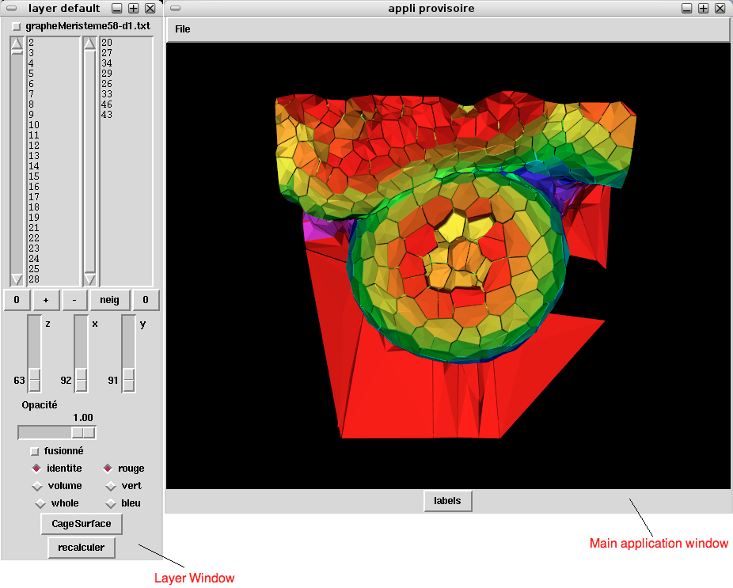

VIS : tool for visualizing segmentation results
+++++++++++++++++++++++++++++++++++++++++++++++

VIS is a visualisation software which aims at:

	1) helping visualizing segmentation result using a small resolution mesh

	2) overlapping different 3D structures to compare them

	3) selecting cells and contituting lists of cells of interest for further analyses

Requirements
""""""""""""

We recommend the use of ipython for the sake of compatibility with every libraries.

VIS requires the following packages:

* `IPython <http://ipython.scipy.org/moin/>`_
* `VTK <http://www.vtk.org/>`_
* `Tkinter <http://wiki.python.org/moin/TkInter>`_

General Layout of UI
--------------------

When VIS tool is started, it provide the following user interface :

:Main application window:
This is where the visualization of the data happens..

:Window Layer:

1- radio button with the name of the file (here graphemeristeme.txt). If checked the layer will be considered as selected when you click on the main window label button.

2- the two text fields : the left text field contains the cells ids that are currently on screen, the right text field is used to define cell ids of interest.

3a- right 0 button : reinitialize the cell list (reset previous changes).

3b- left 0 button : erase the right text field

3c- +/- : add/remove the right cell list to the left cell list

3d- neig : add every neighbouring cell of each cells defined in right cell list in right cell list (hence increasing the size of the right cell list)

4- z,x,y : changing these values will suppress every cell which barycenter is above the value from the left cell list

5- the "opacité" value is the opacity of the layer

6- "fusionne" will suppress or put a void space between cells.

7- "identite" colors cells following ids, "volume" following volumes, "whole" colors every cells the same way defind by "rouge", "vert", "bleu"

8- cagesurface modify the rendering of the structure.

9- "recalculer" will regenerate the layer using the current left cell list.

Tutorials
"""""""""

`Building of Cell graph <vis/building_cellgraph.html>`_ 

`Opening a file <vis/opening.html>`_

`Cell selection and removal <vis/selection_removal.html>`_

`Displaying Cell labels <vis/labels.html>`_

`Cell territory display <vis/territory.html>`_

