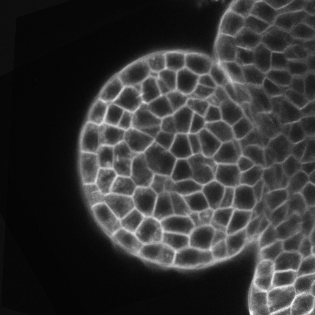

.. _mars_alt_segmentation:

Segmentation
############

This document explains how to segment a 3D image to identify
the cells as individual 3D objects. For that, we use a
watershed algorithm which is well-suited to our images,
in which the objects to segment are dark areas (cell interiors)
surrounded by bright and thin boundaries (cell walls).

The python script for this example can be downloaded
(download file : :download:`example_segmentation.py` along with the
:ref:`images <install_vtissuedata>`. Run the script like this::

	user@computer:$ python example_segmentation.py

Seed extraction
===============

Filtering
---------

Generally, sources for watershed methods are the local minima of the input image.
However, it is known that such a strategy leads to over-segmentation.
We first denoise the input image to enhance the signal/noise ratio and eliminate
high frequency noise while preserving the main structural properties of the image.
It appeared that the denoising method has to be adapted to the type of processed images.
Then the main local minima are extracted.

First, we need to get the input image. There are two basic ways to obtain the input image.
The data may exist in a file that can be read with :func:`~openalea.image.serial.basics.imread` function,
or the image may be procedurally generated
(via :ref:`multi_angle_reconstruction` for example).

    A slice in the 3D image to segment.

For the floral buds images, acquired with a single photon laser scanning microscope,
the Alternate Sequential Filter (ASF) is used as denoising method.
This is a succession of morphological opening and closing operations with structuring
elements of increasing size. For structuring elements, we chose discretized
Euclidean sphere of radii ranging from 1 to N, N being equal to 4 for the high
resolution images, and to 2 or 3 for the normal resolution images (here equal to 3).

In a |QtEnSh| :

.. literalinclude:: example_segmentation.py
    :lines: 8-17

.. note::

    For the root meristem images, acquired with a multiphoton microscope,
    a Gaussian filtering (i.e. a convolution with a 3D Gaussian function) is preferred.
    The typical value of the standard deviation is 0.5 μm.

    .. literalinclude:: example_segmentation.py
        :lines: 20

In VisuAlea, the same function exits in the ``vplants.mars_alt.nodes`` package.
Let's drag and drop the ``filtering`` node in the workspace.

.. note::

    If you use the Alternate Sequential Filter as denoising method,
    the filtering value is cast to integer as it is not the sigma of
    a gaussian but the number of iterations of the filter.

    Filtering dataflow

    .. dataflow:: vplants.mars_alt.demo.segmentation filtering

Seed extraction
---------------

The seeds are then extracted by computing the h-minima from the denoised image.
The parameter h allows controlling the pertinence of extracted minima: two neighboring
basins will be merged if they are separated by a “mountain” whose minimal height
(with respect to the higher basin) is less than h.
The parameter h is set for each series of image, whereas it varies between 3 and 5
(in intensity units) for the floral buds, and between 4 and 6 for the roots.
These seeds serve as markers for the foreground. Eventually, an additional marker is added for the background.

.. literalinclude:: example_segmentation.py
    :lines: 23-25

    Seed exctraction dataflow

    .. dataflow:: vplants.mars_alt.demo.segmentation seed_extraction

    And the resulting seed image:

    .. image:: ./images/seeds.png
        :width: 35%

Watershed transformation
========================

The principle of the watershed transformation is to consider the image to be segmented
as an elevation map, and to flood water from different sources (the markers)
to extract the catchment basins that will be separated from the watershed ridges.

.. literalinclude:: example_segmentation.py
    :lines: 28-30

    Watershed dataflow

    .. dataflow:: vplants.mars_alt.demo.segmentation watershed

    And the resulting segmentation:

    .. image:: ./images/watershed1.png
        :width: 35%

Over-segmentation correction
============================

The extracted cells are then subsequently analyzed. Cell with too small volumes
(typically less than 8 μm3 or 1000 voxels) are obvious errors.
Corresponding markers are removed from the seeds, and the watershed transformation
is computed again until convergence.

.. literalinclude:: example_segmentation.py
    :lines: 33-35

    Over-segmentation correction dataflow:

    .. dataflow:: vplants.mars_alt.demo.segmentation over_segmentation

