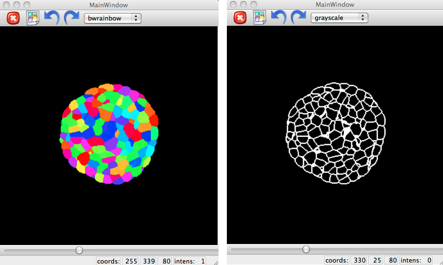
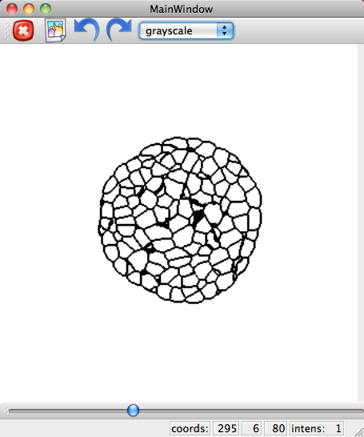
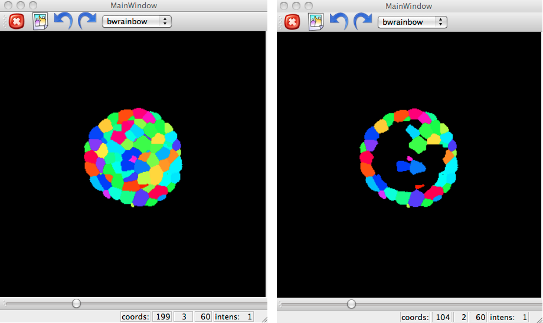

.. _mars_alt_analysis:

Modeling and Structural Analysis 
################################

Analysis of tissue properties
+++++++++++++++++++++++++++++

The goal of this document is to describe how extract a modeling template for the tissue, ie get some information about the number of cells, each cells volume, neighborhood structure and the shared surface area of two neighboring cells.

The python script for this example can be downloaded (download file : :download:`mars_alt_analysis.py`) along with the images 
(download images: :download:`plantB-data.tar.gz`). 
To run the script, it must be in the same directory than the images and run in a shell console using::

	user@computer:$ python mars_alt_analysis.py

Reading and display a segmented image
=====================================

A segmented image (for example in inrimage format) can be loaded in :mod:`openalea.image` as follows:

.. code-block:: python
    :linenos:

    from openalea.image import imread,display
    im = imread('segmentation.inr.gz')

    from PyQt4 import QtGui
    app = QtGui.QApplication([])
    w = display(im)

Dealing with cells
==================

First, let us read the properties of tissue with the function :func:`VTissueAnalysis`.

.. code-block:: python
    :linenos:

    from vplants.mars_alt import VTissueAnalysis
    properties = VTissueAnalysis(im)

Properties
==========

Number of cells
---------------

:func:`nlabels` look at the number of cells in the tissue

.. code-block:: python
    :linenos:

    properties.nlabels()

Center of mass
--------------

:func:`center_of_mass` look at the center of mass of cells in the tissue.

For a single cell :

.. code-block:: python
    :linenos:
    
    properties.center_of_mass(255)

.. warning:: Default, the center of mass is determined in the in real-world units.

To compute the center of mass in voxels :

.. code-block:: python
    :linenos:
    
    properties.center_of_mass(255, real=False)

For a sequence of cells :   

.. code-block:: python
    :linenos:
    
    properties.center_of_mass([265,300])

For all of cells :
    
.. code-block:: python
    :linenos:
    
    properties.center_of_mass()

Volume
------

:func:`volume` look at the volume of cells in the tissue.

For a single cell :

.. code-block:: python
    :linenos:
    
    properties.volume(255)

.. warning:: Default, the volume is determined in the in real-world units.

To compute the volume in voxels :

.. code-block:: python
    :linenos:
    
    properties.volume(255, real=False)

For a sequence of cells :   

.. code-block:: python
    :linenos:
    
    properties.volume([265,300])

For all of cells :
    
.. code-block:: python
    :linenos:
    
    properties.volume()

Neighbors
---------

:func:`neighbors` look at the neighborhood cells eg. which cells have contact with a given cell.

For a single cell :

.. code-block:: python
    :linenos:
    
    properties.neighbors(255)

.. warning:: Any non-one values are used as labels of cells and one values are considered the background.

For a sequence of cells :   

.. code-block:: python
    :linenos:
    
    properties.neighbors([265,300])

For all of cells :
    
.. code-block:: python
    :linenos:
    
    properties.neighbors()

.. warning:: The computing time can be quite long depending on the number of cells.

Shared surface area of two neighboring cells
--------------------------------------------

:func:`surface_area` look at the surface area between two neighborhood cells.

.. code-block:: python
    :linenos:
    
    properties.surface_area(255,1)

.. note:: The following functions are implemented as nodes within VisuAlea .

.. dataflow:: vplants.mars_alt.demo.analysis analysis
    :width: 90%

**Figure 1 : Analysis functions in VisuAlea.**

Extract cells in the layer 1
----------------------------

:func:`extract_L1` return the list of all the cells in the layer 1.

.. code-block:: python
    :linenos:
    
    from openalea.image import imread
    im = imread('segmentation.inr.gz')

    from vplants.mars_alt import extract_L1
    L1 = extract_L1(im) 

.. dataflow:: vplants.mars_alt.demo.analysis extract_L1
    :width: 30%

**Figure 2 : extract_L1 function in VisuAlea.**

Structural Analysis
+++++++++++++++++++

The goal of this document is to describe how extract structures for the tissue, ie get walls for example.

The python script for this example can be downloaded (download file : :download:`mars_alt_structural_analysis.py`) along with the images 
(download images: :download:`plantB-data.tar.gz`). 
To run the script, it must be in the same directory than the images and run in a shell console using::

	user@computer:$ python mars_alt_structural_analysis.py

Draw walls
==========

:func:`draw_walls` can be used for drawing walls from a segmented image.

.. code-block:: python
    :linenos:
    
    from openalea.image import imread,display
    im = imread('segmentation.inr.gz')

    from PyQt4 import QtGui
    app = QtGui.QApplication([])
    w1 = display(im)

    from vplants.mars_alt import draw_walls
    walls = draw_walls(im)
    
    w2 = display(walls)

**Figure 3 : Display walls from a segmented image.**

It is possible to inverse the walls with the :func:`openalea.image.reverse_image` function.

.. code-block:: python
    :linenos:
    
    from openalea.image import reverse_image
    walls_inv = reverse_image(walls)

    w3 = display(walls_inv)

**Figure 4 : Display walls from a segmented image.**

.. dataflow:: vplants.mars_alt.demo.structural_analysis draw_walls
    :width: 30%

**Figure 5 : Display walls from a segmented image in VisuAlea.**

Draw L1
=======

:func:`draw_L1` can be used for drawing the cells in the layer1 from a segmented image.

.. code-block:: python
    :linenos:
    
    from openalea.image import imread,display
    im = imread('segmentation.inr.gz')

    from PyQt4 import QtGui
    app = QtGui.QApplication([])
    w1 = display(im)

    from vplants.mars_alt import draw_L1
    imL1 = draw_L1(im)
    
    w2 = display(imL1)

**Figure 6 : Display the cells in the layer 1 from a segmented image.**

.. dataflow:: vplants.mars_alt.demo.structural_analysis draw_L1
    :width: 25%

**Figure 7 : Display the cells in the layer 1 from a segmented image in VisuAlea.**
