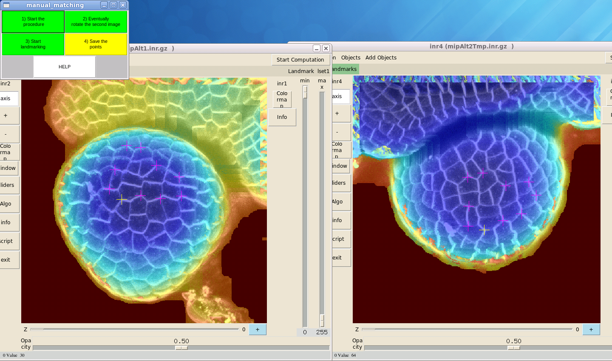
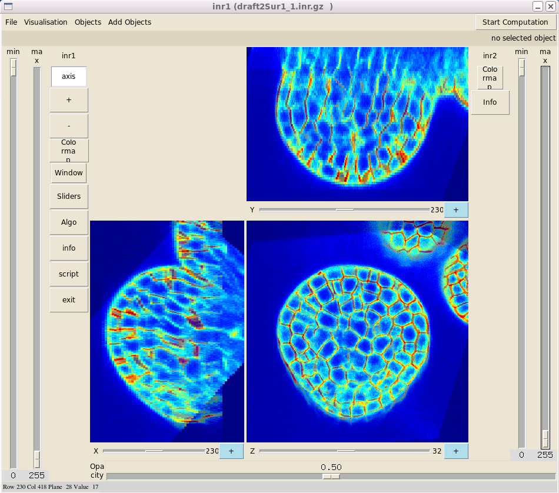

================================
 User-guided linear registration  
================================

The large transformations due to the difference in positioning can not be easily compensated with automated algorithms. 
An initial rigid transformation is computed based on a set of at least 4 landmarks manually identified in both the reference (the top view stack) and the floating stacks. ::
    cp tot*Sub.inr.gz 1_Exporte_Empile
    cd 2_Recalage/
    ./Script_1_Preparation_Recalage
    ./Script_2_Appariements_Manuels

To process to the identification of correspondances by pairing a few anchor points,
Press on "Start the procedure" when the window is displayed.

If you want to change the point of view, you can press on "Eventually rotate the second image". This action rotates the floating image by 90 degrees in the counter-clockwise direction.
And then, you can process to the user-guided registration by marking points which are the same in the two views.
                           
Press on "Start landmarking".

To save, press "Save the points".

.. note:: Repeat this step for each image to be registered.

Run finally : ::

    ./Script_3_Recalage_Rigide_Manuel

You can see the result of the User-guided linear registration: ::

    ./ScriptVisuRecalageManuel 2
    ./ScriptVisuRecalageManuel 3
    

