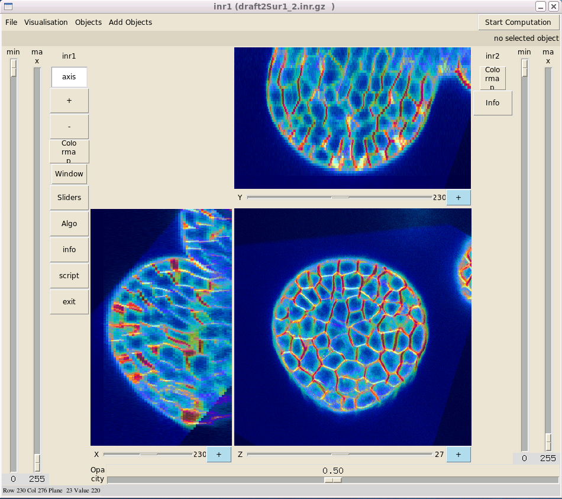

=============================
Automated linear registration  
=============================

The user-guided registration compensates roughly for the positionning error, but does not yield a precise linear registration. 
A more robust transformation is automatically computed using all available image information.
The principe of this procedure is to decompose the images into blocks of fixed size and to find a rigid transformation that computed from mapping between blocks of both images that minimizes the correlation coefficient between corresponding blocks.

You have the possibility to run the linear registration either on the Nef Cluster or on your machine.

Using the cluster need an account on the Nef Cluster - see : "http://www-sop.inria.fr/dream/Cluster/Cluster"

On your machine
---------------

If you have not access on the cluster, you have to activate the "Script_4_5_6_en_local" and run it: ::

    chmod +x Script_4_5_6_en_local
    ./Script_4_5_6_en_local

And you can see the result with "ScriptVisuRecalageRigide": :: 

    ./ScriptVisuRecalageRigide 2
    ./ScriptVisuRecalageRigide 3

On Nef Cluster
--------------

Run "Script_4_Recalage_Rigide_Auto_sur_grille_0" and follow the instructions on the screen: ::

    ./Script_4_Recalage_Rigide_Auto_sur_grille_0
    ssh -X login@server
    mkdir tmpBaladin

Then run "Script_5_Recalage_Rigide_Auto_sur_grille_1" ::

    ./Script_5_Recalage_Rigide_Auto_sur_grille_1
    ssh -X nef
    cd ./tmpBaladin
    chmod +x ScriptSubBaladin

You can run "showq" to check your job are been processed and then you can logout. A mail from the cluster will send to you when the process will be finished.

And finally run the "Script_6_Recalage_Rigide_Auto_sur_grille_2": ::

     ./Script_6_Recalage_Rigide_Auto_sur_grille_2

