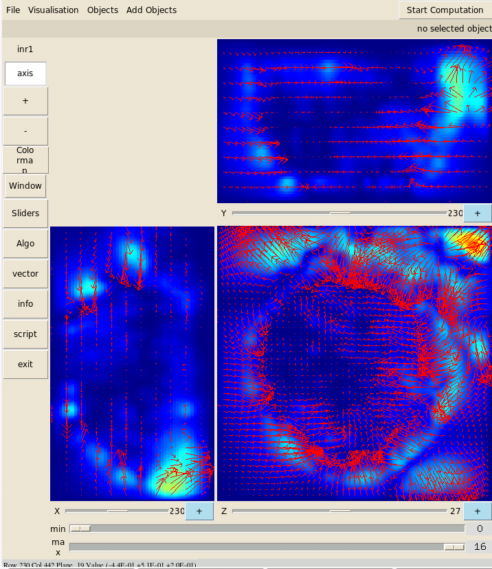

=================================
Automated non-linear registration  
=================================

A global linear transformation can not handle the deformations essentially due to plant manipulation and the time lapse
between two acquisitions. A block-based pyramidal algorithm is used to compute a final no-linear transformation that accomodates for the residual local deformations between the reference and the floating images.

You have the possibility to run the linear registration either on the Nef Cluster or on your machine.

On your machine
---------------

.. warning:: The time of process is quite long.

If you have not access on the cluster, you can run : ::

    ./Script_7_Recalage_Dense_Auto_local_0

Then run "Script_8_Recalage_Dense_Auto_local_1": ::

    ./Script_8_Recalage_Dense_Auto_local_1

And follow the instructions on the screen: ::

    cd MAF_LOCAL

Run: ::

    ./build_atlas_baloo

You can run the "Script_9_Recalage_Dense_Auto_local_2". ::

    cd ..
    ./Script_9_Recalage_Dense_Auto_local_2

Finally you can see the result of vector field based shape deformation. :: 

    cd Recalage_2_Dense/
    zviewer champ_1.inr.gz champ_2.inr.gz champ_3.inr.gz

On Nef Cluster
--------------

Using the cluster need an account on the Nef Cluster - see : "http://www-sop.inria.fr/dream/Cluster/Cluster" ::

    ./Script_7_Recalage_Dense_Auto_sur_grille_0

And follow the instructions on the screen: "Script_7_Recalage_Dense_Auto_sur_grille_0": ::
    
    ssh -X nef.inria.fr
    mkdir ~/tmpBaloo
    exit

Then run "Script_8_Recalage_Dense_Auto_sur_grille_1": ::

    ./Script_8_Recalage_Dense_Auto_sur_grille_1

And follow the instructions on the screen: :: 
    
    ssh -X nef
    cd ./tmpBaloo
    chmod +x build_atlas_baloo
    echo "./build_atlas_baloo" | at now + 1minute

You can run "showq" to check your job are been processed and then you can logout.

You have to wait that the "Script_8_Recalage_Dense_Auto_sur_grille_1" is finished. When you receive a mail from the cluster that means the process is terminated.

.. code-block:: c

    ################ Build mean image ########################
    *** Iteration 1 ***
        * reference =  /export/home/rfernand/tmpBaloo32/images/Img_1.inr.gz
        * processing data  2
        1357357.nef.inria.fr
        * processing data  3
    1357358.nef.inria.fr
    Fri Nov  6 18:26:01 CET 2009
    0/2 0/2 0/2 0/2 0/2 0/2 0/2 0/2 0/2 0/2 0/2 0/2 0/2 0/2 0/2 0/2 0/2 0/2
    0/2 0/2 0/2 0/2 0/2 0/2 0/2 0/2 0/2 0/2 0/2 0/2 0/2 0/2 0/2 0/2 0/2 0/2
    0/2 0/2 0/2 0/2 0/2 0/2 0/2 0/2 0/2 0/2 0/2 0/2 0/2 0/2 0/2 0/2 0/2 0/2
    0/2 0/2 0/2 0/2 0/2 0/2 0/2 0/2 0/2 0/2 0/2 0/2 0/2 0/2 0/2 0/2 0/2 0/2
    0/2 0/2 0/2 0/2 0/2 0/2 0/2 0/2 0/2 0/2 0/2 0/2 0/2 0/2 0/2 0/2 0/2 0/2
    0/2 0/2 0/2 0/2 0/2 0/2 0/2 0/2 0/2 0/2 0/2 0/2 0/2 0/2 0/2 0/2 0/2 0/2
    0/2 0/2 0/2 0/2 0/2 0/2 0/2 0/2 0/2 0/2 0/2 0/2 0/2 0/2 0/2 0/2 0/2 0/2
    0/2 0/2 0/2 0/2 0/2 0/2 0/2 0/2 0/2 0/2 0/2 0/2 0/2 0/2 0/2 0/2 0/2 0/2
    0/2 0/2 0/2 0/2 0/2 0/2 0/2 0/2 0/2 0/2 0/2 0/2 0/2 0/2 0/2 0/2 0/2 0/2
    0/2 0/2 0/2 0/2 0/2 0/2 2/2
    1357365.nef.inria.fr
    Fri Nov  6 19:55:46 CET 2009
    .......................................................................

You can run the "Script_9_Recalage_Dense_Auto_sur_grille_2". ::

    ./Script_9_Recalage_Dense_Auto_sur_grille_2

Don't forget to erase "tmpBaladin" and "tmpBaloo" directories. 

