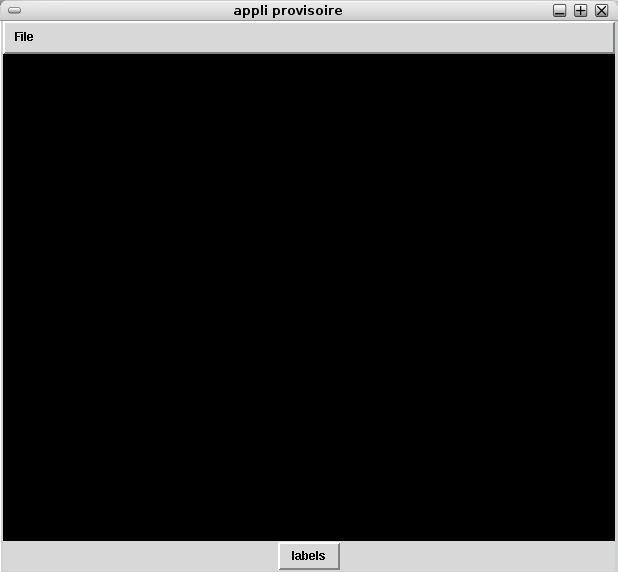
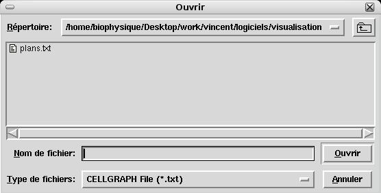
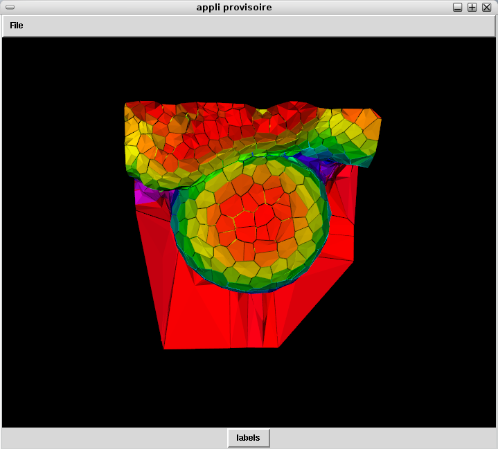

==============
Opening a file
==============

To launch the software, use a terminal and launch ipython, then use the following command :: 

    cd $VTISSUEPATH/python
    ipython
    %run visualisation

The main application window will open :

Use the File menu to access to the file browser, and go to your data directory. 

The file should be of the .txt type. 

Select it from datas directory and clock on « ouvrir » :

Another window has been created, we will return to it later. For the moment **you should still have a black window**. 
The image is here but not centered in the frame.

Use the mouse : 
    * Push the right button on the black window, stay pushing and slide the mouse toward the bottom. This zooms out. 
The image should appear, decreasing in size. Note that the same mouse button with a movement up zooms in.

    * Push the middle button and stay pushing, moving the mouse will now move the object according to the arrow.

    * Push the left button and stay pushing, moving the arrow will now rotate the object

.. note:: It is currently not possible to close a file once opened. Furthermore the layer window should not be closed since it cannot be currently reopened. To exit the software just click on the cross at the right upper border of the window.

