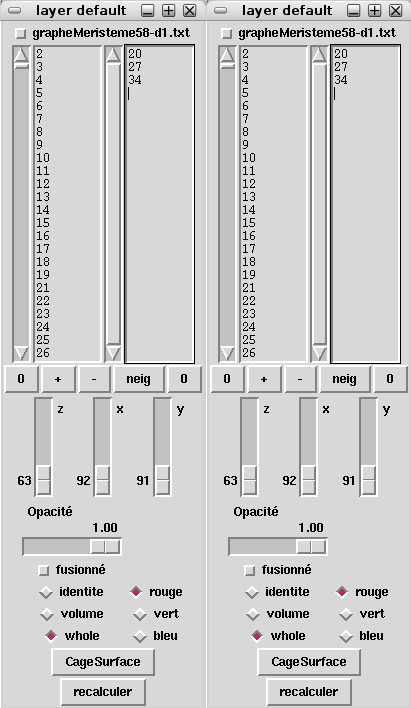
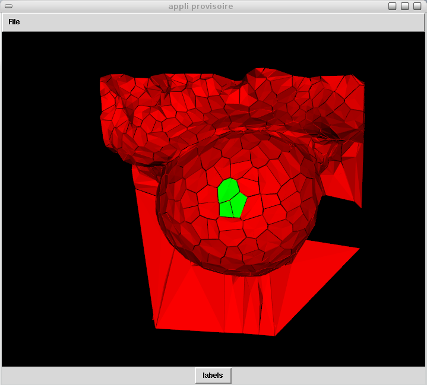
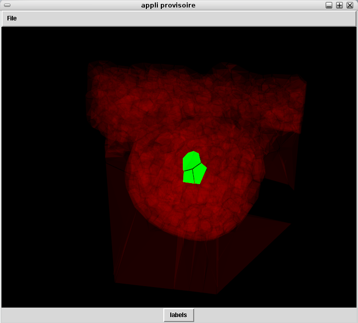

======================
Cell territory display
======================

Open a structure, move it at the center of the screen.
Reopen the structure.

A second layer window should appear. You have now two times the same structure at the same place. Of course you do not see it yet because they overlap perfectly.

Select some cells using the selection process (see tutorial). The cell labels should appear on the two layer windows. Do not forget to activate the main window by clicking on it before selecting cells, otherwise pressing the « p » letter won't have any effect.

Choose one of the layer window, we will call it layer one for the purpose of the tutorial. The other one is layer two. 

In layer one, erase the entire list of cells on the left text field, then click on « + ». You just replaced the entire cell list by the selected cells.

In layer two, click on the « - » button. You just removed the selected cells from the main list.

Click on  « recalculer » on both layers.

You should not see any differences on the main window. We will display them now. 

On layer one, click on « whole » and then on « vert »
On layer two, click on « whole » and then on « rouge »

Activate the main window by clicking on it. Now you should see tow types of cells. The green one are the selected cells and the red one the cells of the rest of the object.

If you want some fancy effect, try to move the opacity (« opacité ») of layer two to 0.03 and activate the main window.

Fancy isn't it?

