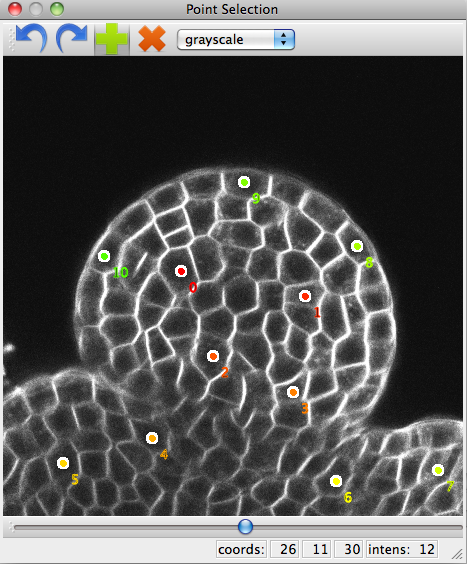
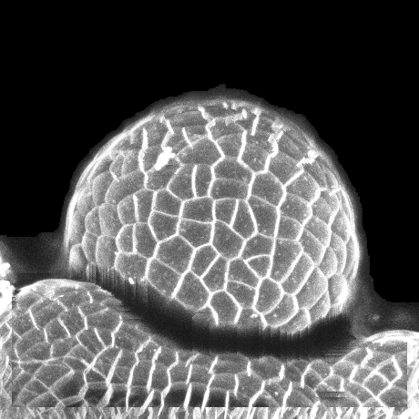
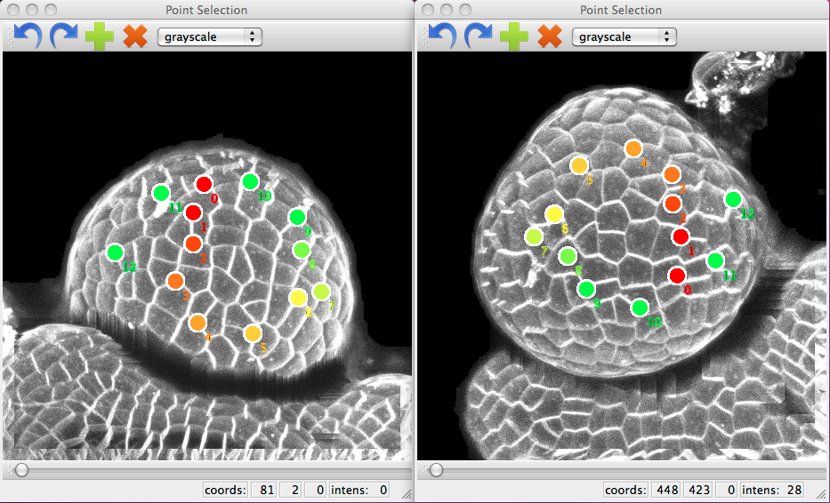
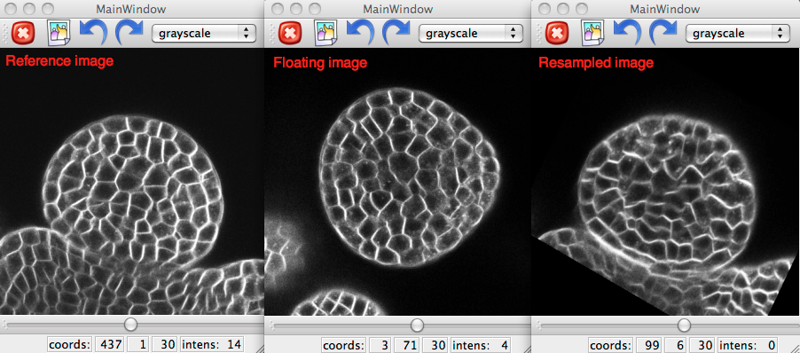
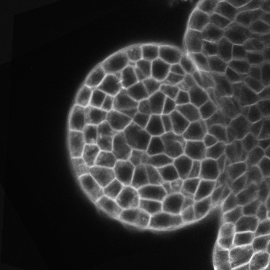

.. _mars_alt_reconstruction:

3D Reconstruction
#######################

This document explains how to reconstruct an isotropic 3D image (i.e. with voxels of the same dimension along the 3 axis)
by fusing image stacks acquired at different angles.

The python script for this example can be downloaded (download file : :download:`mars_alt_reconstruction.py`) and run in a shell console using:

.. code-block:: python

    user@computer:$ ipython -q4thread
    >>> %run mars_alt_reconstruction.py

.. _using_point_selection:

User-assisted linear co-registration
====================================

In order to avoid the failure of retrieve large transformations (for instance, rotation with an angle greater than 45 degrees),
we used a first registration with user assistance as initialization for further automated registration.

:class:`openalea.gui.point_selection` displays a view of an image in which you can pick points by pointing and clicking. For more information, see :class:`openalea.gui.point_selection`.
For each couple of images to be registered, we use :class:`openalea.gui.point_selection` to identify correspondences by pairing a few anchor points.

.. code-block:: python
    :linenos:

    from openalea.image import point_selection
    ps1 = point_selection(im1)
    ps2 = point_selection(im2)

**Figure 3: point_selection tool.**

It is possible to load any points from a txt file and use them.

.. code-block:: python
    :linenos:

    import numpy as np
    pts12-1 = np.loadtxt("pts12-1.txt")
    pts12-2 = np.loadtxt("pts12-2.txt")
    ps1.set_points(pts12-1)
    ps2.set_points(pts12-2)

The following points can be get with :class:`openalea.gui.point_selection.get_points()` and save to .txt file with :class:`numpy.savetxt`.

.. code-block:: python
    :linenos:

    pts12-1 = ps1.get_points()
    pts12-2 = ps2.get_points()

    np.savetxt("pts12-1.txt",pts12-1)
    np.savetxt("pts12-2.txt",pts12-2)

In VisuAlea, use :class:`Point Selection` node in the package :class:`openalea.gui` to create an user-assisted linear co-registration dataflow.

.. dataflow:: vplants.mars_alt.demo.reconstruction simple_user_registration
    :width: 40%

**Figure 4: User-assisted linear co-registration dataflow.**

To ease this operation for the user, we reconstructed the surface of the meristem from each image stack.

.. code-block:: python
    :linenos:

    from vplants.mars_alt import im2surface
    surf1,alt1 = im2surface(im1)
    surf2,alt2 = im2surface(im2)

    ps1 = point_selection(surf1)
    ps2 = point_selection(surf2)

**Figure 5: Reconstructed the surface of the meristem.**

.. note:: If the points are too close to each other on the meristem surface, the registration error can be high.
             We thus chose points homogeneously distributed over the whole surface and that appear in all the views.

It is possible to load and use saved points from a .txt file.

.. code-block:: python
    :linenos:

    import numpy as np
    pts1=np.loadtxt("pts12-1.txt")
    pts2=np.loadtxt("pts12-2.txt")
    ps1.set_points(pts1)
    ps2.set_points(pts2)

**Figure 6: User-assisted registration with the surface of the meristem.**

Since this is a projected view of this surface, anchor points manually positioned are in 2D coordinates. To infer the 3D coordinates of the points,
we use :class:`vplants.mars_alt.surface2im` function.

.. code-block:: python
    :linenos:

    from vplants.mars_alt import surface2im
    pts1_3D = surface2im(pts1,alt1)
    pts2_3D = surface2im(pts2,alt2)

**Figure 7: Dataflow for user-assisted registration with the surface of the meristem.**

In this step, you have to pass the 3D coordinates points to the :class:`openalea.registration.pts2transfo` function.
This function infers a rigid transformation from the anchor points.

.. note:: For the moment, only a rigid transformation is possible.

.. code-block:: python
    :linenos:

    from openalea.image import pts2transfo
    Tr12 = pts2transfo(pts1_3D,pts2_3D)

.. dataflow:: vplants.mars_alt.demo.reconstruction positioning_landmarks
    :width: 40%

**Figure 8: Compute the user-assisted registration.**

As the final step, it is possible to resample the (floating) image with the computed transformation and to save the transformation.

.. code-block:: python
    :linenos:

    np.savetxt("Tr12.txt",Tr12)
    from vplants.asclepios import reech3d
    im_res = reech3d(im2,mat=Tr12,vin=im1.resolution,vout=im1.resolution)

.. dataflow:: vplants.mars_alt.demo.reconstruction rigid_resampling
    :width: 40%

**Figure 8: Resampling using the rigid transformation matrix.**

**Figure 9: Result after resampling.**

.. warning:: For each couple of images to be registered, the user has to identify correspondences.

Automated linear co-registration
================================

An automated linear registration method is used to refine the previously computed transformation.
We chose :class:`vplants.asclepios.baladin` function which is block-matching based method.
The principle of this method is to pair sub-images (or blocks) between both images to be registered and then to compute a transformation that explains the obtained pairings.
Pairing is achieved by maximizing the correlation coefficient between blocks of the two images,
while the rigid transformation that best superimposes them is computed by minimizing the squared distances between the paired blocks’ centers.
This is iterated until convergence, and embedded into a multi-scale strategy.

For this example, we use the following parameters :
    * the size of blocks is set to 4 x 4 x 4 voxels,
    * block spacing is set to 3 voxels along each dimension,
    * and only the 75% blocks of highest variance are kept (to avoid considering blocks of homogeneous intensity).
    * Block similarity is assessed with the correlation coefficient.
    * The transformation estimation is conducted with a least trimmed squares scheme, with a cut value of 0.75.
    * The multi-scale pyramid starts with images of size 32 x 32 x 32 and ends at full resolution.

.. code-block:: python
    :linenos:

    from vplants.asclepios import baladin
    im_res_baladin,Tb12 = baladin(im1,im2,transformation="rigid",estimator="ltsw",pyn=6,pys=1,ltscut=0.75,v=0.75,inireel=Tr12)

.. dataflow:: vplants.mars_alt.demo.reconstruction block_matching
    :width: 40%

**Figure 10: Compute the automated linear registration.**

.. note:: If there exists a geometric distortion between the 2 images, apply an "affine" transformation to uniform the distortion.

.. code-block:: python
    :linenos:

    im_res_baladin,Tb12 = baladin(im1,im2,transformation="affin",estimator="ltsw",pyn=6,pys=1,ltscut=0.75,v=0.75,inireel=Tr12)

Automated non-linear co-registration
====================================

After linear co-registration, differences may still exist between image stacks that are due to slight deformations.
To compensate for them, we used a non-linear registration method, initialized by the previously computed rigid transformations,
that enables to compute a deformation field between images.

.. code-block:: python
    :linenos:

    from openalea.asclepios import superbaloo

.. todo:: Not running for the moment.

Fusion
======

The fusion of all images was done by averaging the voxel intensities after resampling them within a common geometry.
To cancel the effect of voxel geometric anisotropy, the reference image was itself resampled at a higher resolution with smaller cubic voxels,
while the other (floating) images were resampled with the combination of all computed transformations in the same geometry.

.. todo:: Link with the previous code

.. code-block:: python
    :linenos:

    from vplants.mars_alt import fusion

    im1 = imread('./temp/imgReech1.inr.gz')
    im2 = imread('./temp/imgReech2.inr.gz')
    im3 = imread('./temp/imgReech3.inr.gz')

    mat2 = np.loadtxt('./temp/mat2.txt')
    mat3 = np.loadtxt('./temp/mat3.txt')

    def1 = imread('./temp/champ_1.inr.gz')
    def2 = imread('./temp/champ_2.inr.gz')
    def3 = imread('./temp/champ_3.inr.gz')

    im_fus = fusion(im1,def1,[im2,im3],[mat2,mat3],[def2,def3])

.. dataflow:: vplants.mars_alt.demo.reconstruction fusion_v1
    :width: 70%

**Figure 10: Compute the fusion between the 3 images.**

**Figure 9: Fusion result : high-resolution image.**

