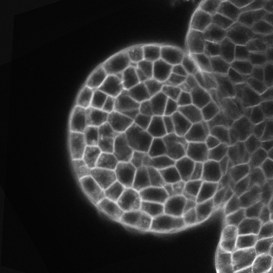

.. _mars_alt_segmentation:

Segmentation
############

This document explains how to segment a 3D image to identify the cells as individual 3D objects. For that, we use a watershed algorithm which is well-suited to our images, 
in which the objects to segment are dark areas (cell interiors) surrounded by bright and thin boundaries (cell walls).

The python script for this example can be downloaded (download file : :download:`mars_alt_segmentation.py` along with the images 
(download images: :download:`plantB-data.tar.gz`). 
To run the script, it must be in the same directory than the images and run in a shell console using::

	user@computer:$ python mars_alt_segmentation.py

Seed extraction
===============

Filtering
---------

Generally, sources for watershed methods are the local minima of the input image. However, this is known that such a strategy leads to over-segmentation. 
We first denoise the input image to enhance the signal/noise ratio and eliminate high frequency noise while preserving the main structural properties of the image. 
It appeared that the denoising method has to be adapted to the type of processed images. Then the main local minima are extracted.

First, we need to get the input image. There are two basic ways to obtain the input image. The data may exist in a file that can be read with :class:`~openalea.imread` function, or the image may be procedurally generated (via `mars_alt reconstruction pipeline <reconstruction.html>`_ for instance).

**Figure 1: Fused image.**

For the floral buds images, acquired with a single photon laser scanning microscope, the Alternate Sequential Filter (ASF) is used as denoising method. 
This is a succession of morphological opening and closing operations with structuring elements of increasing size. 
For structuring elements, we chose discretized Euclidean sphere of radii ranging from 1 to N, N being equal to 4 for the high resolution images, and to 2 or 3 for the normal resolution images (here equal to 3).

.. warning:: Filtering doesn't work correctly.

.. code-block:: python
    :linenos:
    
    from openalea.image import imread, display
    # im_fus = imread(".im_fus.npy")

    from PyQt4 import QtGui
    app = QtGui.QApplication([])
    w1 = display(im_fus)

    from vplants.mars_alt import filtering
    img_d_asf = filtering(im_fus,filter_type="asf",filter_value=3)

For the root meristem images, acquired with a multiphoton microscope, a Gaussian filtering (i.e. a convolution with a 3D Gaussian function) is preferred. 
The typical value of the standard deviation is 0.5 μm.

.. code-block:: python
    :linenos:

    img_d_gauss = filtering(im_fus,"gaussian",0.5)

In VisuAlea, the same function exits in the package :class:`vplants.mars nodes`. Let us drag and drop the node :class:`filtering` in the workspace.

.. warning:: If you use the Alternate Sequential Filter as denoising method, the filtering value is cast to integer.

.. dataflow:: vplants.mars_alt.demo.segmentation filtering
    :width: 25%

**Figure 2: Filtering dataflow.**

The seeds are then extracted by computing the h-minima from the denoised image. 
The parameter h allows controlling the pertinence of extracted minima: two neighboring basins will be merged if they are separated by a “mountain” whose minimal height 
(with respect to the higher basin) is less than h. 
The parameter h is set for each series of image, whereas it varies between 3 and 5 (in intensity units) for the floral buds, and between 4 and 6 for the roots. 
These seeds serve as markers for the foreground. Eventually, an additional marker is added for the background. 

.. code-block:: python
    :linenos:

    from vplants.mars_alt import seed_extraction
    seeds = seed_extraction(img_d_asf,3)
    w2 = display(seeds)

.. dataflow:: vplants.mars_alt.demo.segmentation seed_extraction
    :width: 30%

**Figure 3: Seeds extraction dataflow.**

**Figure 4: Seeds extraction.**

Watershed transformation
========================

The principle of the watershed transformation is to consider the image to be segmented as an elevation map, and to flood water from different sources (the markers) 
to extract the catchment basins that will be separated from the watershed ridges.

.. code-block:: python
    :linenos:

    from vplants.asclepios import watershed
    wat = watershed(seeds,im_fus)
    w3 = display(wat)

.. dataflow:: vplants.mars_alt.demo.segmentation watershed
    :width: 35%

**Figure 5: Watershed dataflow.**

 
**Figure 6: Watershed transformation.**

Over-segmentation correction
============================

The extracted cells are then subsequently analyzed. Cell with too small volumes (typically less than 8 μm3 or 1000 voxels) are obvious errors. 
Corresponding markers are removed from the seeds, and the watershed transformation is computed again until convergence.

.. code-block:: python
    :linenos:

    from vplants.mars_alt import remove_small_cells
    new_seeds = remove_small_cells(wat,seeds,volume=1000,real=False)

    new_wat = watershed(new_seeds,im_fus)

.. dataflow:: vplants.mars_alt.demo.segmentation over_segmentation
    :width: 35%

**Figure 5: over-segmentation correction dataflow.**

