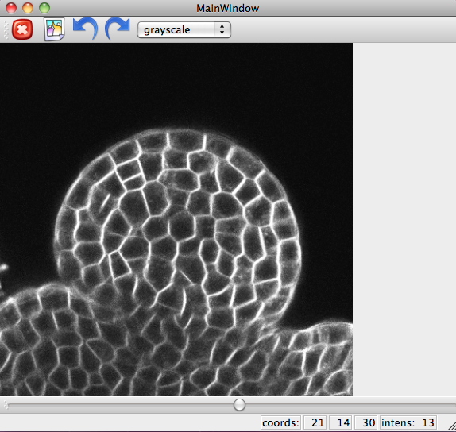

.. _mars_alt_visualization:

3D Visualization
################

This document explains how to visualize 2D and 3D images.

The python script for this example can be downloaded (:download:`mars_alt_visualization.py <./scripts/mars_alt_visualization.py>`) and run in a ipython console using :

.. code-block:: python

    user@computer:$ ipython -q4thread    
    >>> %run mars_alt_visualization.py

Read the Images
===============

The following example reads 3 images and displays them.

.. code-block:: python
    :linenos:
    
    from openalea.image import imread, display
    im1 = imread("plantB-1.lsm")
    im2 = imread("plantB-2.lsm")
    im3 = imread("plantB-3.lsm")

    w1 = display(im1)
    w2 = display(im2)
    w3 = display(im3)
 
.. warning:: Supported format are either the classical format for images
	     like png and jpg or lsm and inrimage format for spatial nd images.

**Figure 1: display tool.**

In VisuAlea, the same function exits in the package :class:`openalea.serial`. Let us drag and drop the node :class:`~openalea.imread` in the workspace.
The input is a string path or a Python file-like object.

.. dataflow:: vplants.mars_alt.demo.visualization imread
    :width: 50%

**Figure 2: imread function usage.**

