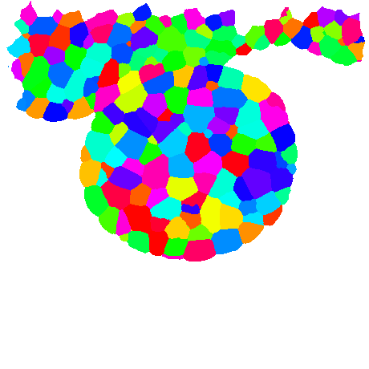

.. _Data-from-Segmented-Image:

How to extract data from a segmented image 
##########################################

.. topic:: Section contents

    In this section, we introduce the tools to analyse segmented tissu.
    We will present how to create a 2-3 dimensional graph (:class:`PropertyGraph`) from a :class:`SpatialImageAnalysis`.

.. warning:: If you want to use display functions (2D and 3D), make sure you launch python or ipython with the ``-q4thread`` option, launching the Qt4 environnement.

.. code-block:: bash
    
    user@computer:$ ipython -q4thread

.. note:: You can use simultaneously the ``-pylab`` option, a matplotlib-based Python environment.

.. code-block:: bash
    
    user@computer:$ ipython -q4thread -pylab

The Tools : :class:`SpatialImageAnalysis`
-----------------------------------------

Loading the image
=================
We provide a 2D illustration of the pipeline.

We start by loading a segmented image (see: `the MARS-ALT user guide <http://openalea.gforge.inria.fr/beta_doc/vplants/vtissue/doc/_build/html/user/index.html>`_ to learn how to segment a tissu.).

.. code-block:: python

    import openalea.container
    from openalea.deploy.shared_data import shared_data
    data_filepath = shared_data(openalea.container, 'p58-t1_imgSeg_cleaned.inr.gz')
    data_files = shared_data(openalea.container, pattern='*.inr.gz') # return a list
    
    from openalea.image.serial.basics import imread
    t1 = imread(data_filepath)

One can ask for a display of the object. Use the slider to walk through the meristem.

.. code-block:: python

    from openalea.image.all import display
    display( t1 )

We select one slice for the example:

.. code-block:: python

    from openalea.image.all import SpatialImage
    im = SpatialImage(t1[:,:,115])

Creating a :class:`SpatialImageAnalysis`
========================================
Then we load the class :class:`SpatialImageAnalysis.` 
This class regroup tools dedicated to spatial image analysis.
For each cell, you can ask for volumes, center of mass, inertia axis, curvature, neighbors...

.. code-block:: python
 
    from openalea.image.algo.analysis import SpatialImageAnalysis
    analysis = SpatialImageAnalysis(im)

One can ask for a display of the object.

.. code-block:: python

    from openalea.image.all import display
    display( im )

Using the :class:`SpatialImageAnalysis`
=======================================

The class :class:`SpatialImageAnalysis` can be used directly, but if you want to work on the graph, you can go to :ref:`structure-graph`.

* We can remove cells at the margins of the stack:

.. warning:: This function modify the :class:`SpatialImage` on analysis.image !!!

.. code-block:: python

    analysis.remove_margins_cells( verbose = True )

* Now we can display the image contained in the :class:`SpatialImageAnalysis` object without the cells at the margins of the stack:

.. code-block:: python

    from openalea.image.all import display
    display( analysis.image )

* To call an image analysis function, use the property of the class.

.. code-block:: python

    analysis.inertia_axis( self, labels = None, center_of_mass = None, real = True )
    analysis.center_of_mass( self, labels = None, real = True )
    analysis.neighbors( self, labels = None  )
    analysis.L1( self, background = 1)

``self.inertia_axis()`` and ``self.center_of_mass()`` return a dictionary where keys are cell labels and values are the properties.

``self.neighbors()`` returns a dictionary where values are the list of topological neighbors of the cell (keys).

``self.L1()`` returns a list of cells that belong to the external layer.

.. _structure-graph:

The Structure : :class:`PropertyGraph`
--------------------------------------

The class :class:`PropertyGraph` defines 3D graphs (nodes and ‘structural’ edges) from a segmented image:

* Nodes represent cells and can receive cells properties. 
* An edge symbolizes the topological relation between two cells. 

Creating a :class:`PropertyGraph`
=================================

To create a :class:`PropertyGraph` you have to call the class :class:`graph_from_image`. 

.. code-block:: python

    from openalea.image.algo.graph_from_image import graph_from_image
    # ~ graph_from_image(image, labels = None, background = 1, default_properties = default_properties, default_real_property = True, bbox_as_real = False)
    
    # -- If you want every cells for your graph analysis:
    graph = graph_from_image( im )
    # -- If you want to get rid of the margin cells for your graph analysis:
    graph = graph_from_image( analysis.image )
    # -- or:
    graph = graph_from_image( im, set(analysis.labels())-set(analysis.border_cells()) )
    # -- If you want to keep only cells belonging to the first layer for your graph analysis:
    graph = graph_from_image( im, analysis.L1() )

Default options for graph creation are to compute:
``default_properties = ['volume', 'barycenter', 'boundingbox', 'border', 'L1', 'epidermis_surface', 'wall_surface', 'inertia_axis']``

Using the :class:`PropertyGraph`
================================

One can ask for a listing of the cells property.

.. code-block:: python

    list( graph.vertex_property_names() )
    ['label',
     'volume',
     'barycenter',
     'inertia_axis',
     'L1',
     'boundingbox',
     'epidermis_surface',
     'border']

If you want to access to a property, e.g. volumes, use ``self.vertex_property(<my_listed_property>)``:

.. code-block:: python

    graph.vertex_property('volume')[8]
    287.0
    
    graph.vertex_property('volume')
    {4: 624.0,
     5: 946.0,
     8: 287.0,
     34: 642.0,
     40: 331.0,
     43: 179.0,
     ...

.. note:: Here the volume corresponds to the area since there is no third dimension.

Vertex labels can be retreived with:

.. code-block:: python
    
    list( graph.vertices() )

The same thing can be done with the edges:

.. code-block:: python

    list( graph.edge_property_names() )
    ['wall_surface']
    
    graph.edge_property('wall_surface')
    {0: 4.0,
     1: 25.0,
     2: 15.0,
     3: 26.0,
     4: 19.0,
     ...

.. plot:: user/pyplots/histo_wall_surface_p58.py

Modifying the structure of a :class:`PropertyGraph`
===================================================

You can modify the structure of the :class:`PropertyGraph` by using these functions:

.. code-block:: python
    
    from openalea.image.algo.graph_from_image import ( add_vertex_property_from_label_and_value,
                                                     add_vertex_property_from_label_property,
                                                     add_vertex_property_from_dictionary,
                                                     add_edge_property_from_label_and_value,
                                                     add_edge_property_from_label_property )

* ``add_vertex_property_from_label_and_value(graph, name, labels, property_values, mlabel2vertex = None)``:

Add a vertex property with name 'name' to the graph build from an image. The values of the property are given as two lists. First one gives the label in the image and second gives the value of the property. Labels are first translated in id of the graph and values are assigned to these ids in the graph.

* ``add_vertex_property_from_label_property(graph, name, label_property, mlabel2vertex = None)``:

Add a vertex property with name 'name' to the graph build from an image. The values of the property are given as a dictionnary associating a label and a value. Labels are first translated in id of the graph and values are assigned to these ids in the graph.

* ``add_vertex_property_from_dictionary(graph, name, dictionary, mlabel2vertex = None)``: 

Add a vertex property with name 'name' to the graph build from an image. The values of the property are given as by a dictionary where keys are vertex labels.

* ``add_edge_property_from_label_and_value(graph, name, label_pairs, property_values, mlabelpair2edge = None)``:

Add an edge property with name 'name' to the graph build from an image. The values of the property are given as two lists. First one gives the pair of labels in the image that are connected and the second list gives the value of the property. Pairs of labels are first translated in edge ids of the graph and values are assigned to these ids in the graph.

* ``add_edge_property_from_label_property(graph, name, labelpair_property, mlabelpair2edge = None)``:

Add an edge property with name 'name' to the graph build from an image. The values of the property are given as a dictionnary associating a pair of label and a value. Pairs of labels are first translated in edge ids of the graph and values are assigned to these ids in the graph

Browsing the :class:`PropertyGraph`
===================================

These function help you to move through space within the :class:`PropertyGraph`.

* If you want to kown the neighbors of one cell (`vid`), use: ``neighbors(self, vid, edge_type='s')``.

.. code-block:: python

    graph.neighbors(5)
    set([4, 65, 158, 390, 501, 857, 884, 985, 998])

* For the edges linking the vertex `vid` to its neighbors, use: ``edges(self, vid, edge_type='s')``.

.. code-block:: python

    graph.edges(5)
    set([5, 6, 7, 8, 9, 10, 11, 12, 13])

* The label list containing the neighborhood of the vertex `vids` within 0 and distance `rank` ``neighborhood(self, vids, rank, edge_type='s')``.

.. code-block:: python

    graph.neighborhood(5,1)
    set([4, 5, 65, 158, 390, 501, 857, 884, 985, 998])

    graph.neighborhood(5,2)
    set([4, 5, 63, 65, 142, 158, 190, 244, 298, 337, 373, 390, 500, 501, 723, 759, 857, 884, 901, 912, 985, 990, 998])
    # -- Note that if you ask for a rank >= 2, lower ranks neighbors will be returned too !!!

.. sectionauthor:: Jonathan LEGRAND, Maryline LIÉVRE
