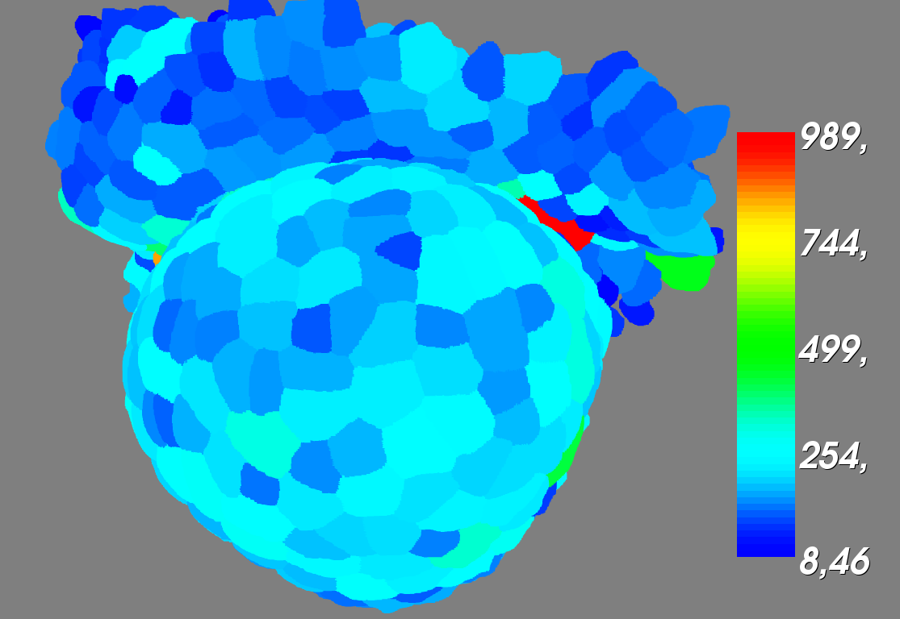
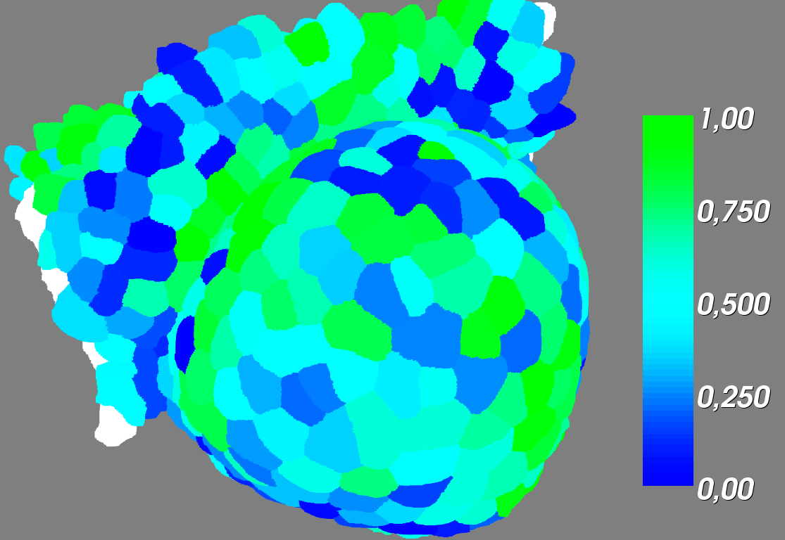

How to visualise a Spatio-temporal object :class:`TemporalPropertyGraph` on a :class:`SpatialImageAnalysis`
###########################################################################################################

.. topic:: Section contents

    In this section, we introduce the visualisation tools.

.. warning:: If you want to use display functions (2D and 3D), make sure you launch python or ipython with the ``-q4thread`` option, launching the Qt4 environnement.

.. code-block:: bash
    
    user@computer:$ ipython -q4thread

.. note:: You can use simultaneously the ``-pylab`` option, a matplotlib-based Python environment.

.. code-block:: bash
    
    user@computer:$ ipython -q4thread -pylab

Loading the images and creating the corresponding :class:`PropertyGraph`
========================================================================

.. code-block:: python

    import openalea.container
    from openalea.deploy.shared_data import shared_data
    data_files = shared_data(openalea.container, pattern='*.inr.gz') # return a list

    # -- We load the images corresponding to the different time points
    from openalea.image.serial.basics import imread
    t1 = imread(shared_data(openalea.container, 'p58-t1_imgSeg_cleaned.inr.gz'))
    t2 = imread(shared_data(openalea.container, 'p58-t2_imgSeg_cleaned.inr.gz'))
    t3 = imread(shared_data(openalea.container, 'p58-t3_imgSeg_cleaned.inr.gz'))

    # -- We create the corresponding SpatialImageAnalysis objets
    from openalea.image.algo.analysis import SpatialImageAnalysis
    analysis1 = SpatialImageAnalysis(t1)
    analysis2 = SpatialImageAnalysis(t2)
    analysis3 = SpatialImageAnalysis(t3)

    # -- We don't want to compute values (in `graph_from_image()`) for cells at the margins of the stack.
    analysis1.remove_margins_cells(verbose=True)
    analysis2.remove_margins_cells(verbose=True)
    analysis3.remove_margins_cells(verbose=True)

    # -- We now create the PropertyGraphs
    from openalea.image.algo.graph_from_image import graph_from_image
    graph_1 = graph_from_image( analysis1.image )
    graph_2 = graph_from_image( analysis2.image )
    graph_3 = graph_from_image( analysis3.image )

For more detailed instruction concerning this part, see :ref:`Data-from-Segmented-Image`

Loading the lineages
====================

To link cells over time we need to have information about their fate. 

.. code-block:: python

    from vplants.tissue_analysis import LienTissuTXT
    lin_12=LienTissuTXT.LienTissuTXT(shared_data(openalea.container, 'suiviExpertEntier58-12.txt'))
    l12=lin_12.cellT1_cellT2
    lin_23=LienTissuTXT.LienTissuTXT(shared_data(openalea.container, 'suiviExpertEntier58-23.txt'))
    l23=lin_23.cellT1_cellT2

``l12`` and ``l23`` are dictionaries containing the cell mother labels (keys) and the labels of the corresponding daughter cells.

Creating the :class:`TemporalPropertyGraph`
===========================================

To create the :class:`TemporalPropertyGraph` we now need to link the graphs (:class:`PropertyGraph`) over time using the lineages.

.. code-block:: python

    from openalea.container import TemporalPropertyGraph
    g = TemporalPropertyGraph()
    g.extend([graph_1,graph_2,graph_3],[l12,l23])

We now have a 4D structure containing the maximum information we could extract from the segmented images (:class:`SpatialImage`).

.. warning:: The cells labels have been renamed during this step.

Visualisation of the :class:`TemporalPropertyGraph`
===================================================

Plotting histograms of values
^^^^^^^^^^^^^^^^^^^^^^^^^^^^^
.. code-block:: python

    ## --- Distribution function of L1 cells' volume for p58
    volumes=list(( np.sort(graph_1.vertex_property('volume').values()), graph_2.vertex_property('volume').values(), graph_3.vertex_property('volume').values() ))
    import matplotlib.pyplot as plt
    color=('b','g','r','c','m')
    fig = plt.figure()
    fig.subplots_adjust( wspace=0.13, left=0.08, right=0.95, top=0.95)
    plt.hist(volumes, bins=20, normed=False,
        label=( ('t1, n='+str(len(volumes[0]))+', mean='+str(np.round(np.mean(volumes[0]), 2))) ,
        ('t2, n='+str(len(volumes[1]))+', mean='+str(np.round(np.mean(volumes[1]), 2))) ,
        ('t3, n='+str(len(volumes[2]))+', mean='+str(np.round(np.mean(volumes[2]), 2, cumulative=False )
    plt.title("Distribution function of L1 cell volumes for p58", fontsize=22)
    plt.xlabel('Volumes'+ r' ($\mu m^3$)',fontsize=18)
    plt.ylabel('Frequency',fontsize=18)
    plt.legend(loc=1)
    plt.show()

    ## --- Cumulative distribution function of L1 cells' volume for p58
    volumes=list(( np.sort(graph_1.vertex_property('volume').values()), graph_2.vertex_property('volume').values(), graph_3.vertex_property('volume').values() ))
    import matplotlib.pyplot as plt
    color=('b','g','r','c','m')
    fig = plt.figure()
    fig.subplots_adjust( wspace=0.13, left=0.08, right=0.95, top=0.95)
    plt.hist(volumes, bins=2000, normed=True,
        label=( ('t1, n='+str(len(volumes[0]))+', mean='+str(np.round(np.mean(volumes[0]), 2))) ,
        ('t2, n='+str(len(volumes[1]))+', mean='+str(np.round(np.mean(volumes[1]), 2))) ,
        ('t3, n='+str(len(volumes[2]))+', mean='+str(np.round(np.mean(volumes[2]), 2))) , histtype='step',cumulative=True )

    plt.title("Cumulative distribution function of L1 cell volumes for p58", fontsize=20)
    plt.xlabel('Volumes'+ r' ($\mu m^3$)',fontsize=16)
    plt.ylabel('Relative frequency',fontsize=16)
    plt.legend(loc=2)
    plt.show()

Representation of spatial data
^^^^^^^^^^^^^^^^^^^^^^^^^^^^^^
We choose to represent as an example the volume information (in µm\ :sup:`3`) contained in the object :class:`TemporalPropertyGraph`. 

Since we forgot about the geometrical information, in :class:`TemporalPropertyGraph`, we will need the :class:`SpatialImageAnalysis` corresponding to each time point to visualize the 3D data.

In order to extract data at one time point of the :class:`TemporalPropertyGraph` we can use ``g.translate_from_graph_at_time()``

.. code-block:: python

    from openalea.image.all import display3D, rainbow_blue2red
    display3D( analysis1, dictionary = g.translate_from_graph_at_time(g.vertex_property('volume'),0), lut = rainbow_blue2red )

    Volume (in µm\ :sup:`3`)

.. note:: If some keys of your dictionary are not in the :class:`SpatialImage` or the :class:`SpatialImageAnalysis`, it won't be a problem for the display function.
.. note:: If some labels of the :class:`SpatialImage` or the :class:`SpatialImageAnalysis` are not in the keys of the dictionary, they will be displayed in white.

Representation of spatial correlation
^^^^^^^^^^^^^^^^^^^^^^^^^^^^^^^^^^^^^
Here we want to show an example of a statistical analysis and use the parameter `fixed_lut_range` (for visualisation!).
We show on the image below, the **absolute correlation** in terms of direction between the main vector of shape and the main vector of curvature for a cell.

.. code-block:: python

    analysis1.compute_principal_curvatures(verbose=True)
    axis = analysis1.inertia_axis()
    axis_vec = axis[0]

    from openalea.image.algo.analysis import vector_correlation
    coor_curv_main_axis = {}
    for n,c in enumerate(analysis1.principal_curvatures_directions):
        coor_curv_main_axis[c] = abs(vector_correlation(analysis1.principal_curvatures_directions[c][0],axis_vec[n][0]))

    from openalea.image.all import display3D, rainbow_blue2green
    display3D( analysis1.image, list(set(analysis1.labels())-set(analysis1.L1())), coor_curv_main_axis, rainbow_blue2green, verbose = True, fixed_lut_range=[0,1] )

    **Absolute correlation** in terms of direction between the main vector of shape and the main vector of curvature

.. note:: For those who want to be rigorous, the vectors do not have the same origin: geometrical median of the external wall for the curvature and barycenter for the shape eigenvector. We assume that the translation does not change the angle between the two vector.

Representation of a spatio-temporal analysis
^^^^^^^^^^^^^^^^^^^^^^^^^^^^^^^^^^^^^^^^^^^^
Here we show an example of a function differentiating spatial data along time.
We compute the relative change of cell volume between two time points, which is the relative volumetric growth.

.. code-block:: python

    from openalea.container.temporal_graph_analysis import relative_temporal_change
    ## -- Relative Temporal Change -VOLUME- rank = 1 (t_n -> t_n+1)

    # -- Compute and display on the t_n image
    VG12 = g.translate_from_graph_at_time(relative_temporal_change(g, 'volume'), 0 )
    display3D( t1, dictionary = VG12, lut = rainbow_blue2red, verbose = True )
    # -- Compute and display on the t_n+1 image
    VG21 = g.translate_from_graph_at_time(relative_temporal_change(g, 'volume',labels_at_t_n = False), 1)
    display3D( t2, dictionary = VG21, lut = rainbow_blue2red, verbose = True )

.. figure:: p58_VolGrowth_12-1.png
    :width: 100%
    :align: center
    
    Relative volumetric growth (t1 -> t2, visualized on t1)

.. figure:: p58_VolGrowth_12-2.png
    :width: 100%
    :align: center
    
    Relative volumetric growth (t1 -> t2, visualized on t2)

.. note:: Since the lineage is not complete (hand-made lineage) we do not have information for every cell. Cells with no information are white.

.. sectionauthor:: Jonathan LEGRAND, Maryline LIÉVRE
